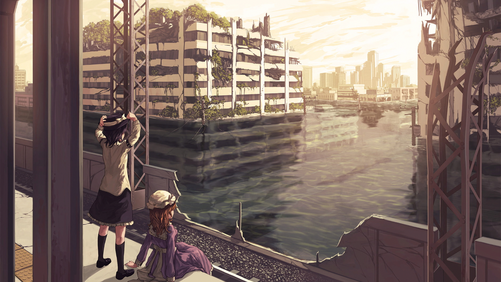

# 👋 Write-ups

## Sobre Mi

> Soy un entusiasta de la ciberseguridad, apasionado por explorar el fascinante mundo de la tecnología y la seguridad informática. En este espacio, documentaré mis experiencias y descubrimientos mientras me sumerjo en el emocionante ámbito de vulnerabilidades y la creación de scripts. Como ingeniero y jugador de CTF (Capture The Flag), disfruto desafiando mis habilidades y conocimientos en cada reto que se presenta.
>
> Mi objetivo es seguir mejorando constantemente, obtener certificaciones que respalden mi crecimiento profesional y, sobre todo, divertirme en el proceso. Aquí encontrarás análisis detallados, tutoriales y reflexiones sobre mis proyectos y descubrimientos en el ámbito de la ciberseguridad.

> ¡Acompáñame en este viaje, donde cada encuentro es un nuevo misterio y cada paso nos acerca a la magia de lo desconocido!

<figure><figcaption></figcaption></figure>
