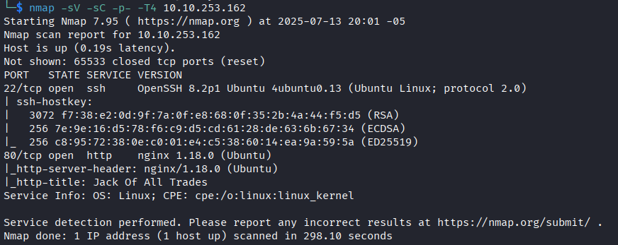
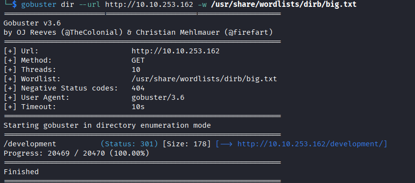
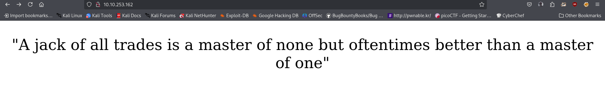
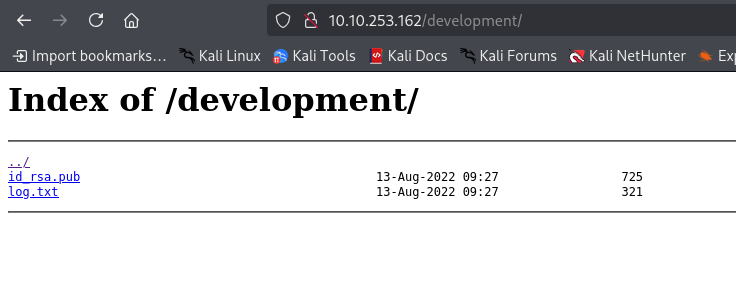
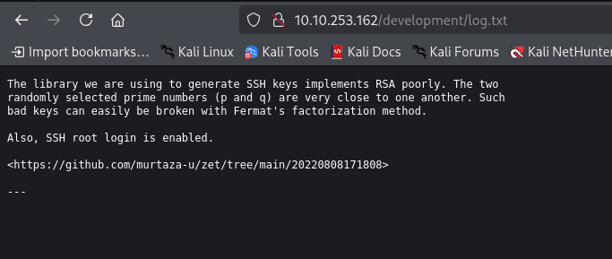
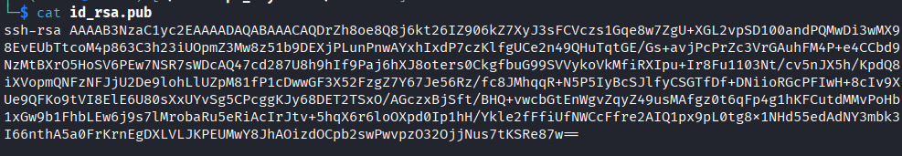
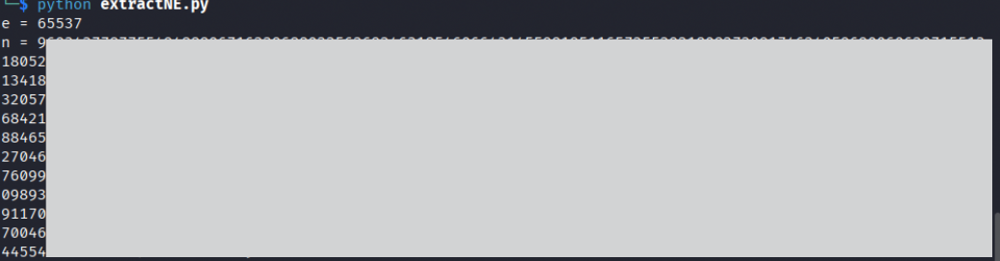
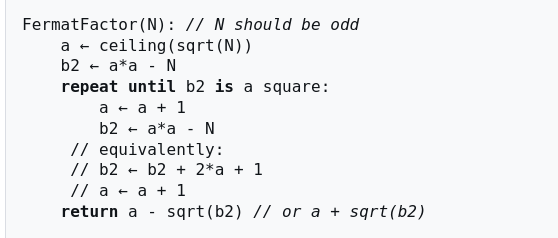
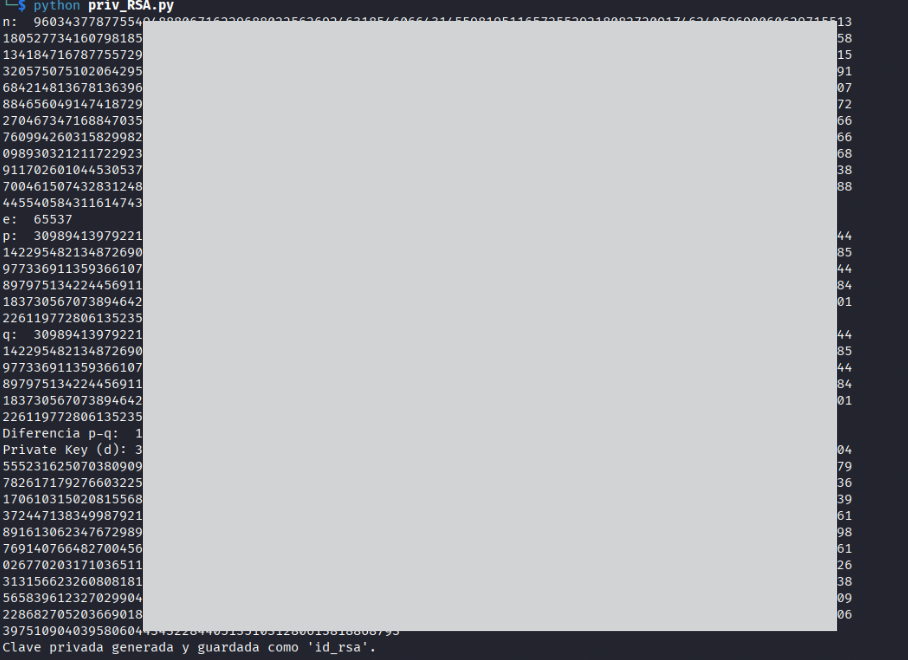
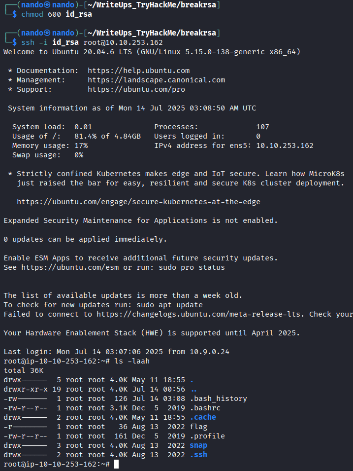

# Breaking RSA

Comenzamos realizando un escaneo de puertos en la máquina objetivo.

```bash
nmap -sV -sC -p- -T4 <ip>
```

* -sV: Sondeo de puertos abiertos para determinar la información del servicio/versión
* -sC: equivalente a _--script=default_.
* -p-: Escanea todos los puertos de la Red (65536)
* -T4: La velocidad de escaneo de puertos.

Observamos que hay dos puertos abiertos: el `22`, que corresponde a `SSH,` y el `80`, que es para `HTTP`.

<figure><figcaption></figcaption></figure>

Enumeramos los directorios que tenemos disponibles en el puerto `HTTP.`&#x20;

<figure><figcaption></figcaption></figure>

Contamos con dos páginas en funcionamiento: la principal, a la que se puede acceder directamente mediante la URL, y la página `/development`.

<figure><figcaption></figcaption></figure>

La página `/development` nos proporciona acceso a dos archivos.

<figure><figcaption></figcaption></figure>

`/development/log.txt` Nos proporciona el siguiente mensaje: _"La biblioteca que estamos usando para generar claves SSH implementa RSA mal. Los dos números primos seleccionados al azar (p y q) están muy cerca unos de otros. Tal Las claves defectuosas se pueden romper fácilmente con el método de factorización de Fermat. Además, el inicio de sesión raíz SSH está habilitado."_&#x20;

<figure><figcaption></figcaption></figure>


Es probable que nuestra tarea implique extraer `N` y `e` de la clave pública para factorizar `N`, lo que nos permitirá obtener `p` y `q`, y finalmente calcular `d`. El valor `d` corresponde a la clave privada y podremos generar la clave privada de SSH, lo que nos permitirá acceder a la máquina. Puedes  visitar este enlace si quieres repasar sobre RSA ([https://www.ssldragon.com/blog/what-is-rsa/](https://www.ssldragon.com/blog/what-is-rsa/))

Descargamos la clave publica que se encuentra en `/development/id_rsa.pub`&#x20;

<figure><figcaption></figcaption></figure>

Para determinar la longitud de la clave RSA, utilizamos el siguiente comando.

```bash
ssh-keygen -l -f id_rsa.pub
```

* -l: Muestra la huella digital del archivo de clave pública especificado.
* -f: Especifica el nombre del archivo.

<figure><figcaption></figcaption></figure>

Para obtener `e` y `N` , utilizamos el siguiete codigo.

```python
#!/usr/bin/env python3
from Cryptodome.PublicKey import RSA

path = 'id_rsa.pub'
with open(path) as f:
    key = RSA.import_key(f.read())
    print('e = %d' % key.e)
    print('n = %d' % key.n)
```

Suponiendo que `path = 'id_rsa.pub'` se encuentra en el mismo directorio donde se ejecuta el código, así obtenemos el valor de `e`, que representa el exponente público de la clave RSA, y el valor de `N` , que corresponde al módulo de la clave RSA.

<figure><figcaption></figcaption></figure>

La descripción del desafío nos proporciona una indicación clara sobre cómo calcular `p` y `q` en esta implementación débil. Debemos emplear el método de factorización de Fermat.  Puedes obtener información sobre la factorización de Fermat aquí:



Primero, diseñamos un código para la factorización de Fermat. El siguiente código es el resultado:

<figure><figcaption></figcaption></figure>

<pre class="language-python"><code class="lang-python">import gmpy2

<strong>def fermat_factorization(n):
</strong>    """Método de Factorización de Fermat"""
    a = gmpy2.isqrt(n) + 1
    b2 = gmpy2.square(a) - n
    while not gmpy2.is_square(b2):
        a += 1
        b2 = gmpy2.square(a) - n
    p = a + gmpy2.isqrt(b2)
    q = a - gmpy2.isqrt(b2)
    return p, q
</code></pre>

Para generar la clave privada de RSA, utilizamos el siguiente código:

```python
from Cryptodome.PublicKey import RSA

# assume d was correctly calculated
n = 1234....L
e = 65537L
d = 43434...L
private_key = RSA.construct((n, e, d))
dsmg = private_key.decrypt(msg)
```



Podemos crear y almacenar nuestra clave privada en un archivo llamado `id_rsa` utilizando el siguiente código:

```python
from Cryptodome.PublicKey import RSA

# Generate a new RSA key
mykey = key_generada

# Export the private key to a file
with open("id_rsa", "wb") as f:
    f.write(mykey.export_key(format='PEM'))
```



Al combinar todos los códigos anteriores, obtenemos el siguiente resultado, que responde a la mayoría de las preguntas planteadas en el desafío.

```python
import gmpy2
from Cryptodome.PublicKey import RSA

def fermat_factorization(n):
    """Método de Factorización de Fermat"""
    a = gmpy2.isqrt(n) + 1
    b2 = gmpy2.square(a) - n
    while not gmpy2.is_square(b2):
        a += 1
        b2 = gmpy2.square(a) - n
    p = a + gmpy2.isqrt(b2)
    q = a - gmpy2.isqrt(b2)
    return p, q

def calculate_private_key(p, q, e):
    """Calcular la clave privada 'd'"""
    phi = (p - 1) * (q - 1)
    d = gmpy2.invert(e, phi)
    return d

# Abrir el archivo de clave RSA
path = 'id_rsa.pub'
with open(path) as f:
    # Importar la clave RSA
    key = RSA.import_key(f.read())
    
    # Obtener el módulo (n) y el exponente público (e)
    n = key.n
    e = key.e

# Factorizar n en p y q usando el método de Fermat
p, q = fermat_factorization(n)

# Calcular la clave privada 'd' usando p, q y el exponente público 'e'
d = calculate_private_key(p, q, e)

# Imprimir los resultados
print("n: ", n)
print("e: ", e)
print("p: ", p)
print("q: ", q)
print("Diferencia p-q: ", abs(p - q))
print("Private Key (d):", d)

# Crear la clave privada RSA
private_key = RSA.construct((n, e, int(d)))

# Exportar la clave privada a un archivo
with open('id_rsa', 'wb') as f:
    f.write(private_key.export_key('PEM'))

print("Clave privada generada y guardada como 'id_rsa'.")
```

<figure><figcaption></figcaption></figure>

Por último, ya podemos iniciar sesión con el usuario `root`, tal como se mencionó en `/development/log.txt`. Utilizamos los siguientes comandos y podremos encontrar la `flag` de root.

```bash
chmod 600 id_rsa
ssh -i id_rsa root@<ip> 
```

<figure><figcaption></figcaption></figure>

> _¡Espero que hayas disfrutado mientras leías y resolvías el desafío! Recuerda que los errores son lecciones valiosas y que la práctica constante te llevará a mejorar cada día más._
>
> <p align="center"></p>
